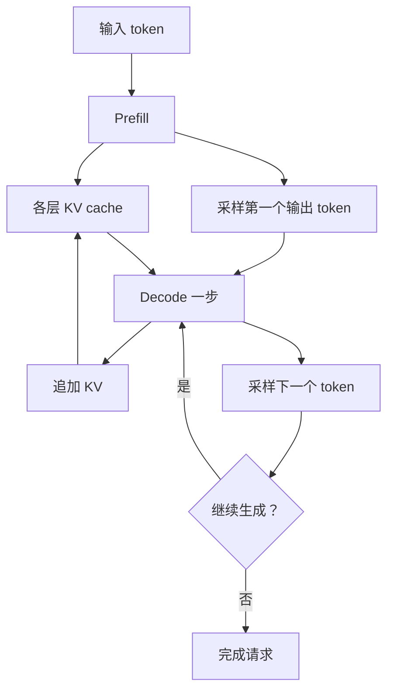
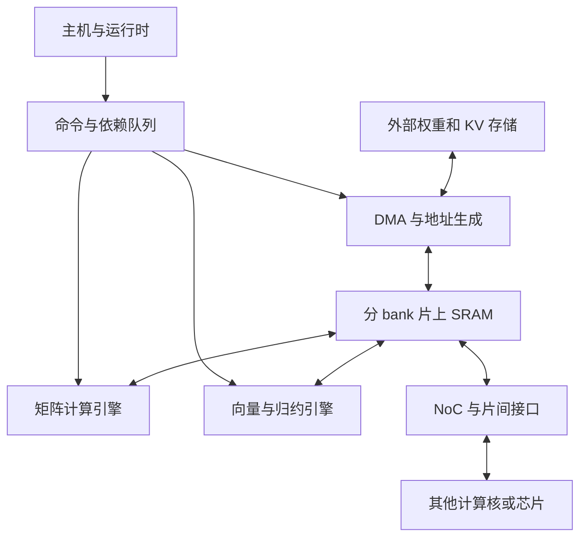

# AI 推理加速器：从计算负载到硬件架构与研究方法

理解推理加速器，最有效的起点是问：**每一步在计算什么、数据在哪里、哪些数据能够复用、下一步必须等待什么？** 随后才能判断应该增加矩阵算力、内存带宽、片上容量，还是降低通信与调度延迟。

本文以数据中心大语言模型（LLM）推理为主，补充视觉、推荐、扩散模型和边缘推理。先建立推理执行的概念，再分析专用加速器如何匹配负载，最后讨论前沿研究和 RTL／模拟器的使用方法。文中“专用加速器”主要指 TPU、NPU、数据流处理器、晶圆级处理器以及 PIM 等非 GPU 路线；严格来说，现代 GPU 本身也是 AI 加速器。

## 1. 先掌握六个结论

**推理是一组不同的工作阶段。** 对自回归 Transformer，prefill 一次处理已知的输入 token，decode 逐步生成输出；推测解码又加入 draft 和 verify。相同模型的不同阶段，矩阵形状、权重复用和临界路径都可能不同。[^1][^4]

**低延迟 decode 的困难经常在数据供给。** 少量 token 仍需要访问大量权重，并读取历史 KV。增加乘加单元只有在数据来得及送达、并行度足够时才有价值。大 batch 能提高线性层的权重复用，但各请求通常拥有不同 KV，attention 不会获得同等程度的复用。[^1][^5]

**专用加速器没有统一的微架构。** TPU 和 Trainium 仍采用外部高带宽内存；Groq 的公开 TSP 架构强调编译器调度与片上存储；Cerebras 通过晶圆级局部存储与空间映射缩短数据路径；PIM 把部分计算放到内存附近。它们解决的问题以及付出的代价各不相同。[^10][^11][^13][^14][^16]

**软件映射是硬件设计的一部分。** 同一组乘加单元，采用不同分块、布局、数据流和通信方式，利用率可能完全不同。新芯片是否能高效执行 GQA、MoE、长上下文和推测解码，也取决于编译器、算子库与运行时。[^7][^15][^20]

**RTL 与模拟器通常配合使用。** RTL／HLS 证明关键模块能实现，并提供面积、功耗和时序依据；快速模拟器用于运行完整模型、扫描架构参数和分析系统行为。周期级模拟器不自动等于“由真实 RTL 得到的精确模型”。[^18][^19][^20]

**比较硬件应比较服务结果。** 在同等模型质量、请求分布和延迟要求下，考察每秒有效输出 token、每 token 能耗、总成本与尾延迟。单用户 token/s、整个集群 token/s 和峰值 FLOPS 是三个不同指标。[^2][^37]

## 2. “推理架构”有三个层次

| 层次 | 回答的问题 | 例子 | 对硬件的影响 |
|---|---|---|---|
| 模型架构 | 网络由哪些计算构成？ | 稠密 Transformer、MoE、GQA／MLA、SSM、DiT | 算子、状态大小、数据依赖 |
| 推理服务架构 | 请求怎样批处理、分配和执行？ | 连续批处理、前缀缓存、PD 分离、推测解码 | 实际 batch、数据迁移、尾延迟 |
| 加速器架构 | 算子在哪些硬件上执行？ | 矩阵阵列、向量单元、SRAM、HBM、NoC | 吞吐、容量、带宽、功耗 |

研究时应把这三个层次连接起来。例如，GQA 是模型结构变化，减少 KV 头数；PagedAttention 是 KV 的存储管理与访问方法；PIM attention 是执行位置变化。三者可以同时存在，不能用同一个“attention 优化”概念代替具体分析。[^3][^6][^16]

### 2.1 一次自回归生成怎样执行

输入文本首先被 tokenizer 转为 token ID。Prefill 计算输入序列在各层的表示，建立每层的 KV cache，并利用最后位置的输出预测第一个新 token。之后，每次 decode 把刚产生的 token 送入模型，读取历史 KV、追加新的 KV，再预测下一 token。

自回归依赖发生在**同一请求的相邻输出 token**之间。一个 token 内部的矩阵运算仍然可以并行，不同请求之间也可以并行。把 decode 说成“只能串行计算”会掩盖这些可利用的并行性。[^1]

### 2.2 优化目标先于芯片参数

| 指标 | 含义 | 主要受什么影响 |
|---|---|---|
| TTFT | 请求到第一个输出 token 的时间 | 排队、预处理、prefill、必要的数据转移 |
| ITL | 相邻输出 token 的时间间隔 | decode 执行、调度、通信和抖动 |
| TPOT | 常用的平均每输出 token 时间指标 | 需要明确是否排除首 token，以及平均口径 |
| 输出吞吐 | 系统每秒产生多少输出 token | batch、芯片数、负载分布和利用率 |
| Goodput | 满足服务目标的有效工作吞吐 | TTFT／TPOT 约束、超时、长尾 |
| 能效与成本 | Joule/token、成本/token | 整机功率、利用率、设备与运维成本 |

例如，增大 batch 可能提高整个系统吞吐，同时让单个用户等待更久。语音交互、代码补全和离线数据生成应使用不同的目标函数。DistServe 的核心就是围绕首 token 和后续 token 的不同延迟约束组织服务资源。[^2]

对于 reasoning 模型，还应区分“第一个内部思考 token”和“用户看到的第一个答案 token”。内部生成很快，并不直接等于用户可见 TTFT 很低。[^17]

## 3. 从 Transformer 算子推导计算模式

### 3.1 一层 Transformer 不只是一个 GEMM

忽略具体模型的归一化位置差异，一层通常包含 QKV 投影、attention、输出投影和 FFN／MLP，同时穿插残差、归一化、激活与位置编码。

| 计算 | 简化表达 | 主要硬件需求 |
|---|---|---|
| QKV 投影 | Q=XWq，K=XWk，V=XWv | 矩阵／向量乘加、读取权重 |
| Attention 分数 | S=QKᵀ/√d | 乘加、读取 K、mask |
| Softmax | P=softmax(S) | 最大值归约、exp、求和归约、归一化 |
| Attention 输出 | O=PV | 乘加、读取 V |
| 输出投影 | Y=OWo | 矩阵／向量乘加 |
| FFN | 例如 SwiGLU 的 up、gate、down | 大量线性计算和逐元素运算 |
| 其他 | RMSNorm、RoPE、残差、采样 | 向量／标量、归约、地址生成 |

QKV 投影和 FFN 都涉及模型权重；QKᵀ 与 PV 的第二个操作数则来自本次请求的激活或 KV。这个区别决定了 batching 可以复用什么。FlashAttention 进一步说明：即便数学表达不变，是否把中间 attention 分数写回外部内存，也会显著改变数据流量。[^5][^6][^8]

### 3.2 Prefill 与 decode：变化的是矩阵的 M 维

考虑一个线性层：

$$
Y_{M\times N}=X_{M\times K}W_{K\times N}.
$$

这里 M 是本次线性计算一起处理的 token 数，不总是请求数。对于 B 个等长、长度为 S 的请求，完整 prefill 的 M 可以达到 B×S；普通 decode 的 M 通常是 B；单请求普通 decode 则是 M=1。

因此，prefill 经常形成较大的 GEMM，低 batch decode 经常形成 GEMV 或很“瘦”的 GEMM。随着 batch 增加，decode 线性层也可以有效利用矩阵计算单元。这正是 NeuPIMs 区分批量 decode 中线性计算和 attention 计算的出发点。[^16]

下面用矩阵维度做独立推导。一次乘加按两个 FLOP 计：

$$
F=2MKN.
$$

若权重、输入、输出每元素分别占 qw、qx、qy 字节，且理想情况下各从所讨论的存储层读写一次，那么流量近似为：

$$
D=q_wKN+q_xMK+q_yMN.
$$

于是算术强度为 I=F/D。当权重流量占主导时：

$$
I\approx\frac{2M}{q_w}\quad\text{FLOP/Byte}.
$$

BF16 权重 qw=2 时，M=1 的强度约为 1 FLOP/Byte；M=128 时约为 128。**同一块权重被更多 token 使用，就能把读取成本摊薄。** 这里未包含重复读、scale 元数据和中间结果溢出；实际强度要按真实映射重新计算。

把这个值与硬件计算吞吐／内存带宽的比值比较，就能得到第一步的瓶颈判断：

$$
I_{\rm ridge}=C_{\rm peak}/BW.
$$

I 低于这个比值，理想 roofline 受到带宽限制；高于这个比值，才可能受到计算限制。该判断必须针对具体精度、矩阵单元、存储层和 tile 形状，不能只拿整芯片峰值作为真实速度。[^1][^20]

### 3.3 一个能手算的低 batch 例子

**以下是说明机制的假设案例，不是任何产品实测。** 假设某稠密模型每步需要读取约 80 亿个线性权重，使用 BF16，并有总计 2 TB/s 的可用外部内存带宽、200 TFLOP/s 的可用乘加峰值。

单请求 decode 的权重大小约为 16 GB，因此仅理想读取权重就需要：

$$
16\times10^9/(2\times10^{12})=8\text{ ms}.
$$

对应约 160 亿 FLOP 的线性计算，在计算单元完全饱和的假设下仅需：

$$
16\times10^9/(200\times10^{12})=0.08\text{ ms}.
$$

这并不表示实际 GEMV 能达到峰值，而是说明**即便计算部分接近理想，外部权重读取仍大两个数量级**。单看权重读，输出速度上界约为 125 token/s；加上 KV、通信和其他算子后还会下降。如果片上容量足以保留权重，就不再适用这项“每步读取全部外部权重”的假设。

若权重改成 4 bit，纯权重字节数约为原来的四分之一，但实际收益还受 scale、反量化、计算格式以及准确率影响。W4A16 表示权重低位存储与较高精度激活／计算路径，不能直接理解为整条流水线都执行 4-bit 乘法。AWQ 是理解这种分离的合适入口。[^26]

### 3.4 KV cache 是独立的容量与带宽问题

对标准 MHA／GQA，假设各层配置相同、每个请求上下文长度为 T，KV 占用为：

$$
D_{KV}=2LBTH_{KV}d_hq_{KV}.
$$

2 表示 K 和 V 两份；L 为层数，B 为请求数，Hkv 为 KV 头数，dh 为每头维度，qKV 为每元素字节数。忽略分页元数据、对齐及共享前缀。这一式子不应原样用于 MLA 的压缩状态。[^1][^6]

取 L=32、Hkv=8、dh=128、qKV=2，得到以下独立计算：

| 上下文长度 | 单请求 KV | 32 个无共享前缀请求的 KV |
|---|---:|---:|
| 8,192 token | 1 GiB | 32 GiB |
| 32,768 token | 4 GiB | 128 GiB |
| 131,072 token | 16 GiB | 512 GiB |

这些只包括 KV，还要为权重、工作区、激活和运行时留空间。容量变大让系统能够容纳更多请求；带宽变大才帮助系统更快读这些状态，二者不能互换。

普通完整 attention 的 decode 中，每个 query 需要扫描历史 K、V。不同请求的 KV 通常不相同，所以增加 batch 时，attention 的数据量也随之增加。GQA／MQA 通过让多个 Q 头共享 KV 头减少状态并增加复用；MLA 改变缓存表示；KIVI 等 KV 量化研究进一步减少每元素字节数。具体收益取决于 kernel 是否真正复用加载的数据。[^6][^27]

### 3.5 Prefill 的 attention 与 decode 的 attention 也不相同

在一个长度为 S 的序列上，prefill 的 attention 涉及多个 Q 对多个 K，稠密 attention 的运算量随 S² 增长。因果 mask 使它只关注允许的历史位置，但不把渐近复杂度降为线性。

Decode 每个请求只有少量新 Q，但已有长度 T 的 KV，单步 attention 的工作随 T 增长。因此，长输入既会增加 prefill 工作，也会增加后续每一步 decode 的状态访问。

FlashAttention 使用分块和在线 softmax，避免把完整分数矩阵反复写回 HBM；它保留精确 attention 的数学目标，并不是自动变成稀疏 attention。硬件需要同时支持矩阵乘、向量归约和片上暂存。[^8]

### 3.6 MoE、推测解码改变硬件看到的负载

**MoE 的计算稀疏与参数容量必须分开看。** 每个 token 经路由只执行少数专家，但所有可能访问的专家仍需要可用的存储位置。以 DeepSeek-V3 原始报告为例，671B 总参数与每 token 激活约 37B 参数描述的是不同量；不能据后者估算完整模型的存储需求。[^6]

专家并行（EP）把专家放在不同设备上，执行 dispatch → 专家计算 → combine。各专家收到的 token 数量不同，容易形成大小不一的 GEMM、热点和尾部等待。因此，MoE 硬件除了低精度乘加，还需要考虑路由、gather／scatter、all-to-all、专家放置与负载均衡。DeepSeek 的硬件反思报告明确讨论了这些软硬件相互约束。[^7]

**推测解码把单步生成改成“草拟—验证—提交”。** 小 draft 模型或辅助预测机制先提出若干候选，target 模型并行验证候选位置，再提交可接受的 token；未接受的分支状态需要丢弃或回收。标准精确推测采样依靠特定接受／纠正机制保持目标分布，不能把任何多 token 猜测都视为无损。[^4]

如果一轮提出 k 个候选，target 线性层的有效 M 可能接近 B×k，验证阶段会比单 token decode 更像小型 prefill。代价包括 draft 计算、额外状态和拒绝浪费。可用下面的独立成本表达评估：

$$
\text{平均每个提交 token 的时间}
\approx\frac{t_{draft}+t_{verify}+t_{state}}{\mathbb{E}[n_{committed}]}.
$$

这里提交数量可能包括纠正或额外采样 token，取决于算法。EAGLE-3 是实际草拟机制的代表；其硬件启示是，需要同时评估低 M 的 draft、高一些 M 的 verify，以及状态管理，不宜只用 GEMV microbenchmark 代表整套系统。[^9]

## 4. 从负载特征到硬件需求

下表综合前述模型与算子分析，属于架构推导；它描述常见瓶颈，而非所有配置下都成立的定律。

| 负载／场景 | 计算与数据模式 | 优先检查的瓶颈 | 值得考虑的硬件能力 |
|---|---|---|---|
| 长 prompt prefill | 大 GEMM、attention 分块计算 | 矩阵计算、片上流量、非线性单元 | 高效矩阵阵列、向量归约、融合与流水 |
| 小 batch decode | GEMV／瘦 GEMM、逐步状态更新 | 权重供给、短任务启动、KV 读取 | 高带宽或权重驻留、小矩阵利用率、轻量控制 |
| 大 batch decode | 线性层 GEMM、逐请求 attention | KV 带宽／容量、阶段失衡 | 分离计算引擎、可分配缓存、重叠调度 |
| 长上下文 decode | 少量 Q 扫描大量 KV | KV 容量、带宽、跨设备归约 | KV 压缩、分页访问、attention 分片与归约 |
| MoE | 动态路由、小型分组 GEMM | 专家容量、热点、all-to-all | 高效 gather／scatter、专家本地化、低延迟网络 |
| 推测解码 | draft + 批量 verify + 提交 | 接受率、额外计算、状态分支 | 多形状 kernel、状态复制／提交／回收 |
| RAG | 检索后增加输入上下文 | 检索服务、prefill、缓存命中率 | CPU／存储协同、前缀复用、数据搬运 |
| 多模态 | 图像／音频编码 + 文本模型 | 编码计算、输入 token 数、调度 | 多算子支持、编码器与生成器资源协调 |
| 长链 reasoning | 更多生成步骤或多分支探索 | 串行累计延迟、活跃状态容量 | 低 ITL、分支调度、KV 管理 |
| SSM／线性 attention | 状态递推，prefill 常可转为并行分块 | 状态更新、scan、算子融合 | 向量与矩阵协作、递推状态本地化 |
| 图像／视频 DiT | 多轮对整组空间 token 去噪 | 重复的大规模矩阵计算和激活流量 | 矩阵算力、激活缓存、迭代流水 |

SSM 和 DiT 提醒我们：不能把“AI 推理”与“单 token 自回归 decode”画等号。Mamba-2 的 SSD 算法把状态空间模型与结构化矩阵计算联系起来；DiT 在去噪步骤内处理一组 token，步骤之间存在依赖，但通常不采用文本生成那种逐 token KV 增长模式。混合模型仍需要逐层检查状态类型。[^33][^34]

## 5. 如果要设计一款推理加速器，应该怎样配置硬件

### 5.1 先定义设计点

设计规格至少应包含模型结构与精度、上下文范围、并发分布、延迟目标、功率预算和系统规模。例如，“batch 1–8 的低延迟代码补全”和“上百请求并发的离线生成”可能选择完全不同的计算／带宽配比。

不要先确定一个很大的脉动阵列，再寻找可以让它满载的负载。一个可行的设计过程是：获取算子形状和数据流量 → 估算瓶颈 → 扫描资源配比 → 为候选架构寻找映射 → 验证端到端行为。这也是 LLMCompass 同时包含硬件描述、映射搜索与性能评估的原因。[^5][^20]

### 5.2 计算单元：矩阵、向量、标量共同组成流水线

矩阵单元承担投影、FFN 和 attention 中的大部分乘加；向量与归约单元处理 softmax、RMSNorm、激活、scale 与格式转换；标量控制和地址生成负责循环、索引、分支与队列管理。

**阵列尺寸要由形状分布决定。** 在把 M、N 映射为二维空间并行的简单映射中，M 很小可能造成大量位置空闲；但这不是脉动阵列无法执行 GEMV 的证明。可以通过分块、折叠、分区或改变并行维度改善利用率，效果取决于数据通路和归约开销。

可探索多个较小矩阵 tile、可分区阵列，或矩阵阵列搭配向量点积路径。新增模式也会增加 mux、控制、路由和验证成本，应在相同面积／功率约束下比较。Gemmini 提供了阵列维度、数据流、scratchpad 和队列参数，适合观察这种取舍。[^25]

矩阵单元加速后，exp、归约、片上端口和同步可能成为新瓶颈。FlashAttention-4 在 Blackwell 上研究的不对称硬件扩展就是一个现实例子：矩阵吞吐的提升，需要配套改变非矩阵操作和流水安排。[^22]

### 5.3 存储：至少分清三类数据

| 数据 | 生命周期与访问特点 | 架构重点 |
|---|---|---|
| 权重 | 模型加载后长期存在；不同请求可共享 | 容量、重复读取、压缩、专家放置 |
| KV／递推状态 | 随请求产生、增长、分支、共享或释放 | 分配粒度、布局、带宽、迁移、回收 |
| 临时激活与部分和 | 算子或层内短暂存在 | 片上暂存、融合、双缓冲、避免溢出 |

片上 SRAM 应同时看容量、bank 数、读写端口、跨 bank 带宽和数据位置。容量够用，并不保证每周期可以向计算阵列提供足够操作数。多引擎同时读取权重、KV 和部分和，还会产生仲裁和端口冲突。

外部内存也不是越快越好这么简单。HBM 适合高带宽和较大容量；DDR／LPDDR 的成本和容量配置可能更适合某些受功率或成本约束的系统；大量 SRAM 驻留能够减少外部读，但增加芯片面积和模型容纳成本。2026 年的存储研究进一步探索近存计算、3D 存储逻辑堆叠和高带宽闪存，其出发点就是重新分配容量、带宽与成本。[^17]

### 5.4 数据流：说明“什么驻留在哪一层”

Weight-stationary 表示在某一计算阶段，把权重留在 PE 或局部存储中，让多个输入复用它；output-stationary 则尽量让部分和留在本地累加。驻留可以只持续一个 tile，也可以扩展到层或模型。**PE 内权重驻留不等于完整模型永久驻留片上。**[^25][^44]

以 Y=XW 为例：按输出列切分 W，不同核产生不同输出切片，可能需要广播 X 和后续拼接；按归约维 K 切分，则每核产生同一输出的部分和，随后需要归约。这是由矩阵代数导出的通信需求，与芯片叫什么名字无关。

对完整 FFN，还可以把 up、gate、逐元素乘和 down 尽量连接成流水，减少中间激活写回。跨层保留数据的收益，需要与 SRAM 压力、其他请求的公平性以及流水失衡一起评估。Tenstorrent 的 reader／compute／writer kernel 与 SRAM 环形缓冲提供了可阅读的实现样例。[^15]

### 5.5 一种可研究的基础微架构

下面是用于讨论的概念设计，不对应某款产品：

真正值得研究的是连接细节：DMA 是否能提前发请求、矩阵与向量单元是否争用端口、归约结果什么时候可见、队列能容纳多少未完成事务、缓冲满时怎样产生反压、通信能否在上一块数据计算时推进。没有这些约束的框图，只能表达功能，不能预测性能。

### 5.6 互联：同时设计局部网络与分布式通信

| 并行方式 | 如何切分 | 推理时主要通信 |
|---|---|---|
| DP，数据并行 | 模型副本处理不同请求 | 路由请求；独立推理副本通常无需训练式梯度同步 |
| TP，张量并行 | 同一层的矩阵／头分到多设备 | all-reduce、all-gather 或 reduce-scatter，取决于映射 |
| PP，流水并行 | 不同层放在不同设备 | 相邻阶段的激活传输、流水气泡 |
| EP，专家并行 | MoE 专家分布在不同设备 | token dispatch 与结果 combine |
| CP／上下文分片 | 历史 token 或 attention 工作被切分 | 传递 Q／KV 或合并局部 attention 结果 |

小 batch 下，消息很小也可能很贵。用简化模型 t≈α+消息字节数／BW，α 表示启动、软件和网络等固定延迟。当 α 占主导时，提高链路峰值带宽帮助有限；需要考虑 hop 数、注入路径、集合通信、直接写片上缓冲和同步机制。[^7][^17]

片上 NoC 还承担广播、组播、部分和归约与 KV 分布。二维网格适合局部连接，未必天然适合所有全局归约；应按通信图和物理成本选择拓扑。晶圆级面积也不意味着远距离通信免费。

### 5.7 硬件接口必须支持服务层变化

连续批处理会不断加入和移除请求；分页 KV 需要不连续物理块的访问；前缀共享需要状态生命周期管理；MoE 需要动态 token 计数；推测解码需要分支状态提交和回收。硬件可以提供高效的索引、搬运、队列和同步原语，策略本身未必都要固化进电路。

PagedAttention 主要解决 KV 分配、碎片和共享的效率；Mooncake 则把 KV 缓存、传输与分离式服务作为系统中心。二者都表明，内存管理和运行时会改变芯片实际接收到的负载。[^3][^48]

## 6. 非 GPU 推理加速器的代表性路线

这里按公开架构机制选案例，而非按厂商宣传性能排名。商用品和研究提案放在不同证据层级理解；特定一代产品的参数不自动适用于整个系列。

| 路线 | 代表案例 | 主要机制 | 适合观察的问题 |
|---|---|---|---|
| 矩阵／向量专用处理器 | Google TPU、AWS Inferentia／Trainium、Ascend | 专用计算单元、显式缓冲、编译器映射 | 算力／带宽配比与 kernel 流水 |
| 编译器调度的流式处理器 | Groq TSP／LPU 路线 | 静态时间安排、流式执行、片上存储 | 低 batch 延迟与确定性 |
| 晶圆级空间处理器 | Cerebras WSE | 大量分布式 SRAM 和核、空间映射 | 权重驻留、模型分区、局部通信 |
| 可编程多核数据流 | Tenstorrent Tensix | 控制核、矩阵／向量引擎、NoC、局部 SRAM | 显式数据搬运与可编程性 |
| FPGA 加速器 | FlightLLM 等 | 可定制 DSP 通路、片上缓冲、混合精度 | 形状／稀疏适配及原型验证 |
| 数字 PIM／PNM | NeuPIMs、P³-LLM、CHIME | 在内存附近执行点积／attention | 数据搬运成本与异构协同 |
| 模拟存内计算 | IBM PCM 原型 | 以电导与电流进行部分矩阵运算 | 能效、精度、转换和外围电路 |

### 6.1 TPU：专用化与大容量外部内存可以共存

TPU7x（Ironwood）的官方文档列出每芯片 192 GiB HBM、7,380 GB/s HBM 带宽，并描述了片上 VMEM、矩阵单元及片间互联。其应用同时覆盖训练、稠密／MoE 模型和 decode 密集推理。因此，“TPU 是 ASIC，所以不用 HBM”或者“TPU 只能训练”都不成立。[^10]

从机制看，它属于利用矩阵单元、片上暂存、编译器和系统互联提高效率的路线。大 M 的工作容易利用矩阵硬件；小 M、KV 访问和形状对齐仍需仔细映射。硬件专用化并不会消除 roofline。

### 6.2 AWS 与 Ascend：专用引擎仍然需要开发算子

AWS Trainium3 的公开架构提供 144 GiB 设备内存、4.9 TB/s 带宽，以及片上 SBUF 和 NeuronLink。Neuron 支持高层框架，也提供 NKI 自定义 kernel。Trainium 的名字来自训练定位，但官方软件同样支持推理。[^11]

Ascend 的计算接口体现了矩阵、向量、标量和数据搬运的分工；开发者需要组织片上缓冲、搬运与算子流水。具体 Cube／Vector 的拆分和数量必须按芯片代际检查，不宜从一个示意图外推全部 Ascend 产品。针对 Ascend 的 parallel scan 论文与官方 Scalar 内存访问文档，是理解它与 CUDA 执行模型差别的入口。[^12][^47]

这两类平台的关键区别首先出现在编程和存储接口，而不是推理数学发生变化。部署模型通常是框架适配、图编译、kernel 调优和运行时集成，并不要求使用者写 RTL。

### 6.3 Groq：把执行时序更多交给编译器

公开 TSP 研究描述了分布的存储、矩阵与向量执行单元以及编译器控制的流式执行。BERT 映射论文展示了非线性与矩阵计算的融合，并在实际 TSP 设备上测量响应时间。它适合研究确定性调度怎样减少硬件动态管理开销。[^13]

架构上的潜在收益是短执行路径和可预期的单次延迟；代价是片上容量限制、多芯片部署和编译器映射负担。动态形状、MoE 路由或多租户请求不能仅靠“静态调度”四个字解决，需要预编译变体、运行时策略或其他适配机制。

芯片内部执行可预测，也不表示云服务排队和网络延迟固定。早期 TSP 的 BERT 实测不能直接当作现代 LLM 集群的端到端证据。

### 6.4 Cerebras：把模型映射到大量局部计算与存储资源

Hot Chips 2024 的 WSE-3 报告给出 44 GB 分布式片上存储，并展示把模型层放到晶圆不同区域、让激活跨区域前进的推理流水。这里的核心是空间映射与数据局部性，不能把整片 WSE 想成一个固定 TPU 脉动阵列。[^14]

Cerebras 后续推理说明也强调把模型权重分布到系统的片上 SRAM，使计算靠近权重。其潜在收益是降低反复读取外部权重的成本；代价是必须为模型、状态、通信和工作空间配置足够的整体资源。44 GB 不意味着任意大模型都能放入单片晶圆。[^28]

**训练 weight-streaming 与推理驻留需要分别分析。** Hot Chips 报告的训练部分使用 MemoryX 存储／流送权重，SwarmX 完成广播与归约；推理部分则介绍空间化的执行方式。不能把“训练扩展主要用 DP”的论述直接改写成“Cerebras 所有推理都只用 DP”。[^14]

从推导上说，片上驻留减少了一类外部流量，但瓶颈仍可能转移到局部 SRAM、晶圆内通信、KV、层间依赖或跨系统连接。厂商所说的极高“聚合片上带宽”，也不是单个算子随时可用的统一内存带宽。

### 6.5 Tenstorrent：显式编写数据供给与计算协作

TT-Metalium 的公开指南以 Tensix 核为基本单位：小型 RISC-V 核负责控制与指令派发，矩阵／向量引擎执行主要数学运算，SRAM 保存局部数据，NoC 连接其他核与外部内存。典型程序由 reader、compute、writer kernel 通过环形缓冲协调。[^15]

这适合观察“软件如何映射到硬件”：谁读下一块数据、谁等待缓冲、何时触发矩阵计算、何时发送结果，都有显式接口。RISC-V 控制核的存在不意味着大矩阵乘由通用 RISC-V 指令逐元素完成。

它提供了比完整固定数据通路更灵活的编程方式，但布局、通信、同步和算子实现质量依然决定性能。公开软件栈或 ISA 资料也不能直接等同于完整商业芯片 RTL 开源。

### 6.6 PIM：降低搬运成本，但需要完整异构系统

PIM／PNM 把计算放在 DRAM bank、逻辑层或内存附近，目标是让部分运算使用内存内部的并行带宽，减少数据经过外部接口的次数。数字 PIM 不必使用模拟电路；“存内计算”和“模拟计算”不是同义词。

NeuPIMs 针对批量 LLM 推理，让 NPU 处理更适合 GEMM 的部分，让 PIM 处理带宽密集的 GEMV，并通过双 row buffer 与子 batch 交错提高并发。这里并非简单地把整个 decode 扔给 PIM。[^16]

PIM 的约束包括 DRAM 工艺下计算逻辑的面积成本、支持的精度、bank 之间的归约、非线性操作、普通内存访问与计算的冲突，以及 NPU/PIM 之间的状态布局。P³-LLM 专门讨论低精度计算单元与量化数据流的协同，说明“内存内带宽高”还不够。[^18]

### 6.7 FPGA、模拟计算及其他推理负载

FlightLLM 利用 FPGA 的 DSP 和异构存储资源，研究稀疏计算、混合精度与映射流程。它适合定制和原型验证；FPGA 的可编程逻辑、布线与频率成本也意味着，不能将一个 FPGA 数据通路的性能直接等同于未来 ASIC。[^30]

IBM 的 PCM 芯片原型把权重编码到电导中，并结合数字计算与片上通信执行推理。模拟阵列的矩阵乘能效必须连同 ADC／DAC、数字外围、误差校准和存储写入评估；对动态 KV 和非线性算子，还需要其他执行路径。它是实测芯片证据，但不代表已经证明完整大规模 LLM 服务优于 GPU。[^29]

在 LLM 之外，Eyeriss 的 CNN 数据流重点是空间与时间复用；NVDLA 通过卷积、逐元素、池化等模块及融合流水减少中间内存访问；Meta 2024 年的 MTIA 设计面向排序与推荐，平衡稀疏计算、局部存储和外部内存。它们说明，专用化首先应针对实际业务负载。[^31][^32][^44]

## 7. 与 GPU 推理相比，究竟有什么不同

### 7.1 差别是设计取舍，而非“通用计算对矩阵计算”

现代 GPU 有 Tensor Core、异步搬运、程序管理的 shared memory、专门的矩阵结果存储和高速互联。Blackwell 的公开编程文档展示了进一步专用化的矩阵执行能力。因此，把 GPU 描述成“用普通 CUDA 标量核做所有乘法”，会误判比较对象。[^46]

| 维度 | 现代 GPU 的常见方式 | 非 GPU 加速器可能采用的方式 |
|---|---|---|
| 执行抽象 | grid／block／warp、SIMT 与专用矩阵指令 | 张量指令、编译器调度的流、多个协作引擎 |
| 调度 | 硬件线程调度与软件 kernel 编排共同作用 | 更多静态安排，或显式队列／事件驱动 |
| 存储管理 | 外部内存、缓存、shared memory、寄存器等 | 显式 scratchpad、分布式 SRAM，或 PIM |
| 算子覆盖 | 广泛算子和多种语言／工具链 | 与产品定位有关，新增算子可能需要专门开发 |
| 延迟优化 | 图执行、融合、持久 kernel、低延迟通信 | 长指令、空间流水、权重驻留、较少动态开销 |
| 能效来源 | 低精度专用单元、并行和复用 | 更有针对性地配置计算、存储、互联与控制 |
| 灵活性成本 | 通用能力也占用面积和功率 | 专用路径失配时可能利用率低或需要回退 |
| 迁移工作 | 既有 CUDA／ROCm kernel 与服务生态 | 图转换、布局、kernel、运行时和运维适配 |

这些是倾向而非二分法。GPU kernel 可以高度静态地安排异步流水；NPU 也可以保留灵活控制核和动态调度。真正要比较的是，在目标负载上，两者各自为计算、缓存、控制和通信投入了多少资源，以及这些资源能否被软件有效使用。[^15][^22][^46]

### 7.2 相同 FFN，在两类平台上怎么映射

在 GPU 上，框架或编译器调用 GEMM 与融合 kernel，把 tile 映射到线程块／warp，通过寄存器、shared memory 和矩阵指令完成计算；不同 kernel 间的中间数据可能留在缓存，也可能写回外部内存。

在具有显式数据流接口的加速器上，编译器或程序员可能把 up／gate 的权重块分给不同计算核，提前 DMA 到局部缓冲，再把激活与部分结果沿 NoC 送往下游引擎。读、算、写可以使用独立命令流推进。两者都需要解决同样的分块、复用和依赖问题，只是暴露给软件的控制方式不同。

因此，“改成专用加速器推理”通常意味着移植软件执行映射，而不是修改模型数学，更不是为每个模型重新流片。如果需要修改阵列、buffer 或数据通路，才进入芯片架构与 RTL 开发层面。

### 7.3 什么时候专用化更可能有价值

以下是基于机制的判断，不能替代产品实测：当模型族和服务目标稳定、规模足以摊销工程成本，或低 batch 延迟、功耗、数据局部性特别重要时，定制硬件更容易发挥优势。对大量新算子、频繁变动的模型以及混合任务，工具链成熟度与灵活性可能比单个算子的极限效率更重要。

此外，两者可以协作。PD 分离让不同设备分别承担 prefill 和 decode；attention–FC 分离让不同引擎执行一层内部的不同部分。PD 的主要跨阶段代价是 KV 转移，attention–FC 分离则可能在每层重复通信，系统设计难度和收益条件不同。[^2][^21]

## 8. 前沿研究正在聚焦什么

### 8.1 八条主线

| 研究方向 | 具体问题 | 代表入口 | 关键评估边界 |
|---|---|---|---|
| Decode 的存储与芯粒组织 | 用更合适的容量／带宽／功率配比缩短 token 延迟 | RPU，HPCA 2026 | 新内存与工艺假设、系统规模、互联成本 |
| PIM／PNM 异构化 | 哪些算子移到内存附近，怎样并行推进 | NeuPIMs；P³-LLM，ISCA 2026 | PIM 面积、精度、普通读写冲突 |
| 长上下文 attention–FC 分离 | KV 与权重的资源需求分开配置 | CHIME，ISCA 2026 | 频繁跨设备通信、容量与带宽配比 |
| 低精度完整数据通路 | 权重、激活、KV、scale 和累加分别用什么格式 | AWQ、KIVI、P³-LLM | 质量损失、反量化和元数据开销 |
| 非矩阵资源与算子流水 | exp、归约、片上端口跟不上矩阵单元怎么办 | FlashAttention-4，2026 预印本 | 具体硬件与形状；训练反向收益不能算入推理 |
| MoE 的通信与布局 | 专家如何放置、路由怎样避免热点 | DeepSeek-V3 硬件反思，2025 | 热点、动态 batch、all-to-all 尾部 |
| 推测解码与状态管理 | draft、verify、提交怎样共同优化 | EAGLE-3，2025；后续并行草拟 | 接受率、服务负载、额外状态和计算 |
| 更大容量和更低延迟系统 | HBF、3D 存储逻辑、近存计算、低延迟网络 | Ma 与 Patterson，2026 | 技术成熟度、写寿命、热约束与可靠性 |

这个列表不是论文热度排名，而是按照“哪一类成本仍未被充分解决”组织的研究地图。来源分别覆盖研究方案、系统实现、真实硬件 kernel 和架构观点，证据类型不能混用。[^7][^9][^16][^17][^18][^19][^21][^22]

### 8.2 四个值得精读的近期案例

**RPU：为低延迟 decode 重新分配功率和面积。** 研究提出容量优化的 HBM-CO 与芯粒系统，并把内存、计算、通信分为可独立推进的流水。值得读的是：为什么缩小单个内存单元容量可能提升特定部署点的带宽效率，以及缓冲怎样吸收阶段间的不平衡。它使用 RTL/HLS 与系统仿真，并包含跨工艺投影；结果不应当作现售芯片实测。[^19]

**P³-LLM：量化方案必须与 PIM 计算单元一起设计。** 它针对不同操作数采用不同数值格式，研究低精度 PCU 与融合数据流，减少反量化等成本。对硬件研究者，重点是看格式选择怎样改变乘加逻辑、存储布局和单位面积吞吐。其 PCU RTL 综合与系统周期级评估属于不同证据层。[^18]

**CHIME：分离 attention 和 FC 后，容量仍然决定吞吐。** 它把 DIMM-PIM 放入长上下文服务设计，研究容量、带宽和计算的供给平衡。论文的评估结合 GPU roofline 模型和修改后的 DRAMSim3，而不是完整系统流片实测；研究价值在于把“更高内存内部带宽”与“实际能容纳多少活跃状态”放在一起分析。[^21]

**FlashAttention-4：GPU 论文也能反过来指导 NPU 设计。** 它针对 Blackwell 中不同单元扩展速度不一致，重新安排矩阵、指数、softmax 和存储流水。由此可推导的硬件问题是：面积预算给更多 MAC，还是给更强向量／归约和片上供给？本文关注其前向 attention；论文的反向计算优化服务于训练，应单独看待。[^22]

### 8.3 容易被过度概括的“前沿”

高带宽闪存（HBF）的吸引力在于容量与读取带宽，但 flash 具有页式访问、高读取延迟和写入寿命限制。它更适合少更新的权重或冷状态，不能不加区分地替代每步更新的 KV 存储。Ma 与 Patterson 将其作为研究机会，并讨论了这些限制；文中的参数比较是方向性估计。[^17]

3D 堆叠和模拟计算也不能只报告局部 MAC 能耗。供电、散热、转换器、校准、通信和可制造性会改变系统结论。对缺少完整工作负载验证的方案，应把它理解为局部机制或潜在架构，而非已经解决通用 LLM 服务。[^17][^29]

另一方面，GQA／MLA、SSM、稀疏 attention 和推测解码会继续改变硬件需求。设计应保留足够的可编程性，并使用多个模型结构检查收益是否稳健；只对旧式 MHA 的 batch=1 优化，可能错过实际部署中的主要计算形状。[^6][^9][^18][^33]

## 9. 设计硬件到底使用 RTL，还是模拟器

### 9.1 两者解决不同问题

| 方法 | 主要产物 | 能回答什么 | 不能单独证明什么 |
|---|---|---|---|
| 解析模型／roofline | 公式、流量、时间和成本估计 | 哪个资源值得增加、粗粒度设计空间 | 仲裁、反压、动态排队和真实时序 |
| 功能模拟器 | 正确输出和指令行为 | 算法、ISA 或 kernel 功能是否正确 | 性能和功耗 |
| 事件／事务级模型 | 数据转移、依赖、资源占用事件 | 大规模执行、重叠、系统调度 | 未建模的电路与周期细节 |
| 周期级架构模拟器 | 每周期的抽象状态与统计 | 队列、bank、NoC、调度与停顿 | RTL 可综合性、物理时序收敛 |
| RTL 仿真 | 寄存器／组合逻辑行为 | 真实设计逻辑和周期行为 | 完成物理实现后的频率／功耗 |
| 综合与布局布线 | 网表、布局、时序与 PPA 估计 | 工艺约束下的实现代价 | 所有真实芯片和整机效应 |
| FPGA／流片测量 | 实际系统观测值 | 给定实现和条件下的运行结果 | 自动推广到其他工艺、平台或负载 |

这里的 PPA 指 power、performance、area：功耗、性能、面积。RTL 仿真可以运行在 Verilator、VCS 等工具中；“模拟器”这个词本来就包括 RTL 仿真器。因此，问题应细化为：**用了哪个抽象层级，参数如何得到，验证覆盖了什么？**

### 9.2 SystemVerilog、Chisel、SystemC、HLS 的关系

SystemVerilog 可以直接表达 RTL；Chisel 是生成硬件的语言／框架，可以产出 Verilog；HLS 可以把受约束的 C/C++ 或 SystemC 描述综合成 RTL。SystemC 也常用于纯功能、事务级或周期级模型，这些模型不一定可综合。

因此，“使用 SystemC”不足以判断是行为模拟还是实际硬件设计。要看有没有综合流程、明确的时钟与接口语义，以及生成 RTL 后的验证。Gemmini 的 Chisel→Verilog→仿真流程和 RPU 的 SystemC/HLS 原型给出了两种具体例子。[^19][^25]

### 9.3 论文和项目实际用了什么

| 工作 | 功能／性能评估方式 | RTL／实现证据 | 读结论时的限制 |
|---|---|---|---|
| LLMCompass，ISCA 2024 | 架构模型、映射搜索，与实际硬件延迟比较 | 不是完整芯片 RTL 交付 | 快速估计精度依赖模型与算子覆盖 |
| NeuPIMs，ASPLOS 2024 | ONNXim + 基于 DRAMSim3 的 PIM 模拟 | 系统结论来自仿真 | 开源复现需要核对 PIM 子模块可用性 |
| P³-LLM，ISCA 2026 | 周期级 NPU/PIM 系统评估 | PCU 用 SystemVerilog、28nm 综合，并投影到目标条件 | PCU 实现不等于整系统流片；DRAM 工艺缩放有假设 |
| RPU，HPCA 2026 | RTL 校准的事件驱动系统模拟 | SystemC/Catapult HLS 原型，N16 到 N2 投影 | 新内存、工艺和系统结果依赖建模 |
| CHIME，ISCA 2026 | GPU roofline + DRAMSim3 扩展 | 本文核验到系统仿真方法 | 不能把 PIM 系统速度标成芯片实测 |
| Gemmini | 功能模拟、RTL 仿真、FPGA 加速仿真等 | 可配置 Chisel 硬件生成器 | 是研究平台，不是现成通用 LLM 服务系统 |
| FlightLLM，FPGA 2024 | 映射和 FPGA 评估 | U280 FPGA 实现 | 每项结果需分别确认实测还是扩展估计 |
| Groq BERT，2022 | 实际 TSP 上运行并测量 | 商业芯片上的软件映射实验 | BERT 与自回归 LLM 的计算模式不同 |
| IBM PCM，2023 | 模拟／数字混合芯片推理测量 | 实测芯片原型 | 芯片实验不等于完整数据中心 LLM 服务 |

该表直接依据论文方法章节、作者项目与设备实验描述整理。[^5][^13][^16][^18][^19][^21][^25][^29][^30]

P³-LLM 的方法尤其清楚：关键 PCU 用 RTL 获得实现依据，整系统用周期级模型评估；RPU 则用更快的事件模型承接完整 LLM 设计空间探索。两者都说明，完整模型每种参数都跑一次 RTL 通常不经济，**关键模块实现与快速系统模型之间的校准关系才是核心。**

### 9.4 一条合理的架构研究流程

1. **提取负载。** 保存真实算子形状、布局、精度、请求长度和依赖，避免只取一个方形 GEMM。
2. **建立解析下界。** 计算算力、外部流量、片上流量、容量与通信的约束，筛掉明显不合理的设计。
3. **搭建时序模型。** 明确 DMA、bank、FIFO、NoC、计算引擎与仲裁，运行 tile／层／模型。
4. **实现关键模块。** 对决定论文贡献的逻辑写 RTL 或 HLS，获得时序和 PPA 依据。
5. **校准并做消融。** 对齐小规模周期与流量，分别去掉新缓存、新调度和新计算单元，检查各自贡献。
6. **回到服务层。** 使用不同请求长度、并发和延迟目标，确认局部优化能改善有效服务吞吐。

对于时间模型，整模型总 FLOP／峰值只是一项下界。若不同算子依次执行，通常需要逐算子或逐阶段累加；重叠部分按实际依赖与资源共享处理，未隐藏的通信和调度延迟另外计入。不能无条件把整个模型的所有计算和搬运都假定完全重叠。

## 10. 哪些开源工具值得用

| 工具／项目 | 适合研究什么 | 主要入口 | 使用边界 |
|---|---|---|---|
| LLMCompass | 模型映射、计算／带宽／成本配比 | [官方仓库](https://github.com/PrincetonUniversity/LLMCompass) | 动态调度和新算子需要核对或扩展 |
| Timeloop／Accelergy | 分块、驻留、层级存储、能耗估计 | [官方文档](https://timeloop.csail.mit.edu/) | 并非完整在线 LLM 服务模拟器 |
| SCALE-Sim | 脉动阵列、利用率、数据访问轨迹 | [v3 仓库](https://github.com/scalesim-project/scale-sim-v3) | v3 增加多核；勿把旧版局限套用所有版本 |
| ONNXim | 多核 NPU、存储和 NoC 瓶颈 | [官方仓库](https://github.com/PSAL-POSTECH/ONNXim) | 支持的 ONNX 算子与动态 KV 语义要确认 |
| Ramulator 2.0 | DRAM 时序、控制器、bank 行为 | [官方仓库](https://github.com/CMU-SAFARI/ramulator2) | 单独使用不代表完整 NPU／LLM 系统 |
| ASTRA-sim | 分布式依赖、集合通信和网络 | [官方仓库](https://github.com/astra-sim/astra-sim) | 需要合适的工作负载与计算／内存后端 |
| Gemmini／Chipyard | 可配置阵列、DMA、scratchpad、ISA、RTL | [官方仓库](https://github.com/ucb-bar/gemmini) | 适合硬件研究；LLM attention 与服务栈需扩展 |
| gem5 | 主机、缓存、内存和设备的系统协同 | [官方仓库](https://github.com/gem5/gem5) | 不自带对任意 NPU 的准确模型 |
| Samsung PIMSimulator | 特定 PIM 组织与命令执行 | [官方仓库](https://github.com/SAITPublic/PIMSimulator) | 与所建模的 PIM 架构绑定 |
| TT-Metalium | 真实加速器 kernel、数据搬运与多核映射 | [编程指南](https://github.com/tenstorrent/tt-metal/blob/main/METALIUM_GUIDE.md) | 是设备软件栈，不是架构探索模拟器 |

以上工具的用途依据官方仓库／文档核验。选择时，问题范围比工具名气更重要：研究阵列用映射工具，研究 bank 冲突用存储模型，研究网络用通信模型，研究主机与设备协同再引入 gem5。[^15][^20][^23][^24][^25][^35][^36][^38][^39][^43]

### 10.1 “代码开源”不等于“所有硬件结果可复现”

NeuPIMs 的作者仓库公开存在，但公开 issue 中有研究者询问未找到 in-house PIM 模拟部分。这只能证明复现者提出了具体疑问，不能据此断言所有 PIM 代码永远不公开。复现前应检查当前分支、子模块、配置和论文所用版本。[^40][^42]

P³-LLM 的公开 README 提供量化与模型评估流程；论文说明了 RTL 和系统模拟方法，但不能仅凭仓库链接就推定完整 RTL、PDK 与综合脚本均已交付。[^18][^41]

同样，厂商提供的 CPU simulator 可能只为功能调试。例如 NKI 的 CPU 模拟说明不按真实引擎并行和硬件指令调度执行，不能用 Python 执行时间估算 Trainium 性能。[^45]

### 10.2 面向 gem5／SystemC 的可操作起点

若研究问题是 RISC-V 主机如何驱动加速器，可让 gem5 负责 CPU／缓存／系统内存，SystemC 模块描述命令队列、DMA、片上缓冲、计算引擎与反压。以下是建议的模型划分，不是现成平台功能承诺。

先实现一个可配置的 tile 计算模型，输入包含操作类型、M/N/K、精度、数据地址和依赖；随后加入受限的 SRAM bank、DMA outstanding 数和有限深度 FIFO。把每次事务的字节数、开始／完成时间、阻塞原因作为核心观测值。

验证顺序可以是 GEMV／瘦 GEMM → 一个 FFN 或 attention block → 一个 Transformer layer → 多层和多请求。若论文重点是内存／通信，不必逐浮点操作计算整个 LLM，但要用小张量功能模型验证索引、依赖和归约语义。

一个只在调用结束后添加“FLOP／峰值”的 TLM 模型，可以作为初步时间估计；它不足以证明双缓冲、bank 冲突、NoC 拥塞或队列设计的收益。每个想讨论的瓶颈都必须在模型里有对应的资源约束。

## 11. 阅读顺序与可以开展的课题

### 11.1 一条从原理到架构的阅读路径

| 顺序 | 材料 | 读完应能回答的问题 |
|---|---|---|
| 1 | JAX Scaling Book：Transformer Inference [^1] | Prefill 与 decode 为什么有不同的算力／带宽需求？ |
| 2 | FlashAttention、PagedAttention [^8][^3] | 算子 IO 优化与 KV 内存管理各改变什么？ |
| 3 | Speculative Decoding、EAGLE-3 [^4][^9] | Draft／verify 怎样提高一次 target 执行的有效产出？ |
| 4 | DistServe、Mooncake [^2][^48] | 为什么分离 PD，转移什么状态，有哪些成本？ |
| 5 | DeepSeek-V3 与硬件反思 [^6][^7] | MoE、MLA、低精度和通信怎样相互影响？ |
| 6 | LLMCompass [^5][^20] | 怎样把模型变成可扫描的架构需求？ |
| 7 | Cerebras Hot Chips 推理部分、TT-Metalium 指南 [^14][^15] | 软件层、tile、buffer、核和互联怎样对应？ |
| 8 | NeuPIMs → P³-LLM → CHIME [^16][^18][^21] | 从 GEMM/GEMV 分工到精度和容量协同，问题如何演进？ |
| 9 | RPU、Ma／Patterson、FlashAttention-4 [^19][^17][^22] | 2026 年研究如何重新分配存储、互联和非矩阵资源？ |
| 10 | Gemmini 或 ONNXim 的实现 [^25][^24] | 如何把架构假设变成可执行模型与硬件？ |

读论文时优先画出两张表：每个算子的形状／流量，以及每类数据的驻留位置／生命周期。随后看 Evaluation 的硬件、精度、batch、上下文、基线和模拟方法，最后再看加速比。这样容易发现“提高计算效率”是否实际来自更小的模型、更多内存或额外芯片。

### 11.2 四个适合落地的研究问题

以下是基于上述证据提出的研究建议，不是已经验证的新结果。

| 候选课题 | 可检验假设 | 首个可实现实验 | 需要控制的变量 |
|---|---|---|---|
| GQA 与推测验证下的阵列分区 | 同面积的小 tile 组合在混合 M 分布下优于固定大阵列 | 固定总 MAC 和 SRAM，扫描 batch、候选长度、分区数 | 频率、端口、映射算法、通信成本 |
| 权重／KV 的共享缓冲调度 | 可适应阶段变化的预取和配额，减少引擎空闲 | SystemC／ONNXim 模型加入有限 FIFO、DMA 和 bank 竞争 | 总 SRAM、带宽、工作集、预取命中 |
| MoE 的低延迟片上与片间通信 | 结合专家放置和局部归约，降低小消息的尾延迟 | 固定专家负载轨迹，比较拓扑和通信调度 | 总链路资源、热点、专家副本成本 |
| NPU–PIM 分工的动态边界 | 最佳 offload 点随 batch、GQA、量化和上下文改变 | 在匹配配置下扫描线性层／attention 的执行位置 | PIM 算力、转换、迁移、普通读写争用 |

如果先做一个课题，**“权重／KV 的共享缓冲与预取”是较清晰的起点**：不必假设新器件，也不必先实现完整芯片，就能把队列、带宽、SRAM 和反压建模起来。若希望直接研究 RTL，则可从矩阵／向量计算共享 buffer 或归约单元入手，同时用系统模型检查局部收益是否能传递到整层。

### 11.3 怎样让实验具有说服力

应同时记录功能质量与系统指标。低精度方案需要模型任务准确率或困惑度等质量证据；推测方案需要接受／提交统计；服务系统需要请求分布和尾延迟；硬件方案需要容量、带宽、面积与功率约束。

| 维度 | 最少应交代的内容 |
|---|---|
| 模型 | 具体版本、稠密／MoE、总参数／活跃参数、MHA／GQA／MLA |
| 精度 | 权重、激活、KV、累加和 scale 格式；稀疏规则 |
| 工作负载 | 输入／输出长度分布、并发、到达率、前缀共享比例 |
| 性能 | Prefill 与 decode 分项、TTFT、ITL／TPOT、尾部统计 |
| 服务效果 | 给定延迟约束下的 goodput、拒绝／超时请求处理 |
| 系统规模 | 芯片数、总内存、总网络资源、功率和成本边界 |
| 基线公平性 | 等模型质量；等芯片数、等功率、等面积或等成本分别说明 |
| 建模可信度 | 实测／RTL／周期级／解析各负责什么，校准误差是多少 |
| 消融与敏感性 | 关闭关键机制、变化 batch／上下文／带宽后的结果 |

MLPerf 提供标准化比较的参考，但论文仍需说明自己的服务目标和测试口径。对推测解码，应统计最终提交给请求的有效 token，不能把被拒绝候选也算作输出吞吐。[^37]

## 12. 证据范围与尚不能确定的部分

公开资料核验截至 **2026 年 9 月 14 日**。基础原理使用已发表论文与作者教程；前沿部分纳入 2025–2026 年论文和公开技术报告。P³-LLM 与 CHIME 的 ISCA 2026 归属同时参考了会议官方议程；预印本、产品文档、厂商实测与研究仿真在文中分别注明。

本文不提供跨厂商速度排行榜，因为模型版本、量化、上下文、batch、芯片数量、服务目标和功率边界通常不一致。商用芯片的全部微架构和编译器内部实现也未必公开，不能从公开 API 反推出其 RTL 或完整调度策略。

文中的手算例子用于验证数量级与因果关系，并非产品预测。开源项目只核验公开文档和入口，未在此报告中安装运行完整模型或复现论文加速比。涉及新内存、模拟计算、工艺投影和大规模集群的结论，仍需相应层级的实现或测量来支撑。

## 参考来源

编号同时作为正文脚注。动态文档与仓库均按上述核验日期使用；论文版本特别相关时列出版本或章节。

[^1]: Jacob Austin 等，Google DeepMind 作者教程。[All About Transformer Inference — How To Scale Your Model](https://jax-ml.github.io/scaling-book/inference/)，2025-02-04。用于基本执行阶段、性能指标、线性层与 KV 的瓶颈关系。

[^2]: Yinmin Zhong 等。[DistServe: Disaggregating Prefill and Decoding for Goodput-optimized Large Language Model Serving](https://www.usenix.org/conference/osdi24/presentation/zhong-yinmin)，USENIX OSDI 2024。用于 PD 分离、TTFT／TPOT 与 goodput。

[^3]: Woosuk Kwon 等。[Efficient Memory Management for Large Language Model Serving with PagedAttention](https://arxiv.org/abs/2309.06180)，SOSP 2023。用于 KV 分页管理、共享与碎片问题。

[^4]: Yaniv Leviathan、Matan Kalman、Yossi Matias。[Fast Inference from Transformers via Speculative Decoding](https://arxiv.org/abs/2211.17192)，2022 预印本，ICML 2023。用于草拟、验证、接受与保持目标分布的条件。

[^5]: Hengrui Zhang、August Ning、Rohan Baskar Prabhakar、David Wentzlaff。[LLMCompass: Enabling Efficient Hardware Design for Large Language Model Inference](https://augustning.com/assets/papers/llmcompass-isca-2024.pdf)，ISCA 2024。用于架构描述、映射搜索、性能与成本模型；其早期预印本标题为 A Hardware Evaluation Framework for Large Language Model Inference。

[^6]: DeepSeek-AI。[DeepSeek-V3 Technical Report](https://arxiv.org/abs/2412.19437)，2024-12 起发布。用于 MoE、MLA、总／活跃参数，以及模型架构对执行的影响。

[^7]: DeepSeek-AI 作者团队。[Insights into DeepSeek-V3: Scaling Challenges and Reflections on Hardware for AI Architectures](https://arxiv.org/html/2505.09343v1)，2025-05。用于低精度、MoE 通信和硬件设计需求。

[^8]: Tri Dao 等。[FlashAttention: Fast and Memory-Efficient Exact Attention with IO-Awareness](https://arxiv.org/abs/2205.14135)，NeurIPS 2022。用于精确 attention 的分块、IO 与中间矩阵处理。

[^9]: Yuhui Li、Fangyun Wei、Chao Zhang、Hongyang Zhang。[EAGLE-3: Scaling up Inference Acceleration of Large Language Models via Training-Time Test](https://arxiv.org/abs/2503.01840)，2025-03 起发布。用于草拟机制及实际推测解码研究入口。

[^10]: Google Cloud。[TPU7x (Ironwood)](https://docs.cloud.google.com/tpu/docs/tpu7x)，官方架构文档，页面更新于 2026-09-09。用于 TPU7x 的计算、HBM、VMEM 与 ICI；容量采用规格表的 GiB 单位。

[^11]: AWS Neuron。[Trainium3 Architecture](https://awsdocs-neuron.readthedocs-hosted.com/en/latest/about-neuron/arch/neuron-hardware/trainium3.html)，官方动态架构文档。用于设备内存、SBUF、DMA、NeuronLink 与推理软件接口。

[^12]: arXiv 原始研究论文。[Parallel Scan on Ascend AI Accelerators](https://arxiv.org/html/2505.15112v1)，2025-05。用于 Ascend 计算引擎分工与 AscendC 编程方式；具体代际按论文限定。

[^13]: I. Ahmed 等。[Accelerating BERT on the Tensor Streaming Processor](https://arxiv.org/pdf/2206.11062)，2022-06，尤其第 II 节与实际设备评估部分。用于 Groq TSP 的映射、确定性调度与 BERT 实测证据。

[^14]: Sean Lie，Cerebras。[Wafer-Scale AI: GPU Impossible Performance](https://hc2024.hotchips.org/assets/program/conference/day2/72_HC2024.Cerebras.Sean.v03.final.pdf)，Hot Chips 2024。PDF 第 10 页为训练系统；第 40–62 页展示推理空间流水与 prompt 处理。没有采用其跨系统宣传加速比作为本文比较结论。

[^15]: Tenstorrent。[TT-Metalium Programming Model Guide](https://github.com/tenstorrent/tt-metal/blob/main/METALIUM_GUIDE.md)，官方动态指南。用于 Tensix、控制核、矩阵／向量引擎、NoC、SRAM 与 reader／compute／writer。

[^16]: Guseul Heo 等。[NeuPIMs: NPU-PIM Heterogeneous Acceleration for Batched LLM Inferencing](https://arxiv.org/pdf/2403.00579)，ASPLOS 2024。用于批量 GEMM／GEMV 分工、双 row buffer、子 batch 调度及 ONNXim／DRAMSim3 评估方法。

[^17]: Xiaoyu Ma、David Patterson。[Challenges and Research Directions for Large Language Model Inference Hardware](https://arxiv.org/pdf/2601.05047)，2026-01 起发布。尤其研究机会部分，讨论 HBF、近存计算、3D 存储逻辑和低延迟互联；参数表为方向性比较。

[^18]: Yuzong Chen 等。[P³-LLM: An Integrated NPU-PIM Accelerator for Edge LLM Inference Using Hybrid Numerical Formats](https://arxiv.org/html/2511.06838v4)，2025 预印本，2026-05-03 版本，ISCA 2026。第 VI-A 节说明 SystemVerilog PCU、综合与工艺缩放、周期级系统模型。会议归属见 [ISCA 2026 官方议程](https://iscaconf.org/isca2026/program/)。

[^19]: Matthew Adiletta、Gu-Yeon Wei、David Brooks。[RPU — A Reasoning Processing Unit](https://arxiv.org/html/2602.18568v2)，HPCA 2026，2026-02-24 版本。第 VI 节说明 SystemC/Catapult HLS、RTL 验证、工艺投影与事件模型。

[^20]: Princeton University。[LLMCompass 官方仓库](https://github.com/PrincetonUniversity/LLMCompass)，ISCA 2024 配套项目。用于模型、映射与设计空间探索入口。

[^21]: Qingyuan Liu 等。[CHIME: A Case for Efficient Long-Context Attention-FC Disaggregated Inference with DIMM-PIM](https://arxiv.org/html/2504.17584v2)，2025 预印本，2026-08-07 版本，ISCA 2026。第 VII-A 节说明 GPU roofline 与修改后 DRAMSim3 的组合；会议归属见 [官方议程](https://iscaconf.org/isca2026/program/)。

[^22]: T. Zadouri 等。[FlashAttention-4: Algorithm and Kernel Pipelining Co-Design for Asymmetric Hardware Scaling](https://arxiv.org/html/2603.05451v1)，2026-03 预印本。用于 Blackwell 非矩阵瓶颈、前向流水与实机 kernel 研究；不将反向结果算作推理收益。

[^23]: Timeloop／Accelergy 项目。[官方文档](https://timeloop.csail.mit.edu/)，动态资料。用于张量映射、分析模型与能耗建模能力。

[^24]: PSAL-POSTECH。[ONNXim 官方仓库](https://github.com/PSAL-POSTECH/ONNXim)，2024 起公开的多核 NPU 周期级模拟项目。用于 Ramulator／BookSim 接口、计算与存储配置。

[^25]: UC Berkeley Architecture Research。[Gemmini 官方仓库与 README](https://github.com/ucb-bar/gemmini)，动态硬件生成器文档。用于 Chisel、脉动阵列、驻留模式、DMA／scratchpad，以及功能／RTL／FireSim 验证层次。

[^26]: Ji Lin 等。[AWQ: Activation-aware Weight Quantization for LLM Compression and Acceleration](https://arxiv.org/abs/2306.00978)，2023 起发布，MLSys 2024。用于低位权重存储与硬件执行的关系；不采用后续修订的性能数字做比较。

[^27]: arXiv 原始研究论文。[KIVI: A Tuning-Free Asymmetric 2bit Quantization for KV Cache](https://arxiv.org/abs/2402.02750)，2024。用于 KV 量化研究入口。

[^28]: Cerebras。[MoE Math Demystified: What Does 8x7B Actually Mean?](https://www.cerebras.ai/blog/moe-guide-calculator)，2025-10-14。用于厂商对推理权重驻留的公开说明；其“永不受内存限制”等概括不作为普遍结论。

[^29]: IBM Research。[An energy-efficient analog chip for AI inference](https://research.ibm.com/blog/analog-ai-chip-inference)，2023-08-10。用于 64 核 PCM 混合信号芯片与实测研究；对应 Nature Electronics 工作由该原始机构文章链接。

[^30]: Shulin Zeng 等。[FlightLLM: Efficient Large Language Model Inference with a Complete Mapping Flow on FPGAs](https://arxiv.org/abs/2401.03868)，FPGA 2024。用于 FPGA DSP、精度、映射与 U280 实现。

[^31]: NVIDIA NVDLA。[Hardware Architectural Specification](https://nvdla.org/hw/v1/hwarch.html)，v1 硬件规范。用于卷积、融合流水、buffer 和功能模块分工。

[^32]: Meta。[Our next generation Meta Training and Inference Accelerator](https://ai.meta.com/blog/next-generation-meta-training-inference-accelerator-AI-MTIA/)，2024-04-10。用于该代 MTIA 的排序／推荐负载与存储／计算配比，不代表后来所有 MTIA 产品。

[^33]: Tri Dao、Albert Gu。[Transformers are SSMs: Generalized Models and Efficient Algorithms Through Structured State Space Duality](https://arxiv.org/abs/2405.21060)，2024-05 起发布。用于 Mamba-2／SSD 与递推、矩阵计算关系。

[^34]: William Peebles、Saining Xie。[Scalable Diffusion Models with Transformers](https://arxiv.org/abs/2212.09748)，2022 预印本，ICCV 2023。用于 DiT 工作负载的基本结构。

[^35]: SCALE-Sim 项目。[SCALE-Sim v3 官方仓库](https://github.com/scalesim-project/scale-sim-v3)，动态资料。用于脉动阵列建模及 v3 多核能力说明。

[^36]: ASTRA-sim 项目。[ASTRA-sim 官方仓库](https://github.com/astra-sim/astra-sim)，动态资料。用于分布式系统、集合通信和多层级后端建模。

[^37]: MLCommons。[MLPerf Inference: Datacenter](https://mlcommons.org/benchmarks/inference-datacenter/)，官方动态基准页面。用于标准化推理比较入口，本文未使用不同提交之间的性能排名。

[^38]: CMU SAFARI。[Ramulator 2.0 官方仓库](https://github.com/CMU-SAFARI/ramulator2)，IEEE CAL 2023 配套项目，动态代码。用于 DRAM 周期级模型与扩展能力。

[^39]: Samsung SAIT。[PIMSimulator 官方仓库](https://github.com/SAITPublic/PIMSimulator)，动态资料。用于特定 PIM 架构模拟入口。

[^40]: CASYS KAIST。[NeuPIMs 作者仓库](https://github.com/casys-kaist/NeuPIMs)，ASPLOS 2024 配套项目。用于公开构建与运行入口。

[^41]: Yuzong Chen 等。[P³-LLM 作者仓库](https://github.com/yc2367/P3-LLM)，动态资料。核验到量化、困惑度及任务评估流程；不据此推定所有硬件工件公开。

[^42]: NeuPIMs GitHub Issue #6。[Request for Access to In-house PIM Simulator](https://github.com/casys-kaist/NeuPIMs/issues/6)，2025-10-03 创建。仅作为复现者提出缺失模块疑问的直接记录，不当作作者确认。

[^43]: gem5 项目。[gem5 官方仓库](https://github.com/gem5/gem5)，动态资料。用于系统架构模拟平台的定位。

[^44]: Yu-Hsin Chen 等。[Eyeriss: A Spatial Architecture for Energy-Efficient Dataflow for Convolutional Neural Networks](https://dspace.mit.edu/bitstreams/84e064a4-684a-4d83-a169-1fb658dd5d04/download)，ISCA 2016，MIT 作者存档。用于数据流、局部复用和 CNN 研究背景。

[^45]: AWS Neuron。[NKI CPU Simulator](https://awsdocs-neuron.readthedocs-hosted.com/en/latest/nki/guides/nki_simulator.html)，官方动态文档。用于功能模拟与硬件调度／性能模拟的区别。

[^46]: NVIDIA。[Blackwell Tuning Guide](https://docs.nvidia.com/cuda/blackwell-tuning-guide/index.html)，官方动态架构编程文档。用于现代 GPU 的矩阵专用化与存储／执行能力。

[^47]: 昇腾 CANN。[Reading/Writing Data by the Scalar Unit](https://www.hiascend.com/document/detail/en/CANNCommunityEdition/900/programug/Ascendcopdevg/atlas_ascendc_10_00031.html)，官方算子开发文档。用于标量控制与可访问存储层级的具体限制。

[^48]: Ruoyu Qin 等。[Mooncake: Trading More Storage for Less Computation — A KVCache-centric Architecture for Serving LLM Chatbot](https://www.usenix.org/conference/fast25/presentation/qin)，USENIX FAST 2025。用于 KV 中心的缓存、传输与分离式推理服务。
