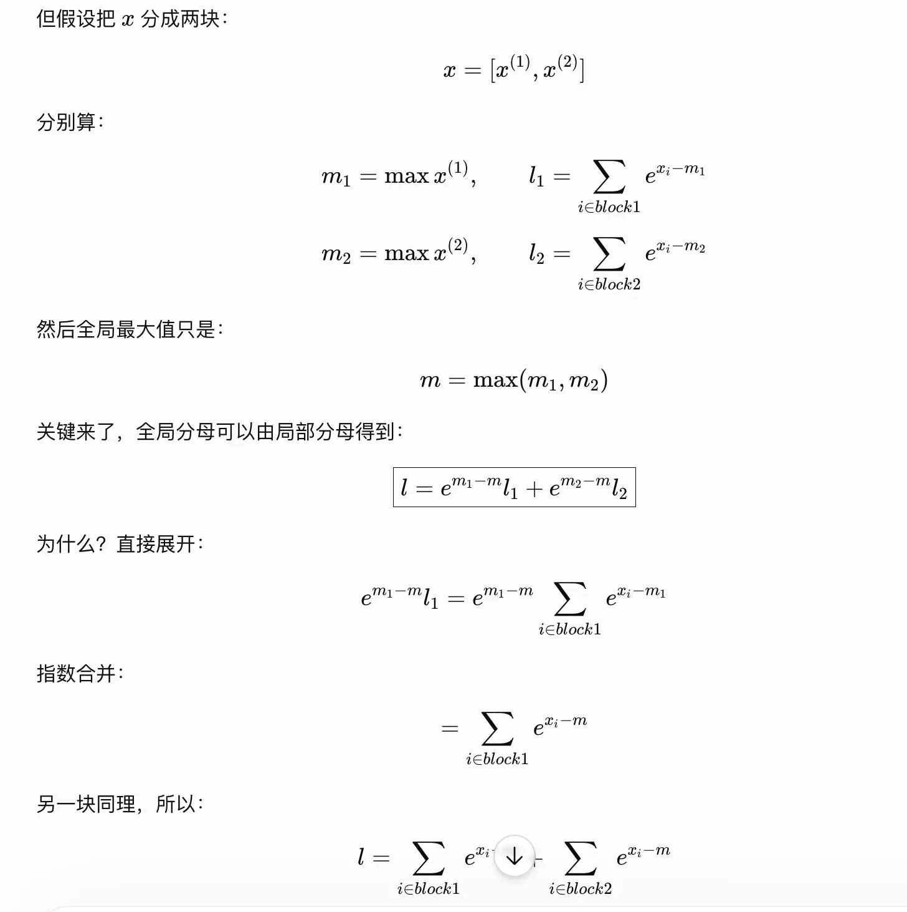
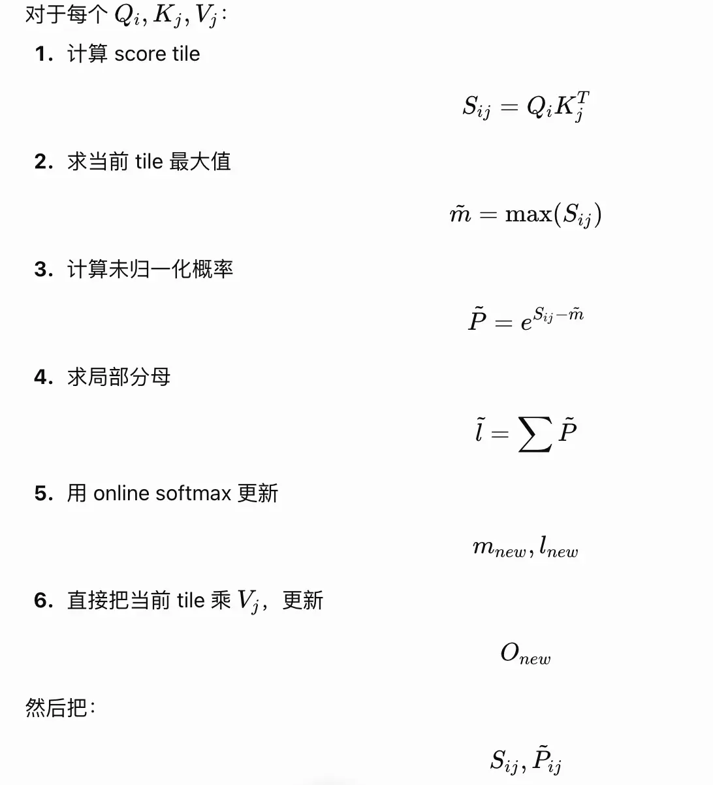
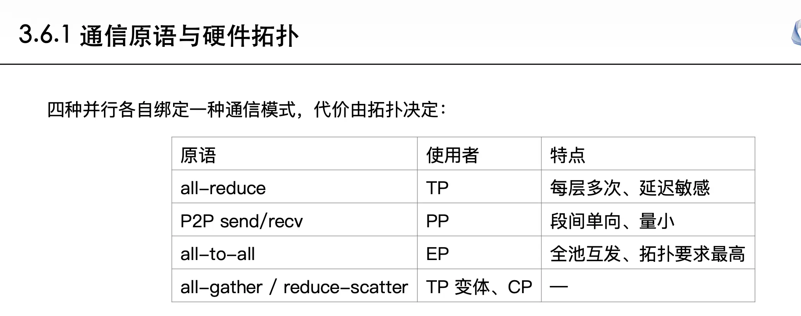

一些名词和关注的问题：
* chunked prefill
* prefix cache
* linear attention、sparse attention
* top-k
* MLA、MQA
* ds推理架构的演进
* 投机解码：draft，verify

从attention到flashAttention

attention的中间步骤是$N*N$ 需要消耗很多存储

如何让softmax能够通过分块计算？
* softmax的分母其实是一个全局的，需要计算所有的元素
* 通过指数的性质，可以先计算局部，再乘上一个因子，变换为全局的分母

f(x)和l(x)都可以通过分块计算得出，所以FlashAttention在计算时通过分块将Q，K，V分块后，按块加载到内存中。

这种softmax也叫做online softmax/safe softmax

FA算法细节：
初识时：O=0（最终答案）；l=0（分母，局部和）；m = -∞（row max）

一个分块的K,V会被所有分块的Q复用

从平方变为线性的

**增大batch**
线性层可以拼接，attention不太好评拼接（独立上下文需要分别计算）

**PD分离**

阅读DistServe、Splitwise的工作

Dynamo

mooncake

长prefill分离，短prefill就地

chunked prefill和pd分离都是为了解决p和d之间调度、争抢资源的问题，但是不同解决方案

**通信原语？**

