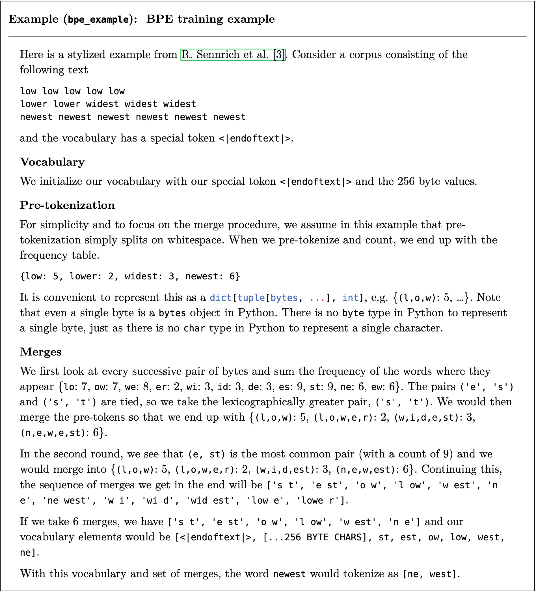

# lab1
直接用unicode不太行，词表太大，有的词也很稀疏。使用unicode encoding，一般使用UTF-8，可以表示大多数
encoding后的每个byte都是0～255，但是一个字可能由多个byte组成

但是这样有个问题，一个word本来只用一个编码就能表示，utf8需要多个这会造成计算、数据依赖更加复杂
折中：subword tokenization，作为二者的tradeoff

比如一个word，“the”，经常出现，assigning it an entry in the vocabulary would reduce this 3-token sequence to a single token.
BPE：a compression algorithm that iteratively replaces (“merges”) the most frequent pair of bytes with a single, new unused index.
把最常使用的bytes块，用一个没用过的词汇表index代替。

词汇表项，要么是byte，要么是合并的字节序列，tradeoff

BPE training的步骤
1. vocabulary initialization：词汇表其实就是，bytestring到id的一一映射。由于utf8有256个可能的字节值，我们的初始词汇表大小为256。
2. pre-tokenization：简单来说bpe就是统计上一步词汇表的各种byte，出现的次数，然后就可以merge
	* 但是这样计算量太大。并且在语料库中直接合并字节可能会导致标记仅在标点符号上有所不同（例如，dog！ vs.dog.）。这些标记将获得完全不同的标记ID，即使它们可能具有高语义相似性（因为它们仅在标点符号上有所不同）。
	* 解决：pre tokenization，可以看做对语料库的粗粒度统计，用一些常见的word，先简单训练一遍BPE，比如“text”，可以把相邻的t，e都增加10次出现的次数。最简单的办法就是以空格分割，每个word粗粒度统计
3. compute BPE merges：最终的词汇表大小是256+ number of merged BPE word
	还有special token需要保留，不能拆分，初始化时即可加入，比如`<|endoftext|>`
	如果多个pair出现的频率都是最高，prefer字典序更大的合并

例子：

一次次迭代，每次merge最高频率的

换句话说，特殊标记在训练期间定义硬分割边界，但它们本身不应该对合并计数做出贡献。

加速，不要每次merge一对，再计算，这样每次改变的其实就只有频率最高的对，其他的都没变，下次迭代重复计算太多。因此，可以通过索引所有对的计数并增量地更新这些计数来提高BPE训练速度，而不是显式地迭代每对字节来计算对频率。类似cache？

试着使用profiling找出程序瓶颈
