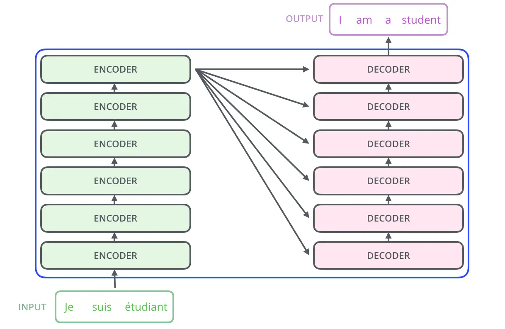
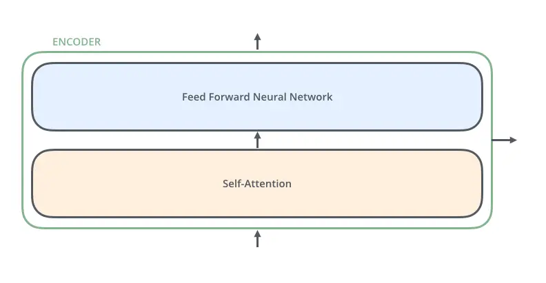
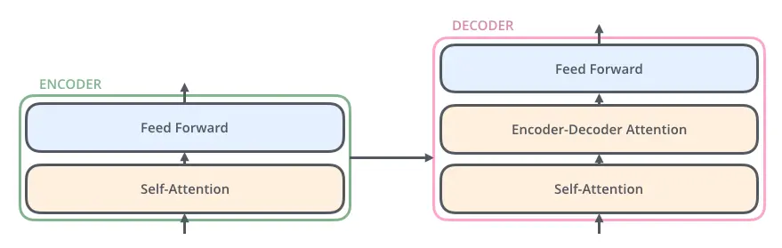
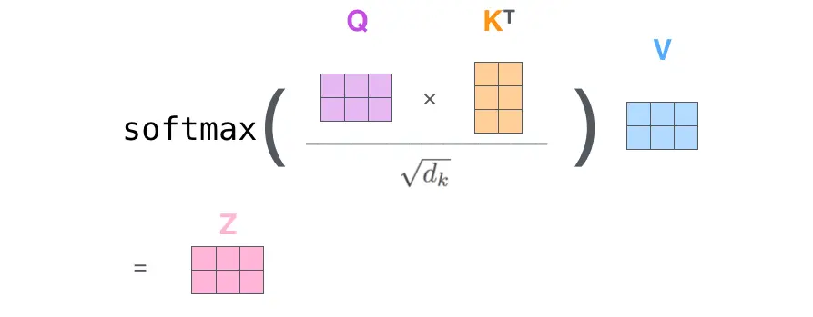
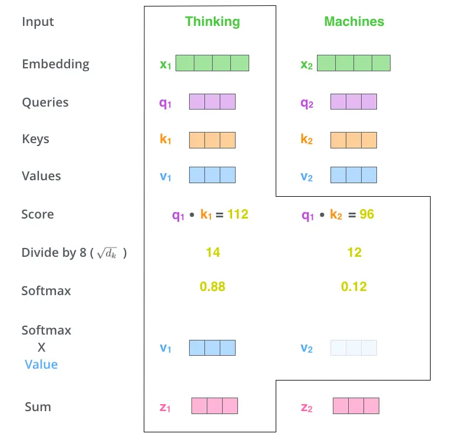
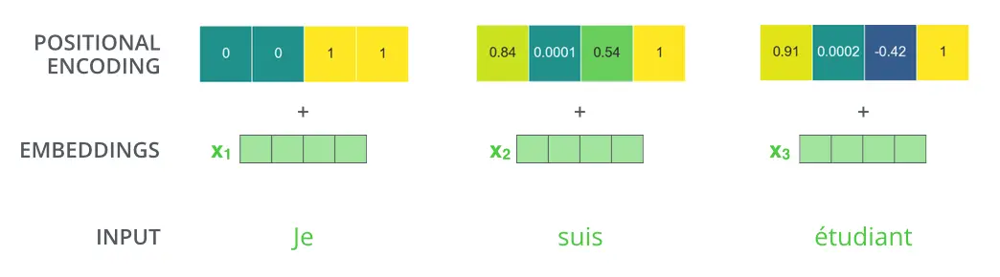
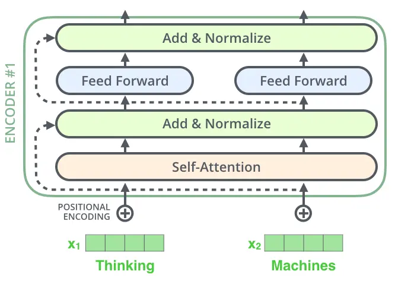
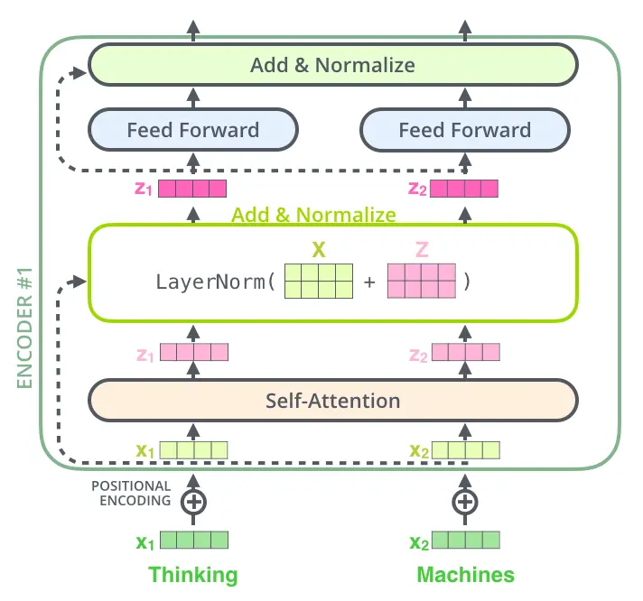
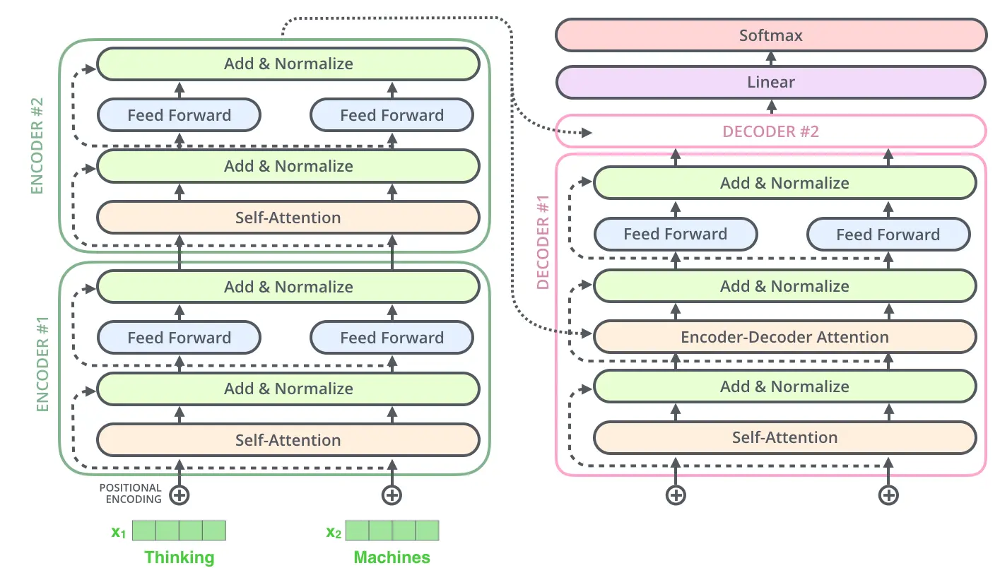
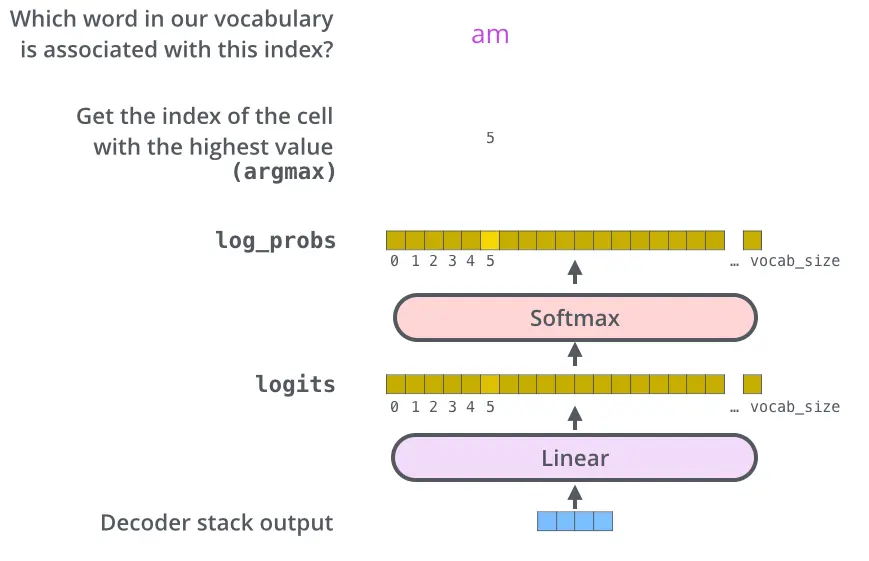

参考资料：https://zhuanlan.zhihu.com/p/219714713

## overview
首先，我们将Transformer看成一个简单的黑盒模型。在机器翻译任务下，将源语言（法语）的一个句子A输入其中，产生一个目标语言（英语）的句子B。

有多少个encoder取决于你的超参数，图中是6个，但是没有什么特殊意义。

所有的encoder结构是一样的，但是不共享权重，每个encoder结构如下

首先经过一个self-attention层（该层可以帮助encoder在对特定单词进行编码时查看输入句子中的其他单词），然后是一个前馈神经网络（feed-forward neural network，ffnn）ffnn主要用于对每个token自身的特征进行变换

decoder的结构类似，但是在self-attention和ffnn之间多了一个attention层：

## encoder
第一个encoder会有embedding层，用于把词转为向量
encoder的self-attention层各个word是有依赖的，不能并行？但是feed forward中各个word是独立的，可以并行

### self-attention
1. 对每一个输入向量计算三个向量，计算方式是与三个不同矩阵乘
	* q：queries
	* k：keys
	* v：values
2. 对某一word进行encoding时，需要计算该单词和其他单词的注意力分数：该单词的 query 点乘**另一单词的 key 矩阵**
3. 将分数除以维度开根
4. 然后softmax
5. 当前计算token的 value 乘 softmax分数，保留关注词的value，削弱非相关词的value
6. 该word相对于每个其他word经过第5步都会有一个结果，需要对对value加权求和形成一个，这也就是encoder的结果
总结为一个公式：

例子：

### 多头注意力
该word与多个word组成的子空间的关系

### position encoding
表示token在句子中的位置，一般是由一个position encoding向量与embedding之后的向量直接相加

### 残差结构
encoder和decoder中的每个子层（Self-Attention，ffnn）在其周围都有残差连接与层归一化（[layer normalization](https://link.zhihu.com/?target=https%3A//arxiv.org/abs/1607.06450)）操作

可视化

这也是用于decoder的子层

## decoder

encoder算出k，v矩阵之后就完成职责了，这些k，v会被decoder每次反复使用

## 最后的线性层和softmax
主要目的是把浮点向量变为一个词
* 线性层是一个简单的完全连接的神经网络，它将解码器堆栈产生的向量投影到一个更大的向量中，称为logits向量。
* softmax层将这些分数转换为概率（全部为正，全部相加为1.0）。 选择具有最高概率的单元，然后该单元对应的单词将作为该时间步的输出。

