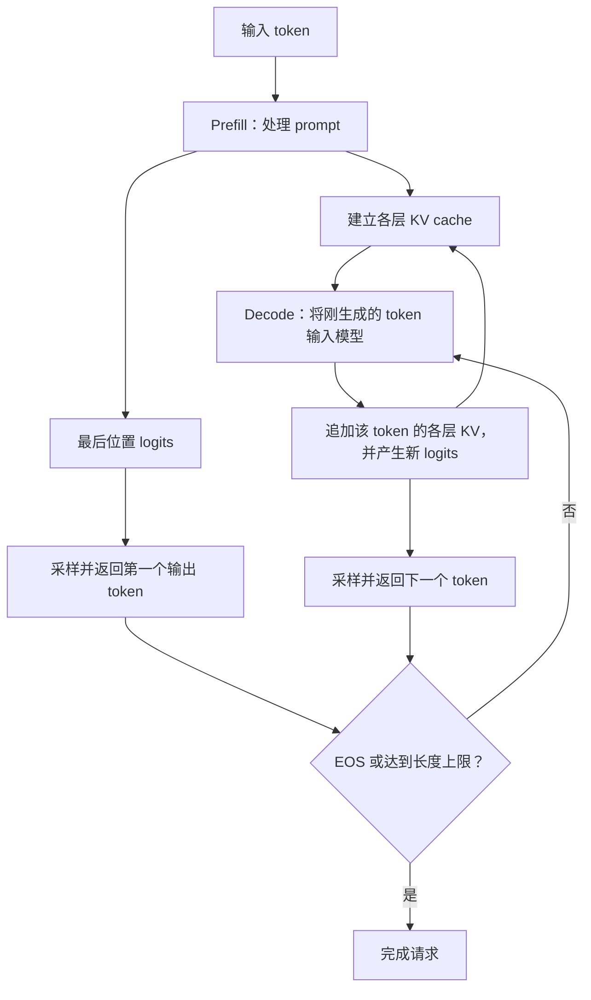
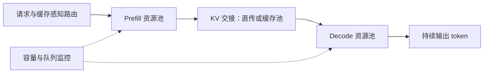

# AI 加速器负载学习

> 调研更新：2026-09-16。以采用 KV cache 的自回归、decoder-only Transformer 推理为主；公式默认稠密线性层和全上下文 attention，特殊模型另行说明。硬件数据标明代际，算例是理论估算，不是实测结果。

## 推理架构/计算特点

推理需要同时优化首 token 延迟、生成速度和服务吞吐。它包含两种形状明显不同的计算：prefill 处理已经知道的输入序列，decode 利用已有 KV cache 逐步处理新 token。两阶段通常执行同一套模型权重，但权重复用程度、状态访问量和调度目标不同。[Transformer 推理参考](https://jax-ml.github.io/scaling-book/inference/)

这里的 token 不等于一个字符；KV cache 保存的是各层的 key/value 张量，不是全部激活，也不是输出 token 的概率表。第一个输出 token 可由 prefill 得到的最后位置 logits 采样；若生成总长度为 $O$，普通流程通常还需 $O-1$ 次 decode 前向计算。

### 应该观察哪些指标

| 指标                         | 含义                         | 对系统设计的影响                   |
| -------------------------- | -------------------------- | -------------------------- |
| TTFT，Time To First Token   | 请求到达至第一个输出 token 返回的时间     | 包含排队、输入处理、prefill、采样及必要的传输 |
| ITL / TBT                  | 相邻输出 token 的时间间隔           | 反映生成是否连续，要关注 P95/P99 卡顿    |
| TPOT，Time Per Output Token | 通常为首 token 之后的平均每 token 耗时 | 不能代表单次间隔的尾延迟               |
| 端到端延迟                      | 请求到达至最后一个输出 token 返回       | 同时受输入和输出长度影响               |
| 吞吐量                        | 每秒完成的请求数或 token 数          | 必须标明输入、输出还是混合 token，以及统计范围 |
| Goodput，有效吞吐量              | 在指定延迟目标内完成的有效工作量           | 比单纯追求最大 tokens/s 更适合交互服务   |
| tokens/J、成本/token          | 能耗和经济效率                    | 要统一模型、质量、延迟约束及功耗统计边界       |

对 $O>1$ 的请求，若 TPOT 按首尾输出时间差取平均：

$$
T_{\mathrm{E2E}}
=
T_{\mathrm{TTFT}}+(O-1)T_{\mathrm{TPOT}}
$$

相同平均 TPOT 可能对应完全不同的卡顿体验，所以还需记录逐 token 间隔分布。DistServe 将 TTFT 和 TPOT 的服务目标一起纳入 goodput 优化。[DistServe](https://arxiv.org/abs/2401.09670)

## Prefill 和 Decode 分析

### Prefill：输入已知，可以在 token 维度并行

对于长度为 $S$ 的 prompt，每层为各位置计算 Q/K/V，执行带因果 mask 的 attention，再经过输出投影和 MLP。各层之间仍然存在依赖，但同层的多个输入位置可以并行处理；因果 mask 不意味着必须像生成一样逐个运行整套模型。

典型工作包括：

1. 对多个 token 执行线性投影，形成较大的矩阵乘法。
2. 计算 prompt 内部的 attention。
3. 将各层 K/V 保存下来，供后续 decode 使用。
4. 计算末尾位置的 logits；普通生成不要求保留所有输入位置的 logits。

### Decode：单请求跨步串行，步内仍可并行

一次普通 decode 前向计算，为每个活跃请求处理一个新 token：

1. 计算该 token 的 Q/K/V。
2. 用新 Q 访问历史 KV，完成 attention。
3. 执行输出投影、MLP 等计算，并追加新 KV。
4. 从新 logits 得到下一个 token。

串行的是同一请求相邻生成步骤之间的依赖。不同请求可以 batch；单步内部仍可以采用张量并行、流水线并行等方式。推测解码还可以一次验证多个候选，但需要考虑接受率和验证开销，不能直接按候选数计算加速比。

### 两阶段的负载对照

| 维度 | Prefill | 普通 Decode |
|---|---|---|
| 本轮新处理 token 数 | 单请求通常为 $S$，也可切成 chunk | 单请求通常为 1 |
| 多请求线性层形状 | 常形成较大的 GEMM | 小 batch 时是 GEMV 或较瘦的 GEMM |
| 权重复用 | 一次加载可服务较多输入 token | 单请求复用少，主要依赖跨请求 batch |
| Attention | 多个 Q 访问 prompt 的 K/V | 每个请求的新 Q 访问自己的历史 KV |
| KV 状态 | 建立 prompt 的 KV | 持续读取已有 KV 并追加 |
| 调度重点 | 尽快完成输入，控制 TTFT | 控制每步延迟和卡顿，维持活跃 batch |

以上为计算模式的归纳。实际实现中的 chunked prefill、前缀缓存和推测解码，会改变一轮到底处理多少个新 token。

## 计算模式与计算强度：如何推导 Prefill 偏计算、Decode 偏访存

### 统一符号，先区分两种 batch

| 符号 | 定义 |
|---|---|
| $B$ | 本模型副本参与当前批次的请求数 |
| $S$ | 每个请求的 prompt 长度，等长时使用 |
| $T$ | Decode 当前可访问的 KV 长度；各请求不同时使用 $T_i$ |
| $M$ | 一次线性层实际共同处理的新 token 数 |
| $K,N$ | 某个线性层的输入、输出维度 |
| $L$ | Transformer 层数 |
| $H_q,H_{kv},d_h$ | Query 头数、KV 头数、每头维度 |
| $s_w,s_a,s_{kv}$ | 权重、激活、KV 每个元素的存储字节数 |
| $C,\beta$ | 对应计算格式的算力 FLOP/s，以及所分析存储层级的带宽 byte/s |

完整、等长 prefill 的 $M=BS$；普通 decode 的 $M=B$。变长 prefill 应计算各请求本轮实际处理的 token 数之和，chunked prefill 只计算当前 chunk。集群总并发数不等于一个模型副本的 $B$，也不等于 MoE 某个专家实际拿到的 token 数。

### Roofline：比较做计算与搬数据所需的时间

令算子工作量为 $F$ FLOPs、穿过指定存储层级的数据量为 $Q$ bytes，则：

$$
I=\frac{F}{Q},
\qquad
I_{\mathrm{crit}}=\frac{C}{\beta}
$$

$$
t\geq\max\left(\frac{F}{C},\frac{Q}{\beta}\right),
\qquad
P_{\mathrm{attainable}}\leq\min(C,\beta I)
$$

当 $I<I_{\mathrm{crit}}$ 时，带宽上限低于算力上限；反之才有机会达到计算上限。这个比较必须固定数据精度和存储层级，不能把 SRAM、HBM 和跨机网络的带宽混用。[Roofline 方法](https://jax-ml.github.io/scaling-book/roofline/)

这里的最大值只是理想下界。实际时间还包括算子启动、流水线气泡、同步、通信及利用率损失；即使 $I>I_{\mathrm{crit}}$，也不保证一定跑满计算单元。

### 从一个线性层自行计数

考虑：

$$
X_{M\times K}W_{K\times N}=Y_{M\times N}
$$

按一次乘加为 2 FLOPs，并假设输入、权重各读一次，输出写一次：

$$
F=2MKN
$$

$$
Q=s_wKN+s_aMK+s_aMN
$$

$$
I=\frac{2MKN}{s_wKN+s_aM(K+N)}
$$

这是理想的数据流量：实际分块可能导致重复读，融合可能减少中间张量写回。若 $M$ 较小、权重读取占主导，可近似为：

$$
I\approx\frac{2M}{s_w}
$$

因此 BF16 权重、$s_w=2$ 时：

$$
I\approx M\ \mathrm{FLOP/byte}
$$

推导的关键是：**更多新 token 共同使用一份权重，可以摊薄每个 token 的权重读取成本。** 同一个线性层，单请求 prefill 可能有几千行输入，单请求 decode 却只有一行。

在这个权重主导近似下：

$$
M_{\mathrm{crit}}\approx\frac{s_wC}{2\beta}
$$

如果保留激活读写项，令 $I=R=C/\beta$，还能得到：

$$
M_{\mathrm{crit}}
=
\frac{R s_wKN}{2KN-Rs_a(K+N)}
$$

只有分母为正，才可能在此理想模型下随 $M$ 增大越过 roofline 拐点。可见“小矩阵只要不断增大 batch 就一定能计算受限”也不成立。

### 数值例子：H100 SXM 上的一个 BF16 线性层

取 H100 SXM 稠密 BF16 Tensor Core 算力约 $989$ TFLOP/s、HBM 带宽 $3.35$ TB/s，因此：

$$
I_{\mathrm{crit}}\approx\frac{989}{3.35}
\approx295\ \mathrm{FLOP/byte}
$$

官方规格中的约 $1,979$ TFLOP/s 带有稀疏性条件，这里按稠密计算使用约一半的值。[NVIDIA H100 规格](https://www.nvidia.com/en-sg/data-center/h100/)

取 $K=N=4096$、权重和激活均为 BF16，代入上面的完整公式：

| $M$ | 示例 | 理想计算强度 FLOP/byte | 算力时间下界 | HBM 时间下界 | 此模型下的主限制 |
|---:|---|---:|---:|---:|---|
| 1 | 单请求 decode | 1.00 | 0.034 μs | 10.02 μs | HBM |
| 32 | 32 请求 decode | 31.51 | 1.09 μs | 10.17 μs | HBM |
| 256 | 256 请求 decode 或小 prefill chunk | 227.56 | 8.69 μs | 11.27 μs | HBM |
| 512 | 更大的 token batch | 409.60 | 17.37 μs | 12.52 μs | 计算 |
| 4096 | 单请求 4096-token prefill | 1365.33 | 138.97 μs | 30.05 μs | 计算 |

这是本文按上述假设计算的单算子示例，不是 H100 benchmark，也不包含 attention。完整公式的临界 $M$ 约为 345，而“295 token”是忽略激活流量的近似值。

由此可以解释：**长 prefill 容易形成足够大的 $M$；低 batch decode 很难摊薄权重流量。** 但大 batch decode 的线性层也可能计算受限，短 prompt、小 chunk 的 prefill 也可能访存受限。

量化同样要重新计算：降低 $s_w$ 可以减少字节数；若计算格式变化让 $C$ 同时增大，临界 batch 未必同比下降。权重低位存储与低位计算是两个不同条件。

### Attention 要单独分析：权重共享不等于 KV 共享

上述 GEMM 分析覆盖 MLP 和 Q/K/V/O 投影，不足以描述 attention 的 QK 与 AV 两次乘法。它们的矩阵形状和 GQA 头数关系可参考 [Transformer 数学](https://jax-ml.github.io/scaling-book/transformers/)；以下按张量元素数推导。

**Decode attention。** 单层、一个请求、一个新 query，KV 长度为 $T$。忽略 softmax 等较低阶运算：

$$
F_{\mathrm{attn,decode}}\approx4TH_qd_h
$$

若 K/V 每个元素只读取一次：

$$
Q_{\mathrm{KV,decode}}\approx2TH_{kv}d_hs_{kv}
$$

故理想强度：

$$
I_{\mathrm{attn,decode}}
\approx
\frac{2H_q}{H_{kv}s_{kv}}
$$

采用 BF16 KV 时，MHA 的 $H_q=H_{kv}$，得到约 1 FLOP/byte；若 GQA 的 $H_q/H_{kv}=4$，则理想值约为 4 FLOP/byte。后一估算要求 kernel 能在同组 query 头间复用 KV，重复加载会降低强度。GQA 通过减少 KV 头数降低缓存需求。[GQA 论文](https://arxiv.org/abs/2305.13245)

对互不共享前缀的 $B$ 个请求，计算量和 KV 读取量都大致乘以 $B$，比例基本不变。**增大 batch 能摊薄共享权重，却通常不能摊薄每个请求自己的历史 KV。** 长上下文会放大 KV 总流量和每步耗时；不一定提高这个算子的计算强度。

**Prefill attention。** 单请求、长度 $S$、从空 KV 开始，若利用因果三角结构跳过无效计算：

$$
F_{\mathrm{attn,prefill}}
\approx 2H_qd_hS(S+1)
=O(S^2H_qd_h)
$$

这里每个 K/V 可被多个 query 使用，存在更多复用机会。但真实 HBM 流量由分块和片上容量决定，不能把每个 K/V 只读一次当作无条件成立的事实。FlashAttention 通过分块和在线 softmax 避免将完整 $S\times S$ attention 矩阵写入 HBM；它减少 IO，不改变稠密精确 attention 的二次计算复杂度。[FlashAttention](https://arxiv.org/abs/2205.14135)

### Batch 为什么不能无限增大

标准 MHA/GQA、各层头数相同、未压缩且不共享前缀时，一个请求的 KV 容量为：

$$
K_{\mathrm{request}}(T)
=
2LT H_{kv}d_hs_{kv}
$$

$B$ 个等长请求的 KV 占用为 $B K_{\mathrm{request}}$。因此模型副本可用内存 $M_{\mathrm{mem}}$ 必须满足：

$$
W_{\mathrm{bytes}}
+
B K_{\mathrm{request}}
+
M_{\mathrm{workspace}}
\leq M_{\mathrm{mem}}
$$

以一个假设的 32 层、8 个 KV 头、每头 128 维、BF16 KV 模型为例：

$$
K_{\mathrm{per\ token}}
=
2\times32\times8\times128\times2
=131072\ \mathrm{bytes}
=128\ \mathrm{KiB}
$$

单请求 8192-token KV 占 1 GiB，32 个请求就占 32 GiB，尚未计权重和工作区。这只是 MHA/GQA 容量算例，不能直接套给 MLA、滑动窗口或混合 attention 模型。

对低 batch、每步近似完整读取一次稠密权重和历史 KV 的情形，还可写出乐观带宽下界：

$$
t_{\mathrm{step}}
\gtrsim
\frac{W_{\mathrm{bytes}}+\sum_{i=1}^{B}K_{\mathrm{request}}(T_i)}
{\beta}
$$

普通 decode 每步产生约 $B$ 个输出 token，因此：

$$
\mathrm{throughput}\approx\frac{B}{t_{\mathrm{step}}}
$$

增大 $B$ 起初能摊薄权重成本；随后 KV、算力和内存容量逐渐限制收益。等待凑 batch 还会增加排队时间，每步 batch 变大也可能提高 TPOT。连续批处理可以及时填补已完成请求留下的空位，但不能消除这些约束。

此外，MoE 应分别考察各专家的实际 token 数和被访问的专家权重，不能把全部参数都代入稠密模型；多卡模型还可能受 all-reduce、all-to-all 或流水线气泡限制。**“计算密集/访存密集”是特定算子、形状、精度、存储层级和硬件共同决定的结果。**

## WSE 为什么不适合 Prefill，为什么很多推理芯片只做 Decode

### 先修正前提：WSE 可以执行 Prefill

Cerebras 的 Hot Chips 2024 报告第 58–62 页展示了 prompt 处理：已知的输入 token 可以占用同一流水级及多个流水级，实现并行。它直接说明 WSE 的设计包含 prefill 执行能力。[Cerebras Hot Chips 2024，第 58–62 页](https://hc2024.hotchips.org/assets/program/conference/day2/72_HC2024.Cerebras.Sean.v03.final.pdf#page=58)

所以更准确的问题是：

> 在什么工作负载和系统配置下，把 prefill 交给其他加速器、让 WSE 专注 decode，能够获得更好的延迟、吞吐或成本？

### SRAM 驻留为什么对低 batch Decode 有吸引力

WSE-3 的公开规格为约 44 GB 分布式片上 SRAM、21 PB/s 聚合内存带宽。[WSE-3 规格，Hot Chips 2024 第 3 页](https://hc2024.hotchips.org/assets/program/conference/day2/72_HC2024.Cerebras.Sean.v03.final.pdf#page=3)

结合前面的模型，可以作出以下架构推断：

- 如果权重能分布驻留在计算附近，反复执行低 batch decode 时，可减少对外部内存搬运权重的依赖。
- 低延迟路径不必完全依靠增加跨请求 batch 来摊薄外部权重流量，更有利于单用户生成速度。
- Prefill 的权重复用本来就较高，单纯继续提高内存带宽的边际收益可能变小；此时要比较矩阵计算效率、容量、功率和价格。

21 PB/s 是聚合的本地存储带宽，不能当作任意核心可访问全部 SRAM 的统一带宽，更不能直接除以 GPU 的 HBM 带宽就得到模型加速比。布局、片上通信、流水线和容量仍然限制可实现性能。

例如，一个假设的 70B 稠密模型，仅 BF16 权重就约 140 GB，超过一片 WSE-3 的 44 GB；即使权重量化能减小占用，也要为 KV、激活及运行时留空间。这说明需要讨论模型在多片上的分布和精度，不能假定整模型天然落在单片 SRAM 中。

### 为什么异构 PD 方案可能选择 WSE 做 Decode

Cerebras 给定博客介绍了异构分工：计算型设备负责 prefill，高带宽设备负责 decode。[用户提供的 Cerebras 博客](https://www.cerebras.ai/blog/disaggregated-inference)

AWS 在 2026-03-13 的官方公告中给出的具体架构是 **Trainium 承担 prefill、CS-3 承担 decode，通过 EFA 互联**。公告中的容量、速度收益带有前瞻性描述，应与正式实测区分。[AWS 与 Cerebras 联合方案](https://press.aboutamazon.com/aws/2026/3/aws-and-cerebras-collaboration-aims-to-set-a-new-standard-for-ai-inference-speed-and-performance-in-the-cloud)

从资源分配角度看，把一台设备用于 prefill，就暂时减少了它可提供的 decode 服务能力。即使 WSE 能做 prefill，若其他设备处理输入更经济、KV 搬运成本又能接受，分工仍可能划算。这个解释是基于负载特点的推断，不能替代同模型、同精度、同延迟目标下的实测成本对比。

### “只做 Decode”要区分能力、定位与部署角色

| 说法              | 实际需要核对什么                  |
| --------------- | ------------------------- |
| 芯片不能做 prefill   | 是否缺少必要算子、容量或软件支持          |
| 芯片主要优化 decode   | 是否偏向低 batch 的带宽、通信延迟与状态驻留 |
| 某部署只让芯片跑 decode | 可能只是为了更好的系统资源分配           |
| 产品宣传生成速度        | 是否同时公开 TTFT、输入长度、并发和端到端吞吐 |

部分产品选择主攻 decode，合理动机包括低计算强度下的性能差异、长输出对逐步延迟的累积放大，以及 agent 多轮调用对响应速度的需求。但不能从几个案例推断整个推理芯片市场“只能做 decode”。

以 $O=1000$ 为例，每个后续 token 节省 1 ms，端到端约可减少 999 ms；若只输出 10 个 token，同样优化仅节省约 9 ms。因此 decode 专用化的价值与输出长度密切相关，长输入、短输出业务可能更应优先优化 prefill。

## PD 分离的几种形态，其好处、坏处

### 先明确：分离的是什么

本文把 PD 分离定义为：**同一请求的 prefill 和后续 decode 由不同执行实例或资源集合承接，并交接必要状态。**

交接对象主要包括各层 prompt KV、已生成 token 或必要的 logits/隐藏状态、位置及请求元数据。权重通常已预加载在两边，不是每个请求都迁移整套模型。两边必须使用兼容的模型、KV 表示和位置编码；TP/PP 布局不同还可能需要重分片。

### 形态不是互斥分类，而是几个可以组合的维度

| 形态 / 维度 | 典型安排 | 好处 | 主要代价 |
|---|---|---|---|
| 进程或队列逻辑分离 | 独立调度，但可能仍共享一张卡 | 便于策略独立实现 | 不自动获得算力、HBM 或尾延迟隔离 |
| 同机不同 GPU / 同一高速互联域 | P、D 使用不同设备，经本机高速链路交接 | 控制传输路径，物理隔离部分计算资源 | 占用独立模型副本，受设备数量与拓扑限制 |
| 跨机同构资源池 | 同型号 GPU 分成 P 池与 D 池 | batch、TP/PP 和实例数可分别配置 | KV 网络流量、额外排队及资源配比失衡 |
| 异构资源池 | GPU/Trainium 做 P，另一类芯片做 D | 针对两阶段匹配算力、带宽和能耗 | 数值与缓存格式兼容、多软件栈及设备能力不对称 |
| PD 分离叠加独立 KV 缓存池 | 缓存位于独立 DRAM/SSD 等资源中 | 跨实例前缀复用、容量扩展、缓存感知路由 | 远程读取和缓存管理可能成为新瓶颈 |
| 动态分离 / 混合池 | 专用 P、D 池加可调节的混合池 | 应对输入输出比例变化，减少闲置 | 扩缩容、请求迁移和延迟隔离更复杂 |

对应的公开设计包括：

- **DistServe**：将两阶段分开，分别选择资源和并行策略，并考虑集群带宽约束。[论文](https://arxiv.org/abs/2401.09670)
- **Splitwise**：研究同构、异构机器的阶段分工；在专用池之外增加可随负载调整的混合池。[作者说明](https://www.microsoft.com/en-us/research/blog/splitwise-improves-gpu-usage-by-splitting-llm-inference-phases/)
- **Mooncake**：将 PD 分离与独立 KV 缓存、缓存感知调度结合，利用 CPU DRAM/SSD 等资源，并采用按层流式传输来隐藏部分交接延迟。[论文](https://arxiv.org/abs/2407.00079)

Chunked prefill 本身不是 PD 分离；它只说明输入被切块。PD 分离也不等于 attention/FFN 分离：后者在每层内部交接激活，通信频率和临界路径不同。

### 好处：隔离干扰，并允许各阶段独立优化

一个长 prefill 若长时间占用设备，会延迟其他请求的 decode。物理分离可以减少这种直接竞争，使 P 池更关注输入处理效率，D 池更关注稳定生成。

两边还可以选择不同的 token batch、并行策略和实例数。例如 P 池优先形成大矩阵，D 池根据 KV 容量和 TPOT 限制活跃请求数。vLLM 的说明把独立调节 TTFT/ITL、控制尾部 ITL 作为主要动机。[vLLM：Disaggregated Prefilling](https://docs.vllm.ai/en/latest/features/disagg_prefill/)

分离不保证原始吞吐量一定提高。它可能在总 tokens/s 变化不大时，通过减少超时和卡顿，提高满足 SLO 的 goodput；也可能因额外传输而降低吞吐，必须说明比较口径。

### 坏处一：KV 交接可能进入临界路径

若完整传输一个请求的 KV，先按未压缩、无复用估算：

$$
t_{\mathrm{transfer}}
\geq
\frac{K_{\mathrm{request}}(S)}
{\beta_{\mathrm{net,eff}}}
$$

沿用上面的 1 GiB KV 算例：

| 理想链路速率 | 换算成字节带宽 | 传 1 GiB 的理想时间 |
|---:|---:|---:|
| 100 Gbit/s | 12.5 GB/s | 85.9 ms |
| 200 Gbit/s | 25 GB/s | 42.9 ms |
| 400 Gbit/s | 50 GB/s | 21.5 ms |

Gbit/s 与 GB/s 相差 8 倍；这里链路带宽采用十进制，KV 容量采用二进制 GiB。表格只计算一个请求独占链路的序列化时间，不包含协议、争用、源端读出、目的端写入和布局转换。多链路、缓存复用及压缩会改变传输量或可用带宽。

还应区分：

- 若 P 端先返回第一个 token，再迁移 KV，传输可能主要表现为第一个与第二个 token 之间的停顿。
- 若等 D 端准备好才返回输出，传输可能进入 TTFT。
- 若 KV 随各层计算流式发送，部分传输可与 prefill 重叠，临界路径只留下未隐藏的部分。

因此不能一律把完整 KV 传输时间加到 TTFT，也不能因为做了重叠就宣称传输没有成本。

### 坏处二：固定资源比例可能跟不上流量变化

假设请求到达率为 $\lambda$，每个请求平均需要的 P、D 设备时间分别为 $w_P,w_D$，资源数为 $n_P,n_D$。在简单平均负载模型下：

$$
\rho_P\approx\frac{\lambda w_P}{n_P},
\qquad
\rho_D\approx\frac{\lambda w_D}{n_D}
$$

两边都需要保留余量，才能控制排队。$w_P,w_D$ 必须来自相应 batch、并行配置下的有效服务时间，不能直接用输入/输出 token 数代替。

例如同构集群原先有 4 个 P 实例、4 个 D 实例，输入突然变长而输出变短：P 端可能排队，D 端却闲置。动态混合池能借用空闲能力，但切换角色可能涉及排空请求、迁移 KV 和重新配置。异构设备若缺少另一阶段的有效执行能力，调节空间更小。

此外，分离通常要求两边各持有可执行的权重副本。相对单副本共置方案，这会增加最低部署规模和容量成本；但相对本来就拥有很多副本的集群，不能简单说权重占用必然翻倍。

### 一个端到端收益判据

令共置为 C、分离为 D，$q$ 表示队列等待，$p$ 表示 prefill 时间，$d$ 表示平均 decode 步耗时，$x$ 表示未被重叠隐藏的交接开销。粗略写成：

$$
T_C\approx q_C+p_C+(O-1)d_C
$$

$$
T_D\approx q_P+p_D+x+q_D+(O-1)d_D
$$

分离降低端到端延迟的条件约为：

$$
(p_C-p_D)+(O-1)(d_C-d_D)
>
x+(q_P+q_D-q_C)
$$

这是本文用于理解取舍的简化模型，不是完整排队模型。若其他项相同，交接增加 21.5 ms、每步 decode 节省 1 ms，则约需 22 个后续生成步骤才摊平交接成本。不过尾部 ITL、TTFT 或能耗可能仍有不同表现，不能仅凭这个不等式选系统。

## 不做 PD 分离的代表：OpenAI Jalapeño，好处和坏处

### 公开资料到底证明了什么

用户给出的 [SemiAnalysis：OpenAI Jalapeño: Better Than Nvidia Blackwell](https://newsletter.semianalysis.com/p/openai-jalapeno-better-than-nvidia) 发布于 2026-08-25。其实验室访问报道明确称，展示的 Jalapeño 测试没有采用 prefill–decode 分离，也没有采用推测解码。报道同时说明，数据由 OpenAI 提供，作者现场核验了部分运行，没有独立跑完整测试套件。

OpenAI 同日的 [Jalapeño 官方说明](https://openai.com/index/jalapeno-first-results/) 强调：显式放置并保持 KV 状态的局部性，在一个互联系统内完成工作，并让相同架构适应 prefill/decode 比例变化。

据此，可以将 **Jalapeño 当时展示的统一推理方案**作为案例。证据不支持把它扩展为“OpenAI 所有线上服务都不做 PD 分离”，也不支持把统一互联系统理解为所有模型只需一颗芯片。该官方说明还将开始部署的时间写为 2026 年底，不能把早期测试等同于已经大规模上线。

### 从统一部署方式可以推导出的好处

以下是由前文成本模型得到的一般分析，不是对未公开 Jalapeño 调度器的描述。

| 好处 | 作用机制 | 条件与边界 |
|---|---|---|
| 减少阶段间 KV 迁移 | 请求在同一执行系统中延续，减少交接与同步 | 张量并行等内部通信仍存在 |
| 资源用途更灵活 | 不必长期固定设备只能接 P 或 D | 实际调度仍受活跃 KV、模型副本与拓扑约束 |
| 更容易应对低流量或突发流量 | 可用设备不受两池固定配比限制 | 极重 prefill 仍可能影响正在生成的请求 |
| 保持多轮请求的状态局部性 | 复用历史 KV 时可减少远程拉取 | 依赖请求路由和缓存是否仍驻留 |
| 简化跨阶段系统协同 | 少一套交接协议、路由与独立扩容逻辑 | 高性能共置调度本身仍然复杂 |

统一部署的硬件设计目标，是在一套系统中提供足够均衡的计算、存储和通信资源。软件则要把这种能力转化为真实的请求效率，不能只看单个算子的峰值。

### 坏处：干扰仍要解决，阶段配置也更耦合

1. **Prefill 可能拖慢 decode。** 若输入不分块，一次长 prompt 计算可能拉长正在生成请求的 token 间隔。
2. **两个阶段难以完全独立选择硬件和并行布局。** 同一权重布局未必同时适合大矩阵 prefill 与低 batch decode。
3. **共享容量也会形成竞争。** 长 prefill 的临时工作区和大量活跃 decode KV 都会挤占内存。
4. **调度存在明确取舍。** 给输入更多时间可改善 TTFT，却可能增加生成间隔；严格优先 decode 又可能让新请求持续等待。

Jalapeño 的公开结果并没有提供“同一硬件、同一软件、仅切换是否分离”的完整对照。因此它能作为一种设计选择的实例，不能单凭跨芯片性能差异证明“不分离必然更快”。

### 不分离如何缓解干扰：Chunked Prefill 与混合批处理

SARATHI 将长 prompt 切成 chunk，再把 chunk 与其他请求的 decode token 组合成批次。这样既限制一次 prefill 的持续时间，又能让线性层处理更多 token，提高权重复用。[SARATHI](https://arxiv.org/abs/2308.16369)

例如某轮有 32 个 decode token，另外加入 256 个 prefill token，则共享线性层可以按 $M=288$ 处理，而不是分别运行 $M=32$ 和 $M=256$。Attention 仍需按各自序列和 mask 正确计算，不能把请求当成一条序列。

Chunk 太大时会拉长 decode 间隔，太小时会降低 prefill 效率并增加调度次数。vLLM 的优化文档说明了先安排 decode、再用剩余 token 预算容纳 prefill 的策略。[vLLM：Chunked Prefill](https://docs.vllm.ai/en/latest/configuration/optimization/#chunked-prefill)

这些是可公开核对的共置优化方法；现有材料不足以确认 Jalapeño 使用了完全相同的实现。

## 如何用这些结论评估一个实际推理系统

比较 PD 分离与共置时，应固定模型与质量要求、总硬件或功率预算，并让两种方案各自调优。共置基线至少应包含合理的连续批处理和 chunked prefill，避免用简单串行调度代表整个路线。

建议按以下顺序记录：

1. **负载分布**：输入/输出长度、到达率、突发程度、前缀缓存命中率和多轮请求比例。
2. **算子形状**：每个副本的 $B$、线性层的 $M$、上下文长度、MoE 专家负载和精度。
3. **资源成本**：权重与 KV 容量、HBM/SRAM 实际流量、KV 网络传输量、并行通信及空闲设备比例。
4. **用户指标**：TTFT、逐 token ITL、端到端延迟的 P50/P95/P99，以及满足相同 SLO 的 goodput。
5. **效率边界**：在相同延迟目标下比较成本/token 和 tokens/J；整机、芯片 TDP 与实际墙上功耗不能混为一谈。

| 观察到的情况 | 优先验证的方向 |
|---|---|
| 长 prefill 造成明显生成卡顿 | 先调 chunk 和 token 预算，再比较物理 PD 隔离 |
| 流量规模大、两阶段资源需求稳定 | 分别优化 P/D 池配置，测试分离后的 goodput |
| 低并发、输入输出比例变化大 | 检查共置或动态混合池能否减少闲置 |
| 输出很长且 TPOT 是主要瓶颈 | 测试 decode 专用设备能否摊平 KV 交接成本 |
| KV 传输已接近 TTFT/ITL 预算 | 优先减少传输、提高局部性或增加有效互联带宽 |
| 前缀复用率高 | 同时优化缓存命中和缓存位置，避免只省计算却增加远程读 |

以上是根据推导形成的验证顺序，不是已经测得的产品排名。原文五个问题最终关联到同一组变量：**每次处理多少新 token、重复搬运多少权重与 KV、数据经过哪一级存储，以及服务允许等待多久。**

## 参考资料索引

原始提示中的五篇资料均保留；正文链接指向支持相应论点的位置。

| 资料                                                                                                                                                                          | 本文用途                         |
| --------------------------------------------------------------------------------------------------------------------------------------------------------------------------- | ---------------------------- |
| [How To Scale Your Model：Roofline](https://jax-ml.github.io/scaling-book/roofline/)                                                                                         | 计算强度、带宽与算力的比较方法              |
| [How To Scale Your Model：Transformers](https://jax-ml.github.io/scaling-book/transformers/)                                                                                 | 算子形状、FLOPs 与 attention 计数    |
| [How To Scale Your Model：Inference](https://jax-ml.github.io/scaling-book/inference/)                                                                                       | 两阶段流程、缓存及 batch 概念           |
| [Cerebras：The GPU Is Being Split in Half](https://www.cerebras.ai/blog/disaggregated-inference)                                                                             | 厂商对异构 PD 的解释；宣传性收益需独立验证      |
| [SemiAnalysis：OpenAI Jalapeño](https://newsletter.semianalysis.com/p/openai-jalapeno-better-than-nvidia)                                                                    | 对当时无 PD 分离测试的实验室访问报道，注意其核验范围 |
| [Cerebras Hot Chips 2024](https://hc2024.hotchips.org/assets/program/conference/day2/72_HC2024.Cerebras.Sean.v03.final.pdf)                                                 | WSE-3 规格及 prompt 并行处理的一手证据   |
| [AWS / Cerebras 公告](https://press.aboutamazon.com/aws/2026/3/aws-and-cerebras-collaboration-aims-to-set-a-new-standard-for-ai-inference-speed-and-performance-in-the-cloud) | Trainium + CS-3 阶段分工         |
| [OpenAI：Jalapeño 首批结果](https://openai.com/index/jalapeno-first-results/)                                                                                                    | 官方的状态局部性、统一架构与部署阶段说明         |
| [DistServe，OSDI 2024](https://arxiv.org/abs/2401.09670)                                                                                                                     | PD 分离与 goodput               |
| [Splitwise，ISCA 2024](https://www.microsoft.com/en-us/research/publication/splitwise-efficient-generative-llm-inference-using-phase-splitting/)                             | 同构/异构分工及动态资源池                |
| [Mooncake](https://arxiv.org/abs/2407.00079)                                                                                                                                | KV 中心架构、缓存调度及流式交接            |
| [SARATHI](https://arxiv.org/abs/2308.16369)                                                                                                                                 | Chunked prefill 与混合批处理       |
| [FlashAttention](https://arxiv.org/abs/2205.14135)、[GQA](https://arxiv.org/abs/2305.13245)                                                                                  | Attention 的 IO 优化与 KV 头共享    |
| [vLLM 分离式 prefill](https://docs.vllm.ai/en/latest/features/disagg_prefill/)、[调优文档](https://docs.vllm.ai/en/latest/configuration/optimization/)                              | 实际引擎的分离与共置策略；滚动文档内容可能随版本变化   |
