# cache介绍

当我们谈论 CPU/GPU 时，我们脑子里想的是它是‘计算的大脑’，在做加减乘除。

但如果我们看它的物理版图（Floorplan），会发现一个惊人的事实：真正的计算单元（ALU/Core）只占了很小一部分面积（往往不到 30%）。

“剩下的大片‘昂贵的硅片地皮’都被什么占据了？是 SRAM，是 Cache。”

**引出问题**：为什么工程师宁愿牺牲塞入更多计算核心的机会，也要塞入这么多 Cache？


以AMD锐龙5000系列，用于游戏或者高生产力要求任务，8核16线程

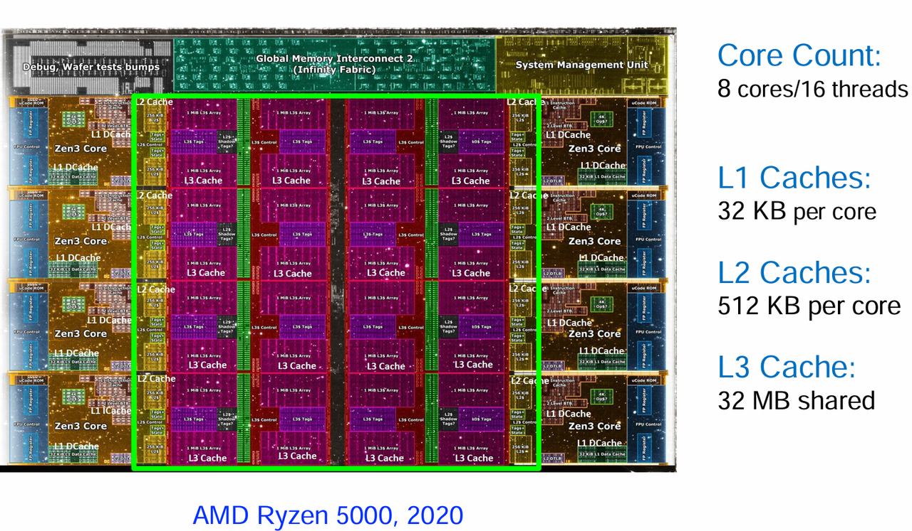


- 可以看到cache，几乎占据了2/3的芯片面积


为什么会这样呢，就是因为Computation is Bottlenecked by Memory

- 内存的发展速度远比不上处理器核心的发展速度

- 随着AI的发展，许多workload都是数据密集型

- 系统60%以上的功耗都花在了数据移动，对于Ml模型来说，更是达到90%以上

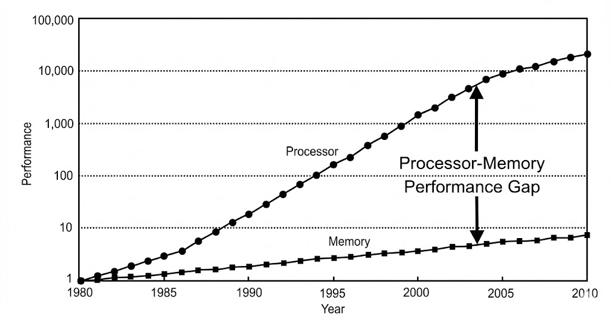


现在的内存基本上如下：

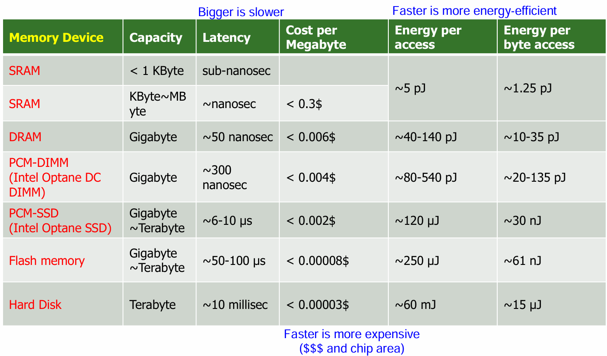

- 内存容量越大，速度越慢，这是由晶体管特性决定的

- 内存速度越快就越贵

- 带宽越大越贵


一般情况，我们可以认为离CPU越近，越小的存储器，其访问延迟越小。那么最理想的情况我们把所有的存储器都放到cpu旁边不就行了吗，但是由于物理限制，一方面存储器越大访问越慢，另一方面cpu旁边只能放那么多东西，再多也放不下了。所以最终我们只能保留一个**小而快、最重要的数据存储器**供CPU高速读写，这就是cache

有了cache之后，CPU的内存操作就可以简化，先访问cache，如果需要的数据在里面，那么就直接取出而不去访问内存；如果数据不在cache里面，那么还是需要访问内存，同时把这块数据搬到cache里面，下一次再访问这个数据就不用访问内存了


以此类推，如果这个cache还是不够用，那么我再添加一块稍大一点，稍慢一点的存储部件，作为cache的cache\.\.\.

那么通过这种分层，就形成了现代处理器的内存层次

**Memory Hierarchy（内存层次）**

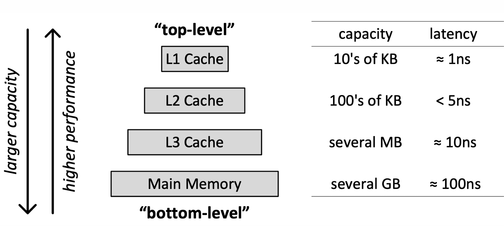


“现在我们有了这些 Cache（L1/L2/L3），接下来的工程挑战是：**当 CPU 想要找一个地址的数据时，它怎么知道这个数据在不在 Cache 里？如果在，它在 Cache 的哪个位置？**”


那么如何确定cache里面存哪些数据，CPU会高频地访问哪些数据，这就是cache优化的一个方向了

- 时间局部性 \- 访问一个存储单元后, 短时间内可能再次访问它（比如循环）

- 空间局部性 \- 访问一个存储单元后, 短时间内可能访问它的相邻存储单元（如数组）


cache的内部结构：cache说到底还是一个存储部件，通过输入的地址索引到数据，不过其容量很小，不可能容纳所有的地址，因此部分地址会索引到同一个数据，引发cache冲突

1. cache如何通过地址找到数据

2. cache如何解决冲突


如何找到数据？

cache的组织形式分为直接映射（一个地址，cache中只有一个地方可以容纳他）、组相联（一个地址，cache中有一组地方可以容纳他）、全相联（一个地址，cache中任何地方都可以容纳他）

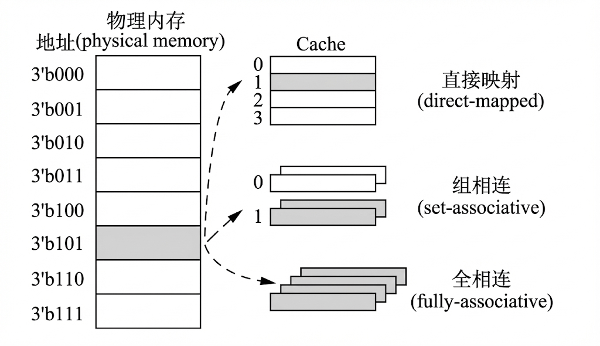

cache把一个地址分成三个部分：

- Index：用于第一步查找，索引到一个cache set

- tag：在cache set里比较tag，找出真正相等的那一个cacheline

- offset：一个cacheline通常是64Bytes，offset找出具体需要哪些byte

只有index和tag都相同才说明找到了，这个也很显然，比如对于一个32位地址，假设offset是低4位，对应16进制最低位，如下几个都对应一个cache中的数据块

```C++
0x12345670
0x12345671
0x1234567a
```


1. 直接映射：只比较一次tag

2. 组相联：需要比较多次tag，具体多少次取决于分成多少组（相联度）

3. 全相联：不需要index，逐个比较tag


如下是一个 4\-way 组相联的cache

可以引出cache的一些概念

1. Cache set：一组cache blk

2. Cache way：set中的编号，way 0，way 1\.\.\.

3. Cache line：访问cache的数据块大小，一次访问都是一个cacheline，一般为64Bytes

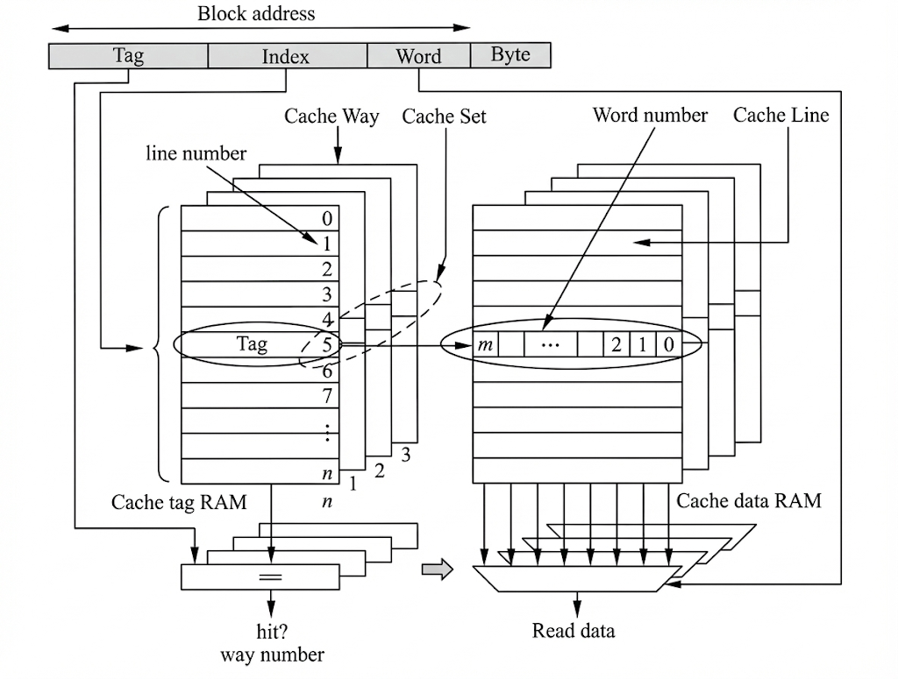

对路的访问可以分为并行访问与串行访问

- 并行访问：同时访问tag和data，一旦tag比对成功直接出数据

- 串行访问：先访问tag，比对成功后再读出数据


以上就是cache的基本结构了，在此基础上，为了提升cache性能，从多个角度进行了优化

AMAT（Average Memory Access Time）公式：AMAT=HitTime \+ MissRate \* MissPenalty，很显然为了让平均访存时间变短，可以从几个方面优化

1. 降低miss率

    1. 更多相联度

    2. 替换策略：如LRU（利用时间局部性）、FIFO

        - 现代处理器往往采用很简单的替换策略甚至随机替换，而不是一些前沿的替换算法，即使是LRU也会引入巨大的开销，带来的收益不大，远远不如直接增大cache容量效果好

    3. 硬件预取：如stridePrefecther

    4. Victim cache、hasing、 pseudo\-associativity、skewed associativity

2. 降低missPenalty

    1. 非阻塞缓存：MSHR

3. 降低hitTime

    1. 并行访问tag和data

    2. 路预测

4. 提升带宽：允许在同一周期发射多条load/store

    1. Cache banking：可以思考一个问题，“对于cache banking来说，不同的地址去不同的bank，那么会不会出现一种情况，在你访问的这个bank没有命中，但是实际上在其他bank会命中呢？” 这样还不如不分块


写回策略和write\_allocator

之前谈论的都是找数据，如果是读很简单，那么对于写cache来说，Cache 里的数据只是内存的一个**副本**。如果我们在 Cache 里把数据改了，内存里的原版数据就变成了**旧数据（Stale）**。这时候，我们要不要立马告诉内存？还是等会儿再说？这就引出了 Cache 设计中写策略的不同决策

写回xxx

写直达xxx


写是否分配，玄铁920二者都支持，它还支持一种自适应的策略，即监测到一大堆写入则不分配以免挤掉csche里面的重要内容


先简单介绍一下各种优化，后面就结合gem5来讲吧

> gem5中TLB也是很大一部分，在这里我们略过
> 
> 在配置文件中可以通过self\.use\_virtual\_addresses = False来设置直接使用物理地址，跳过TLB
> 
> 


各种memcmd分类：

- Read

- Write

- Conherence


可以看一下Conherence Req与一般read/write req的区别

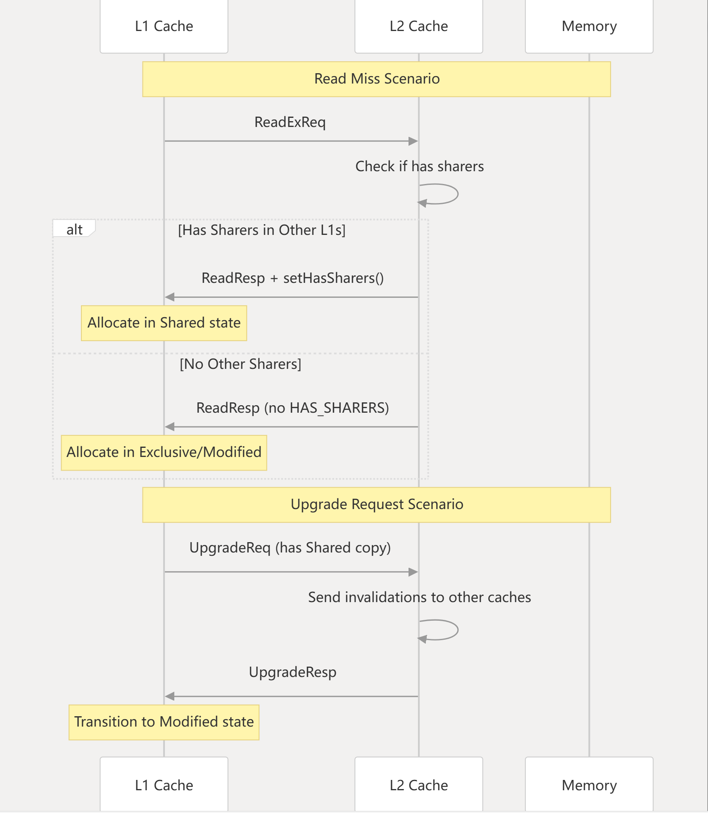


**Memory Banking：（提升的是带宽）**

问题：对于只有一个读写端口的最普通的存储器，在发起上一个访存请求到接受访存回复的这个过程，是不能发起下一个访存请求的

为了支持一个周期发起多个访存，为什么不是简单地增加读写端口，而是进行这种复杂的分块、地址映射？

- 物理设计限制：SRAM的面积不是随端口数线性增长，而是以O\(N方\)的形式增长，因此增加端口数会导致内存面积大幅增长、功耗爆炸

- 不能变成多端口，那么就使用多个单端口cache，通过较少的代价实现大部分效果

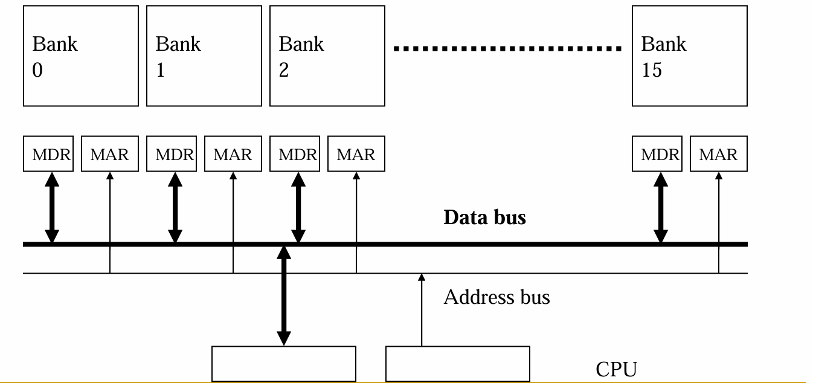

问题：一个大的memory访问时间长，并且不允许同时多个请求

目标：减少访问延迟、并且允许同时多个请求

idea：把一个大的memory分成多个小的bank，每个bank都是独立的

- 相比原来的memory更小，访问速度也就更快

- 由于每个bank独立，因此允许多个请求

关键问题：如何把数据map到不同的bank中，越均匀分布，效率也就越高

banking引入的开销：

- 电路倍增：每个bank需要独立的解码器、放大器

- bus更加复杂


MSHR流程

https://deepwiki\.com/gem5/gem5/5\.1\-packet\-and\-request\-transaction\-model\#timing\-request\-packet\-flow

**MSHR Lifecycle**

1. Allocation \- `MSHR::allocate()` creates MSHR for new miss

2. Target Addition \- `MSHR::allocateTarget()` coalesces subsequent requests to same block

3. Service \- `MSHRQueue::markInService()` when downstream request sent

4. Completion \- `BaseCache::serviceMSHRTargets()` handles response and satisfies all targets

5. Deallocation \- `MSHRQueue::deallocate()` frees MSHR for reuse


**write\_buffer**（writeQueue）负责 writebacks，evictions，uncacheable writes

- 在写到下级缓存或者memory之前作为一个buffer保存他们，减少因为等待写cache造成的阻塞，写到write\_buffer之后CPU就可以去干别的事了

- write合并：如果有多个相同目标的write，writebuffer可以将他们合并（比如都写到一个cacheline里面）

- 如果write\_buffer也满了，那么就会阻塞cache

Uncacheable writes一般来说是直接和总线交互，因此速度非常慢，可以将其直接写到write\_buffer中，让CPU不需要一直等待这个结果


920的内存架构是L1私有、L2共享，不光920，现在很多CPU都是最后一级cache共享，可以想一下为什么L1不是共享、L2不是私有？当然这都是针对多核，如果是单核就没有私有和共享之分了

为什么L2不是private：Private vs shared（多个private放一起）：

- Private cache 更小，数据访问更快

- 共享cache能够消除重复数据的存储，提升有效容量；便于数据共享，core A往里面写，写完core B直接读，核间通信更快


- 为什么L1不是一个巨大的共享cache，但是通过多bank实现并行访存，原因就在“大”上面。越大越慢，CPU不能忍受这么慢的访存，但是这个设计其实是合理的，GPU就采用这样的设计，相比CPU来说，它对访存的要求没那么高，但是共享cache带来的容量提升是它需要的

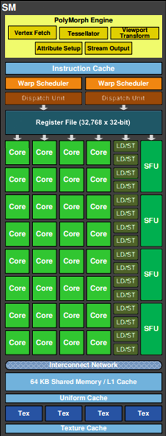


**一致性相关**

在多核情况下，L1 cache私有，L2共享；一个数据副本可能同时存在于多个私有的L1 cache，那么如何维护这个副本的一致性，比如core A写了这个共享数据，如何通知core B等等


首先要介绍write\-back和write\-through，所有的一致性策略都是针对write\-back，如果是write\-through，内存中永远是最新的，就没有必要搞这么复杂的协议了


什么时候写回，如何写回？修改这个状态会发生什么，读这个状态会发生什么

MSI最简单的一致策略：

- 各个cache观察彼此的读写操作，如果某个core需要修改某个块，通知其他所有core使这个块无效

- 数据块状态分类：

    - Valid

        - M：Modified/dirty

        - S：clean/shared

    - I：invalid

- 缺点：一直广播操作，即使其他core没有这个数据块，也会通知所有core，浪费带宽


MESI：

- 数据块状态新加入E：表示独占，如果一个数据块是独占的，那么修改它就不用广播，不需要通知任何人

    - 也就是把clean细分了，其他不变

        - E：Clean Exclusive

        - S：Clean Shared

- 缺点：考虑两个核心都想用脏数据的情况

    - Core A 修改了 `X` \(状态 **M**\)。

    - Core B 想要读 `X`，由于其状态为M，需要先写回内存，Core B在从内存读（状态S）

    - 实际上可以直接让Core A从缓存中把数据给Core B，避免走慢速的内存


MOESI：为了解决上述情况，对M状态进行细分

- modified：

    - M：独占脏数据

    - Owned：shared脏数据，但是以后写回这个数据块，还是归我管


snoop和基于目录的一致性传输：

- 上述方法的优化总结来说是，MSI到MESI减少了广播次数、MESI到MOESI减少了访存次数

- 但是无论怎么说，还是在广播，即使某一个核与这次snoop无关，其缓存控制器也会一直监听共享总线

- 那么能否只通知需要参与进来的core呢，类似点对点传输？可以，这就是基于目录的一致性传输

引入目录，维护每个内存块的全局状态（对于每个数据块，哪些缓存持有该块副本以及处于什么状态）；广播\-\>单播

例子：

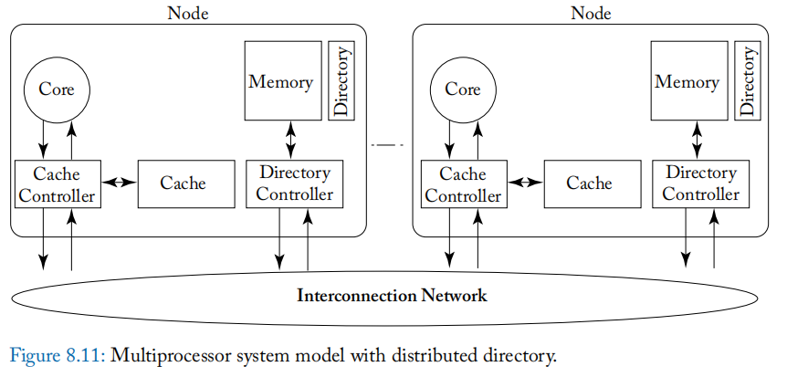

流程：

1. 计算Home Node（寻找目录）：对地址进行计算，可以得到该地址落在哪个目录中

2. 发送单播请求

3. 目录查询：查询缓存块状态

4. 转发：别的core修改了该缓存块数据，转发请求

5. 响应：发起者收到数据，响应方可能更新状态


Classic cache的MOESI：snoop based

- M：exclusive dirty，modified

- O：shared dirty，Owned

- E：ExClusive clean

- S：shared clean

- I：invalid

任何时候M和O在系统所有的数据块中，只能有一个；而E指的是在同一层级只有一个，但是其上层或者下层也可以有一个，比如L1 有这个 cache line 的 E 副本，L2 也有 E 副本

gem5 

```C++
*  state   writable    dirty   valid
 *  M       1           1       1
 *  O       0           1       1
 *  E       1           0       1
 *  S       0           0       1
 *  I       0           0       0
```

共享的情况下可读不可写，独占的情况下可读可写


Ruby Memory System简介

ruby与CPU是两个独立的模块，与classic集成在cpu中不同，ruby是单独的

sequencer负责把gem5的packets转换为rubyRequests

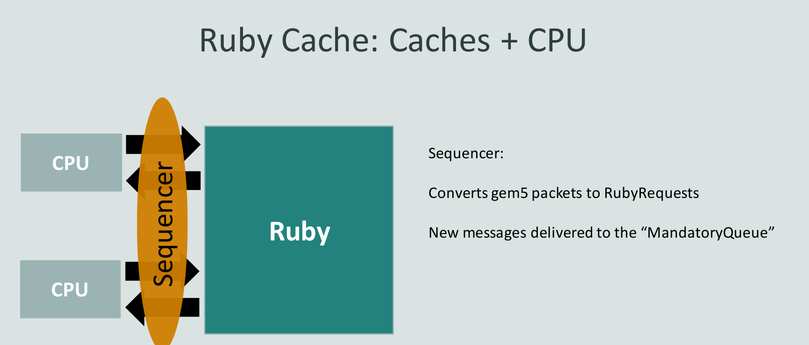


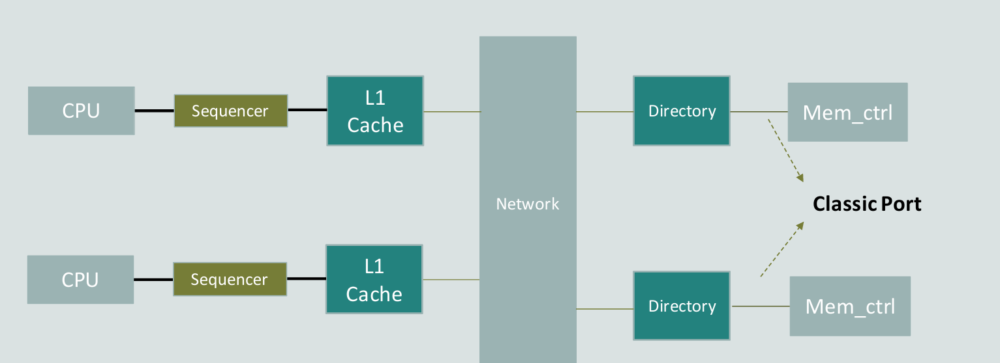
