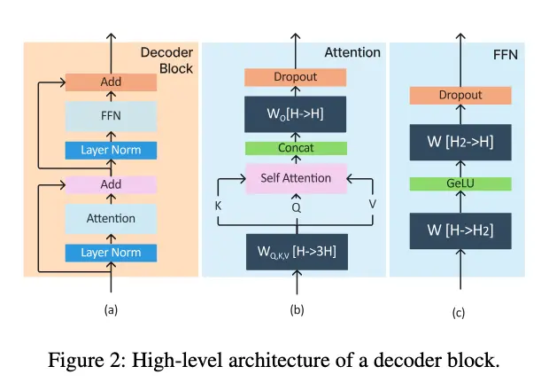
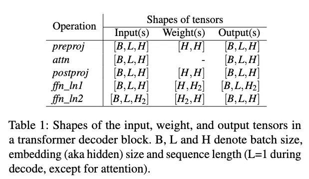
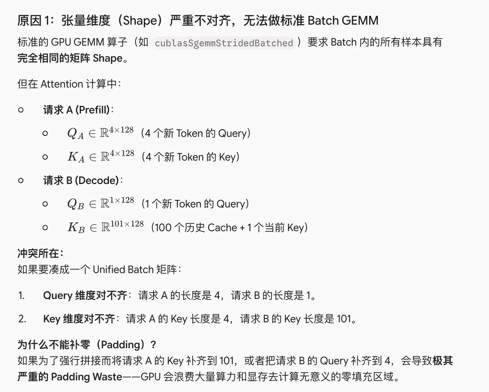
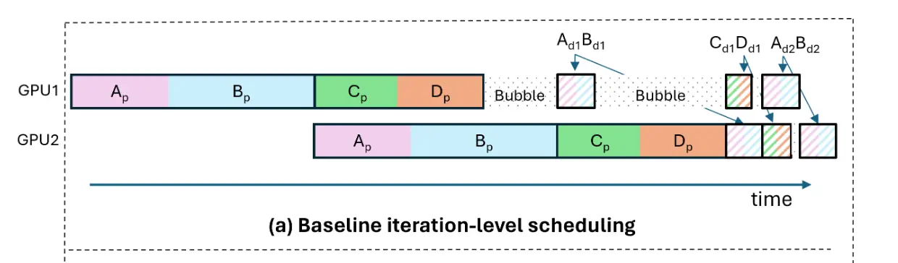
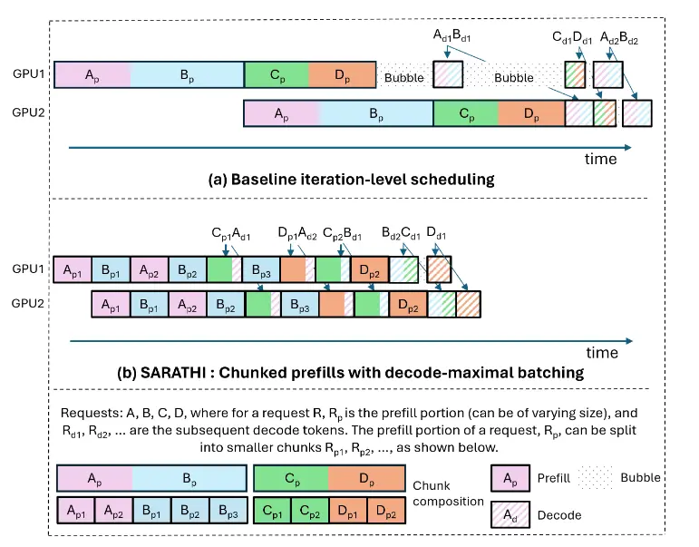

主要是学习“SARATHI”这篇论文，顺带补补 ai 基础知识，这篇论文是 23 年的，比较经典，但是有些计算架构比如 transofmer 内部的layer有些变化，不过大体骨架都是一致的。本文可以作为理解 vllm chunked prefill 的基础，后续会去看一下真实项目的代码。

## 背景：prefill 和 decode 计算特性区别

首先需要理解 transfomer 中 prefill 和 decode 的计算特性，基于这些不同的计算特性，才会有各种各样的优化手段：

此部分还可参考 https://zhuanlan.zhihu.com/p/718715866

transformer 架构的模块可分为：preproj，attn，postproj，ffn_ln1，ffn_ln2，others
others 占比很小，在文章的实验中证明占比小于 5%，因此可以只关注前五种操作

传统的 transfomer 分为 encoder 和 decoder，不过目前都转向 decoder only 的架构，因此重点关注 decoder

decoder block 的计算流程是这样：



transfomer block 的输入的都是一个 tensor，形状是 `[B, L, H]`，B 代表 batch size，L 代表 request 长度，H 代表模型的 embedding size。需要关注每个 block 的 input，weight，output，这些涉及到是否可以合并计算，在后续混合 prefill 和 decode 时会用到



* preproj 就是一个矩阵乘法，计算 Q，K，V，输入 X `[B, L, H]` 乘上 weight，weight 的维度是 `[H, 3H]`，结果是三个 `[B, L, H]`
* postproj 是最后乘上 weight O，`[H, H]`
* attn 就是常见的 attention 计算
* 注意 ffn_ln1 和 ffn_ln2 的 weights 不一样，有一个投影再还原的过程

decode 和 prefill 的计算流程一模一样，只是 decode 的输入维度中的 L 变为了 1，`[B, L, H] -> [B, 1, H]`，除此之外，计算 attn 的过程，依赖于 prefill 计算出的 K，V 缓存，不用重复计算 K，V。decode 中 K，V 的维度也都变为了 `[1, H]`

文章中计算了 per token 的耗时，decode 是 prefill per token 的百倍

prefill 和 decode 的计算特性区别：prefill 低 batch 和高 batch，在利用 GPU 计算能力方面没有太大区别；而 decode，随着 batch 增大，计算能力也会随着增强（decode 提升 batch 能够显著利用 GPU 计算资源，而 prefill 则在低 batch 也会接近饱和，计算量大）

因此提升 decode 的 batch size 才能提高计算强度以及吞吐，但是受制于 kv cache，很难提升。每个 request 都有一个 kv cache，很大。

> prefill 可能几百个 token 才会用一次 kv cache，而 decode 一个 token 就会用一次 kv cache，如果希望提升 batch，多个 decode 的 kv cache 会很快占满显存

差异实际上来源于 prefill 是 matrix-matrix，而 decode 是 matrix-vector

## how to scale decode‘s batch size

**如何增大 decode 的 batch size**，也就成了一个问题：

常见的解决方法有 tensor parrallelism（TP），pipeline parrallelism（PP），这部分只是草草了解，可能理解有误

### TP 和 PP 简介：

* TP（Tensor Parralle）张量并行：一般是把权重拆分到不同 GPU，每个 GPU 还是会走完每一层的计算，只是计算量变小了能放下。比如矩阵 `A * B`，B 太大放不下，把 B 拆分到多个 GPU，每个 GPU 算一部分，最后汇总。通信开销大、在 attn 和 FFN 都会多出一次 all-reduce 归约操作，因为这两层都需要 weight
* PP（Pipeline Parralle）流水线并行：把模型按层拆分为多个阶段，每个 GPU 负责一部分连续的层，多个 micro-batch 像“流水线”一样依次通过每个 GPU。相较 TP，PP 只需要在层与层之间做一次激活值的通信，通信开销更小，尤其适合集群间带宽有限的环境。PP 的另一个优势是能释放部分 GPU 显存，支持更大的 batch size，从而提升 decode 阶段的吞吐效率。

TP 适合单节点、且节点内有高速互联的地方，比如 NVLINk；PP 适合跨节点

> 这里的节点一般指一组服务器，可能有多个卡，有 nvlink

#### 问题：

* TP 的问题是，在缺乏“超级集群（Hyper-clusters）”硬件支持的情况下，大规模使用张量并行（Tensor Parallelism, TP）会导致模型训练或推理的性能急剧下降。
* PP 像 Orca，通过 micro batch 将模型拆分，但是由于 prefill 和 decode 的长度不同，可能会有流水线气泡

文章是基于 PP 的前提展开。前面提到，为了在 decode 阶段充分利用资源，需要提高 batch，但是提高 batch 会有不少挑战

* 内存不够，每个 decode 会占用大量 kv cache，再提高 batch，基本存不下来

### batch 的演进

static batch -> continuous batch -> chunked prefills

这部分如果看不懂可以去看这个[笔记](https://github.com/cr7258/ai-infra-learning/blob/main/lesson/05-chunked-prefills/README.md#2-batching-%E7%9A%84%E6%BC%94%E8%BF%9B%E8%BF%87%E7%A8%8B)的图例，写得很好

#### static batch：

需要等待 batch 中的所有 request 都 decode 完成才能进行下一轮，木桶效应，取决于耗时最长的 request

#### continuous batch：

##### iteration-level scheduling

* 在 static batch 进行改良，不需要等待最长的 request decode 完成，一旦某一个 request 完成，即可替换出去，下一个 request 在此基础上继续 decode？
* 这里的“替换”其实需要满足前置条件
    * 所处阶段要相同，prefill 和 decode 不能混合
    * 输入张量的形状必须完全一致，`[L, H]` 必须一致

        > transfomer 会接收一个 `[B, L, H]` 的向量作为输入，B 代表 batch（请求数量），L 代表一次请求需要处理的 token 数，H 代表模型的 hidden size 隐藏层维度

以下三种情况，都不能一起处理

* 两个请求都处于 prefill 阶段，但是输入 token 数量不同，也就是 `L` 不同
    * 对于长度不一致，能否通过 padding 解决？
* 两个请求都处于 decode 阶段，但是正在生成不同位置的 token：这是因为请求的生成位置不同，kv cache 的 **长度** 也不同，导致 attention 的 key/value 张量形状不同
* 两个请求处于不同阶段：prefill 一次处理所有 token，而 decode 一次迭代只处理 1 token

但是事实上不是所有的 layer 都不能一起计算。为了解决问题，并且提高速度，可以提取这些请求在计算中的共性，我们把粒度更细一点观察，是否能够一起算。对于差异部分则单独处理

##### selective batching

这也就是 **selective batching** 的原理

* 把能混合的一起算，比如 preproj，postproj，FFN1，FFN2（实际上就是除了 attn 之外的操作）
* attn 计算不能混合，因此拆开算

> 这些操作为什么能混合？
>
> 1. 权重共享：这些操作是 token-wise（单 token 独立）的 GEMM，无论是 prefill 还是 decode，只要同处于一个 layer/阶段，都能共用同一份权重，权重的维度一致
> 2. 矩阵乘法的按行拆分/拼接特性：由于权重相同，可以直接把输入进行拼接
>
> 例子：
>
> $$X_{\text{total}} = \begin{bmatrix} X_{\text{reqA}} \\ X_{\text{reqB}} \end{bmatrix} \in \mathbb{R}^{(N_{\text{A}} + N_{\text{B}}) \times D_{\text{in}}}$$
>
> $$Y_{\text{total}} = X_{\text{total}} \cdot W = \begin{bmatrix} X_{\text{reqA}} \cdot W \\ X_{\text{reqB}} \cdot W \end{bmatrix}$$
>
> 为什么 attn 不能混合？
>
> 因为他是 token 交互型计算
>
> 1. prefill 和 decode 的 attn 无法拼接为一个标准的矩阵乘法
>
> 
>
> 2. Attention Score 矩阵与 Mask 掩码逻辑完全不同
>
> prefill 的 attn mask 需要用因果掩码以保证当前 token 只能看到自己和之前的。而 decode 则是全 1，则不需要因果掩码。虽然二者的掩码语义是一样的，但是维度不同难以拼接。是否有解决方案？

###### 混合 prefill 和 decode 阶段的好处

* 互补，一个计算密集一个访存密集
* 可以共享一次权重 weight 读取，如果不混合需要读取两次

总结一下上述优化：最原始版本是 static batch，需要等到 batch 中的所有 request 都完成才能进入下一 batch；iterative batch 优化为如果有 request 完成，在满足条件的情况下，可以替换新的 request 进入，避免浪费时间等待；selective batch 解决了 iterative batch 替换条件苛刻的问题，将粒度缩小，把模型能混合计算的层次放在一起计算，不能一起的则分开，放宽了替换条件，同时采用 PP，但是 PP 中流水线的气泡比较多（prefill 和 decode 在 batch 混合时比例未知，造成不同 batch 时间不同从而产生气泡）

**总结一下局限性：**

* iterative batching 的局限：流水线气泡无法解决
* selective batching 的局限：有一定随机性，同一 batch 中 prefill 多还是 decode 多，不确定

核心问题就是论文里的这张图：



**解释：**

* 一共有四个请求 A，B，C，D 进入推理，这是一个 2way 的流水线并行，每个 batch 需要在两个 GPU 流动计算才能算完成

    > n-way 的意思就是，单个请求/数据包（Micro-batch）的前向传播，必须依次在 $n$ 个 GPU（或 $n$ 组 GPU）之间流动和计算，才能完成整个模型的推导。

* 每个黑色框就是一个 batch，横轴是用时，可以发现每个 batch 的用时不太一样
* bubble 产生原因：
    * 从左到右第一个 bubble：因为 Ap + Bp 组成的 batch 计算量小于 Cp + Dp 组成的 batch 计算量，然后 Ad + Bd 需要等待 Ap + Bp 生成 kv cache 才能继续运算，然后 PP 又是 2-way 的，这导致了需要等待 2 *（Ap + Bp）的时间，而 Cp + Dp 的时间小于一个 Ap + Bp 的时间，从而产生了 bubble（**不同 prefill 的处理时间不一样**）
    * 第二个 bubble：也是因为不同 batch 的时间不一样，但是导致原因是，**decode 和 prefill 的处理时间差异**
    * 后面还有一些很小的 bubble，是因为 **不同 decode 的处理时间不一样**

好了，我们已经理解了各种 bubble 产生的原因，主要的浪费还是集中在前两种 bubble，如何解决呢？

1. 不同 prefill 处理时间不一样：看到这个图，会不会想到单周期处理器到多周期处理器，思考一下，如果我们能够把每个 micro-batch 内部再进行细分，都细分为标准长度/需要标准处理时间的小 chunk，这样就解决了这个 bubble
2. decode 和 prefill 处理时间差异：由于 decode 处理时间相比之下实在是太短，如果沿用 1 的方法，我们可以把 prefill 和 decode 都切成和最小 decode 一样的大小，这样能够消除 bubbke，但是太小的 batch 在 PP 时会有别的代价，后面会说，得不偿失。decode 太短，短是我们可以利用的，能不能把 decode 就插缝到 1 的小块中，再利用 selective batching 的混合计算，这样或许可以。

以上就是 chunked prefill 的 idea，一个是 chunk 对应 1，另一个是 piggyback 对应 2

有一个问题，什么决定了处理时间，这是一个确定性的时间吗？如果不确定，我怎么知道是否还有余量调度？

* 这里需要区分 batch size 和 chunk size：

    > * batch size 限制一次 iteration 里同时放多少个 **request / sequence**
    > * chunk size 限制一个正在 prefill 的 request，在这一轮最多处理多少个 **prompt tokens**

* chunk 针对的不是时间，而是对 token 进行划分，一般来说 token 正比于处理时间
* 是否有余量调度则取决于 piggyback 稍带的数量限制，等于 batch size 减去 prefill request 数量，一般是 B - 1

举个例子：

```
batch_size = 4
chunk_size = 128

Request A: prefill 128 tokens
Request B: decode    1 token
Request C: decode    1 token
Request D: decode    1 token
```

## chunked prefill solution

前面提到，prefill 是 compute bound，decode 是 memory bound，可以混合 prefill 和 decode，decode 时难以利用的资源匀给 prefill，解决计算资源利用率低的问题；融合的条件是与好处在前文已提及

chunked prefill 利用了融合和分块，核心是两点，1 是 chunk，2 是 piggy back。
其主要目的是解决流水线气泡大，selective batching 的随机性

下面具体看一下怎么处理的以及如何解决问题



首先需要选取一个 chunk size，比如 512，然后根据 chunk size 将原本的 prefill 分成多块。这里把 A、C、D 切分为了 2 chunk，B 切分为了 3 chunk。

* A、B 的 prefill 和 baseline 是一样的，重点看绿色部分开始，Cp1 和 Ad1 打包进了一个 batch，消除了原本的 bubble
* 还需要注意 decode 的顺序其实是变了，baseline 版本是 A、B、C、D 分别 decode 一次再循环。而 chunk 版本，由于切分过了可以更早放入 decode，但是需要先 prefill 完成，所以在这里的的顺序是 Ad1、Ad2，然后 B 的所有 decode、C 的所有 decode。这里只是提一嘴，decode 允许放入的时机更早，调度顺序与策略可能变化

简单总结一下，该方法把 prefill request 切成多个相同大小的 chunk，对于 batch 中剩余的 request，则可以加入 decode，其实也可以加入 prefill，不过这样又会产生 bubble，又变回原来的样子了。因为一次 decode 的时间相比于一次 prefill 的时间短很多，加入不会导致大 bubble 的出现，称作“hybrid batch”（混合 batch）

chunk 还有一个好处，由于每个 request 都是一个 prefill + 多个 decode，prefill 的数量比较少，难以保证每个 batch 都有一个 prefill。因此通过把单个 prefill 切块，从而增加 prefill 数量

### 带来一些问题

* chunksize 的选取？这会决定 prefill 数量、batch 剩余给 decode 的余量
* attention mask 需要关注（确保 chunked-prefill 在数学上等同于完整 prefill）
* 调度策略：stall-free

但是，代价是什么呢？chunked-prefill 的主要坏处是：同一个请求的历史 KV cache 会被重复读取多次，导致 attention 的 memory bandwidth 消耗增加。但是因为 prefill 阶段主要耗时在 FFN/GEMM，attention 占比小，所以整体影响有限。对比一次完整 prefill，只会读取一次

```
假如一个 attn 计算，prefill 被分为四块，读取 4 块 kv cache，C0、C1、C2、C3

普通 prefill 就是 c0-c3 各一次


对于 chunked-prefill 来说，则是如下
chunk0:
C0

chunk1:
C0 C1

chunk2:
C0 C1 C2

chunk3:
C0 C1 C2 C3

可以看到反复读取了一些 kv cache，
```

本质上来说，chunked-prefill 其实是让 prefill 转移一部分压力到 memory bandwidth

挖坑：
1. 数学上证明chunked-prefill和普通prefill一致
2. vllm源码chunked-prefill相关，重点看如何调度，即如何塞到PP中，以及单个batch内流程，相同的部分如何计算，不同的部分如何分治

## 参考资料

1. https://zhuanlan.zhihu.com/p/718715866
2. TP：LeGresley, Jared Casper, and Bryan Catanzaro. Megatron-lm: Training multi-billion parameter language models using gpu model parallelism. arXiv preprint arXiv:1909.08053, 2019.
3. PP：Orca
4. SARATHI: Efficient LLM Inference by Piggybacking Decodes with Chunked Prefills
5. https://github.com/cr7258/ai-infra-learning
