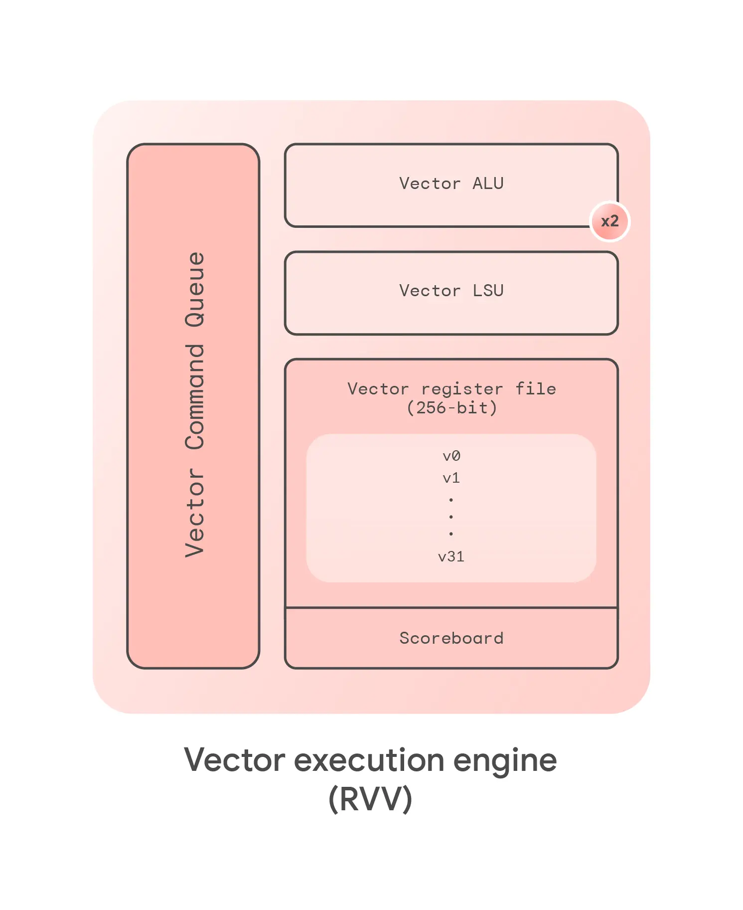

https://developers.google.com/coral/guides/

coral-npu 是作为一个外设接到axi总线上面

内存分为：
* ITCM：有点类似Icache，存放指令的一片内存
* DTCM：类似Dcache，存放数据的一片内存
* external mem：

CSR：
* rv32_Zicsr，https://docs.riscv.org/reference/isa/priv/priv-csrs.html
* 除此之外，有三个独特的，非RISCV架构的CSR，可以被外设读取或者写入数据，比如由系统的主机处理器来操作
	* reset
	* pc_start
	* status

不会dispatch分支、跳转、csr相关指令、中断相关指令
中断指令包括： `csrrw` 、 `csrrs` 、 `csrrc` 、 `ebreak` 、 `ecall` 、 `mret` 、 `fence` 、 `fenci` 、 `wfi` 
不会派发到功能单元执行，而是在first slot执行

Coral NPU 的运算单元包括 4 个标量算术逻辑单元、1 个乘法器、1 个除法器、RISC-V RVV 向量引擎（包含向量算术逻辑单元、乘法器、除法器以及 MAC 单元），还有矩阵运算引擎。

分支预测策略是：backwards branches are taken and forward branches are not taken

标量处理单元与向量处理单元之间通过FIFO结构进行分离，FIFO用于缓存向量指令。该向量单元在指令被排队后实际上可以独立于标量核心进行运算。保持这个队列的填充状态是 Coral NPU 性能提升的关键所在。

编译器是如何自动对代码进行向量化处理的，coral npu的编程模型

## 从axi装载程序到第一条指令
