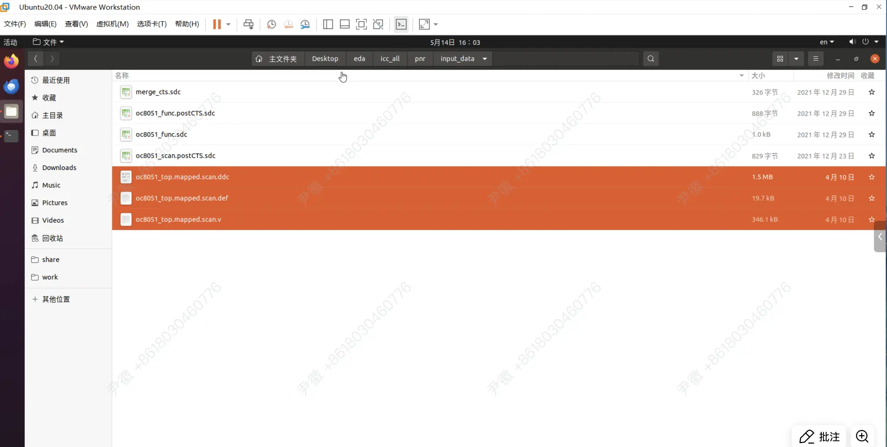

## DC
启动dc shell：`dc_shell`
查看report：`report_xx`

topo模式加入了对后端的一些估计布局布线
到dct/tmp
```
dc_shell -topo | tee -i dct.log
```

**普通 DC：逻辑综合 + 统计线延迟。**  
**DC Topo：逻辑综合 + 物理感知 + 更准的线延迟 + 更接近后端的优化。**

dct/output_data
找 ./scan 三个文件


解包icc1.tar

粘贴回

