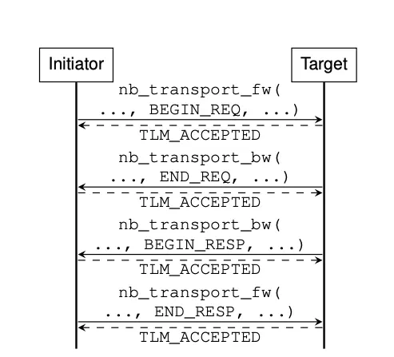
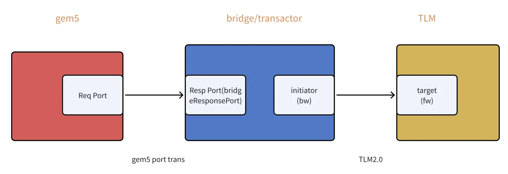
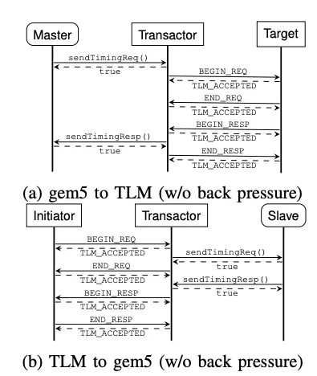
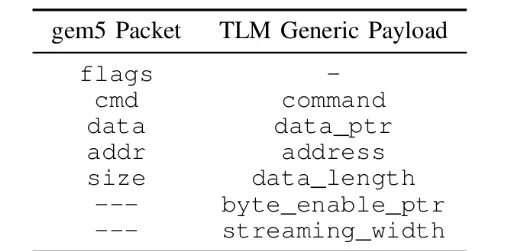
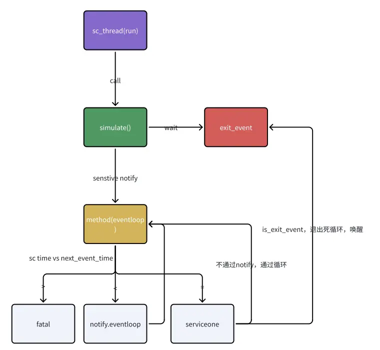

# 总览
随着现在的计算系统越来越复杂，越来越异构，gem5作为单个建模CPU的平台有些不够用，虽然它的精度不错。systemc作为一个C++用于建模的库，也有很多不错的开源项目，比如Dramsys，或是自己写的仿真单元。那么能不能把二者结合到一起，使得既能利用gem5的高精度CPU，其他地方又可以高度自定义来实现整系统的仿真？

答案是可以的，gem5很早便提供了相关代码。为了把systemc和gem5协同仿真，需要解决几个核心问题。（为了方便，以下用sc简称systemc）
1. 事件调度队列统一。gem5和sc都是事件调度仿真，可以视作都有一个调度内核，同时还都有一个事件队列，维护类似<event，tick>这样的队列，当二者到一起时，这个事件队列是由一方维护还是二者一起，如果二者一起，两边事件怎么做到同步？
2. 全局时钟/计时方式统一：gem5计时方式是tick，一个tick=1ps，而sc也有计时方式，是秒，协同仿真时，两边都有计时，但是对于全局的负载，只有一个时间，此时看谁的？
3. port通信时，如何转换：协同仿真最重要的就是gem5和sc的通信，通信一般通过port，gem5内部有自己的port类型，sc内部也有sc port以及tlm通信，各自传递的packet格式不同，port也不同，如何绑定port以及正确在两种世界传递包？

> tlm是一种通信协议，广泛用于sc，详细了解可以看这篇blog，https://www.cnblogs.com/sasasatori/p/19077607

# port通信简介
为了后续说明如何协同仿真方便一点，在此补充一点背景知识。一般来说两个不同模块通信需要通过port，然后发送方传递包，接收方接受并处理，然后加上处理延时，处理完成之后回复。比如CPU给cache发送访存请求就是通过这种方式。
## 一般的gem5 port通信流程
port分为request和response port，需要实现不同的接口
```c++
class RequestPort {
  ...
  public:
    bool sendTimingReq(PacketPtr pkt);
    // inherited from TimingRequestProtocol in `src/mem/protocol/timing.hh`
    virtual bool recvTimingResp(PacketPtr pkt) = 0;
    virtual void sendRetryResp();
   ...
};

class ResponsePort {
  ...
  public:
    bool sendTimingResp(PacketPtr pkt);
    // inherited from TimingResponseProtocol in `src/mem/protocol/timing.hh`
    virtual bool recvTimingReq(PacketPtr pkt) = 0;
    virtual void sendRetryReq();
   ...
};
```

gem5每个port会有一个peer，这个peer，在端口通信时port本身会调用peer的对应函数
- sendTimingReq 最终调用 peer->recvTimingReq(pkt)
- sendTimingResp 最终调用 peer->recvTimingResp(pkt)
- 通过调用peer注册函数的返回值，判断request或者response是否成功，如果不成功需要retry


## sc的TLM2.0通信
在sc建模中一般都使用TLM2.0通信，分为blocking和non-blocking，详见前面推荐的blog，下图是non-blocking，有4个phase


## 加入bridge的port通信流程

如果要把二者结合起来，那么需要一个中介/bridge，因为两边通信协议不同，对于gem5 to tlm来说，gem5的sendtimingreq应该对应TLM的两个REQ阶段，TLM的BEGIN_RESP则会调用gem5的sendtimingresp 


这个bridge其实做了很多事情：
1. 将gem5的packet转为tlm的generic payload，二者的内容差不多但是需要转换一下数据类型
	
2. 一侧通过gem5的port bind绑定到gem5，另一侧通过sc的port bind绑定到sc
3. 将sc侧返回的事件插入gem5事件调度队列，比如当前这次req用时，resp用时，只是记录用于通信的事件，其他sc内部处理的事件由sc自己插入eventq

协同仿真需要做到的事情在文章最开始提及了，主要是事件调度队列统一或者不统一但是要严格按照事件预期发生时间执行，然后是计时方式统一，然后是通过port bind实现函数调用，以及正确初始化二者，因为仿真是只有一个入口，所以通常会在一个入口（gem5/sc）初始化到另一方。下面具体介绍两种sc各自实现上述特性的区别。

# gem5提供的systemc
gem5内部提供的systemc大致分为两种，第一种**native systemc**是gem5将sc内核适配到gem5，修改了很多，比如事件调度都采用gem5内部的event，计时方式也是直接采用gem5的tick；而第二种**ext systemc**基于2.3.1版本，基本没改。

上面二者的编译方式、计时方式也有区别，不过原理大概相同，都会通过一个transactor，以及通过port bind将sc的socket绑定到transactor上面，下面简单说明一下


普通 gem5：main() -> instantiate -> simulate()
* 因此需要把sc也加入到这里的初始化
Ext systemc：sc_main() -> SystemC scheduler -> Module::eventLoop() -> gem5 event queue
* 需要把gem5通过sc来调用其初始化函数，并且作为sc的一个thread由sc内核管理

下面是二者主要区别：

|                |           |                      |               |                               |
| -------------- | --------- | -------------------- | ------------- | ----------------------------- |
|                | 程序入口      | 事件调度                 | 主时钟           | debug手段                       |
| Native systemc | gem5 main | gem5为主               | gem5 curtick  | 齐全，有debug flag与性能计数器          |
| Ext systemc    | sc_main   | sc为主，gem5维护自己的eventq | sc_time_stamp | 只有sc自己的，原debug flag和性能计数器需要适配 |

  

**对原版systemc所做的修改**
**Native systemc**
> 其实这里是最核心的地方，你会看到怎么把sc的内核挂到gem5的eventq，以及怎么在二者之间转移控制权，并且维护一个统一的eventq，sc的eventq虽然是挂到gem5上面，但是需要sc内核自己处理，不过本文重点不在这上面，在了解基础原理并且使用

- sc_main不是由sc内核驱动，通过`ScMainFiber` 在 `gem5` 的控制流里执行
- `sc_start()`、`sc_pause()`、`sc_stop()` 最终都落到 `sc_gem5::scheduler`
- `sc_time_stamp()` 直接读取 `scheduler.getCurTick()`
- sc的各个phase映射到gem5的eventq
    - initialization phase
    - evaluate phase
    - update phase
    - delta notification phase        
    - timed notification phase
- ...

**Ext** **systemc**
- 移除了 SystemC 对 bundled Boost 的依赖
- 把相关调用替换为 C++11 STL

# 事件调度区别
## native sc
1. 事件队列统一：SystemC_Kernel 构造时把 scheduler 绑定到 gem5 eventq
	```c++
	Kernel::Kernel(const Params &params, int) :

gem5::SimObject(params),

t0Event(*this, false, gem5::EventBase::Default_Pri - 1)

{

// Install ourselves as the scheduler's event manager.

::sc_gem5::scheduler.setEventQueue(eventQueue());

}
	```
2. notify和wait等延时通知最终挂到gem5 scheduler：所有sc notify或者wait会调用gem5自己的schedule函数，往自己内部的eventq插入事件，而不会插入到sc内核的eventq，重点看下面的schedule
```c++
void
Event::notify(const sc_core::sc_time &t)
{
    if (delayedNotify.scheduled()) {
        if (scheduler.delayed(t) >= delayedNotify.when())
            return;

        scheduler.deschedule(&delayedNotify);
    }
    scheduler.schedule(&delayedNotify, t);
}
```

3. 计时统一：sc time stamp也是修改过，直接获取gem5的curtick获取当前tick

这样就能够实现，1是全局只有一个eventq，2是全局时钟同步，以gem5 to sc为例，程序都是单线程，当一个包发到sc时，控制权转移到sc，sc内部可以进行很多处理，只需要正常插入事件队列即可。

来看个例子：recvTimingReq，假设是一个从gem5到tlm的请求，一般是通过回来的payload得到delay，然后将 '现在的时间'+delay = 事件预期发生时间，插入到gem5的事件队列中
```C++
调用到bridge的recvtimingreq->fw会有不同返回值

status = socket->nb_transport_fw(*trans, phase, delay);
1. 如果返回tlm::accepted，会先挂起packet，等到sc处理完req，通过nb_transport_bw，插入事件队列
template <unsigned int BITWIDTH>
tlm::tlm_sync_enum
Gem5ToTlmBridge<BITWIDTH>::nb_transport_bw(tlm::tlm_generic_payload &trans,
    tlm::tlm_phase &phase, sc_core::sc_time &delay)
{
    auto cb = [this, &trans, phase]() { pec(trans, phase); };
    auto event = new EventFunctionWrapper(
            cb, "pec", true, getPriorityOfTlmPhase(phase));
    system->schedule(event, curTick() + delay.value());
    return tlm::TLM_ACCEPTED;
}

2.返回TLM_UPDATED
    ...
    } else if (status == tlm::TLM_UPDATED) {
    // The Timing annotation must be honored:
    sc_assert(phase == tlm::END_REQ || phase == tlm::BEGIN_RESP);
    // Accepted but is now blocking until END_REQ (exclusion rule).
    blockingRequest = trans;
    packetMap.emplace(trans, packet);
    auto cb = [this, trans, phase]() { pec(*trans, phase); };
    auto event = new EventFunctionWrapper(
            cb, "pec", true, getPriorityOfTlmPhase(phase));
    system->schedule(event, curTick() + delay.value());
```

 1. gem5 当前某个事件运行到 bridge，调用 recvTimingReq()
  2. bridge 立刻同步调用 target 的 nb_transport_fw()，这一步已经进入 SC module 代码，但还不是 scheduler 驱动的 SC process 执行。
  3. target 在 nb_transport_fw() 里调用 peq.notify(trans, phase, delay)
  4. peq.notify(...) 最终调用 sc_event.notify(delay)
  5. sc_event.notify(delay) 会通过 scheduler.schedule(&delayedNotify, t) 把这个延时事件挂到 gem5 eventq
  6. 当前 gem5 事件执行完，控制权回到 gem5 主仿真循环，doSimLoop() 下一轮继续从 eventq 取队头
  7. 当 eventq 跑到这个 SC 定时点，会执行对应 TimeSlot，TimeSlot::process() 把这一时刻所有 SC timed events 跑掉
  8. timed event 触发 m_e，peq 里那个敏感的 method process 被唤醒，变成 ready，peq_with_cb_and_phase 构造时就 spawn_method() 了一个 fec
  9. scheduler 安排 readyEvent
  10. eventq 跑到 readyEvent 时，runReady() 才真正执行这个 fec() method
     fec() 再调用 owner callback，也就是 C920SimpleMemoryTarget::peq_cb(...)
  11. peq_cb() 里可能再 peq.notify(END_REQ, acceptDelay)、再 peq.notify(BEGIN_RESP, responseLatency())
  12. 当 target 通过 nb_transport_bw() 把 phase 回给 bridge 时，bridge 再把这个 phase 用 gem5 event 安排在 curTick()+delay
  
## ext systemc
这种方式，是把gem5作为一个库，然后sc链接库，调用库内提供的接口进行gem5 simobj的初始化；入口是sc_main，可以把gem5理解为sc的一个thread/method

因此除了bridge之外，还需要有实现gem5嵌入到sc的文件
gem5_within_systemc：把libgem5嵌入到sc进程，目的是
- SystemC 作为总调度器
- gem5 作为被托管的仿真内核
- gem5 的 config.ini 通过 CxxConfigManager 在 C++ 里构造
- gem5 事件循环、日志、统计、异步事件都能在 SystemC 环境里工作

对于gem5来说，sc专门为他新建了一个sc的eventq，然后gem5内部通过schedule，往这个eventq里面维护事件，当然由于这个eventq和sc一般的eventq不一样，时间是tick，需要特殊处理，因此注册了sc method进行处理
```c++
void

Module::setupEventQueues(Module &module)

{

fatal_if(gem5::mainEventQueue.size() != 0,

"Gem5SystemC::Module::setupEventQueues must be called"

" before any gem5 event queues are set up");

  

gem5::numMainEventQueues = 1;

gem5::mainEventQueue.push_back(new SCEventQueue("events", module));

gem5::curEventQueue(gem5::getEventQueue(0));

}
```

eventloop处理eventq
```C++
SC_METHOD(eventLoop);
sensitive << eventLoopEnterEvent;
dont_initialize();

SC_METHOD(serviceExternalEvent);
sensitive << externalSchedulingEvent;
dont_initialize();
```


通过一个sc thread run进入处理，然后执行simulate，在这里触发eventloop这个敏感事件，同时wait(exit_event)，敏感事件会触发eventloop回调函数，然后从eventq里面取出事件进行执行，此时会比较sc time和下一个事件预计发生time，分别进行不同的处理，注意可能同一tick对应多个事件同时执行，这也对应了sc中的delta cycle语义，等到exit event检测到了，就退出仿真。

sc可能有多个eventq，但都由sc内核统一管理，由他来维护时间上各个事件从前到后执行的时间正确性。


gem5的**这个event queue谁来维护？
gem5自己来维护，通过schedule插入**，在gem5 within systemc这条路径中
```Plain
  gem5::numMainEventQueues = 1;
  gem5::mainEventQueue.push_back(new SCEventQueue("events", module));
  gem5::curEventQueue(gem5::getEventQueue(0));
```

大致流程：
1. sc_main() 创建 SimControl 或 Gem5TopLevelModule
2. SimControl 构造时 setupEventQueues()，把 gem5 顶层 event queue 换成 SCEventQueue
3. sc_start() 后，SC_THREAD(run) 调 simulate()
4. simulate() 触发 eventLoop()
5. eventLoop() 用 catchup() 把 gem5 时间追到 sc_time_stamp()
6. 如果 gem5 下个事件在未来，就在 SystemC 里 notify(wait_period) 并返回
7. 到时间后 SystemC 再次唤醒 eventLoop()
8. 如此往复，直到 gem5 产生退出事件


# port bind区别

1. native sc：gem5 port bind流程：
- Tlm port：重写了上面的port.bind函数，使得bind不仅绑定tlm的端口，还绑定gem5的端口，gem5端口绑定其实不是绑定，只是设置一下peer指针    
- Tlm的port需要通过wrapper包一层，然后override gem5_getport来返回这个port，实现连接
- initiator需要注册bw，此注册由gem5_to_tlm中的before_end_of_elaboration来负责
- target需要注册fw，target自己负责

2. ext sc：


   


  

  

**接入sc时，sc这一方需要做什么？**

对于外部sc来说，他会实例化util/tlm里的包装类，这些包装类会调用libgem5库，外部sc可见的高层接口是
- Gem5SimControl：顶层控制器，负责读 config.ini、注册 tlm_master/tlm_slave handler、建立 event queue、开统计/调试、最后调用 simulate() 跑 gem5
- Gem5MasterTransactor：TLM target socket，把外部 TLM 请求送进 gem5
- Gem5SlaveTransactor：TLM initiator socket，把 gem5 请求送到外部 TLM 世界。
- Gem5SimControlInterface：给 transactor 绑定用的最小接口，只有 getSlavePort() / getMasterPort()。
- SCMasterPort / SCSlavePort：桥的 gem5 侧，分别继承 gem5::ExternalMaster::ExternalPort / gem5::ExternalSlave::ExternalPort，负责 gem5 packet 和 TLM payload 互转。

sc_main()内实例化上述对象

  

# 参考
gem5论文
