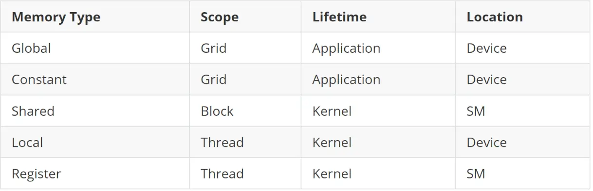
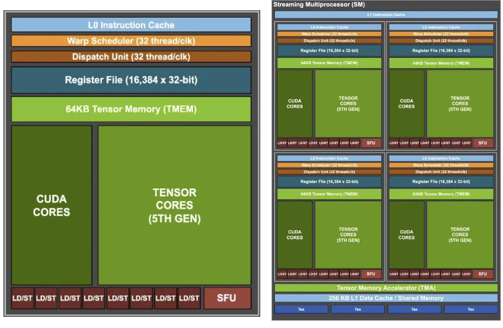
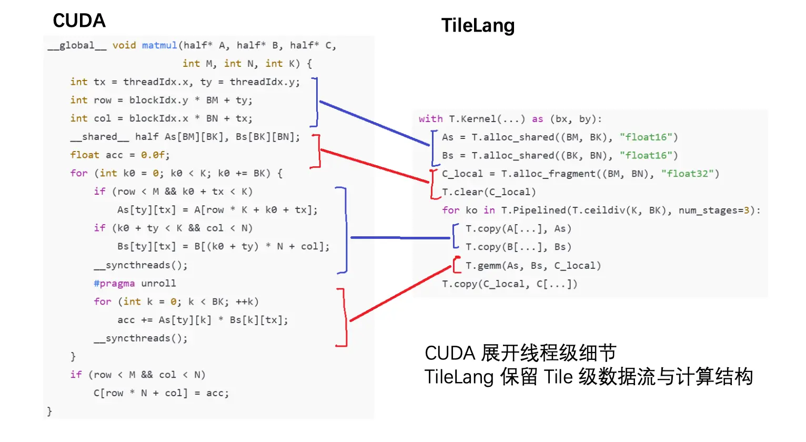
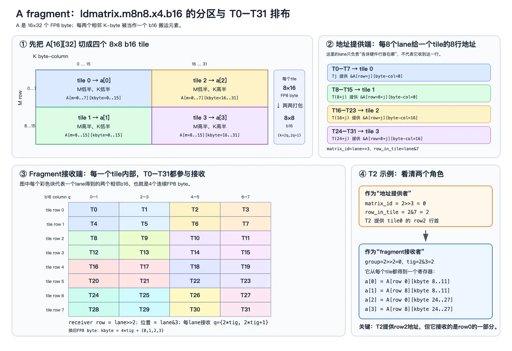
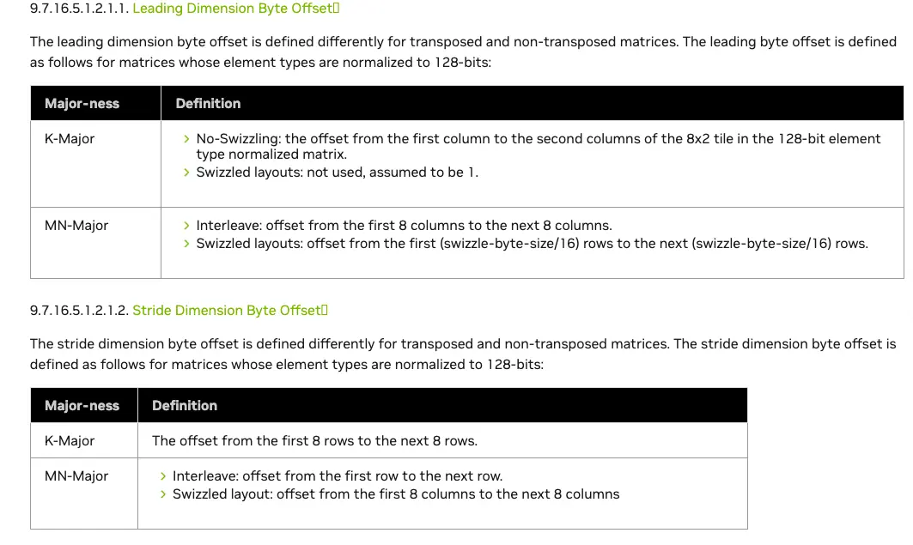

## 基本概念

以下快速对cuda一些基本概念进行复习

thread 属于 warp 属于 block 属于 SM 属于 grid
* 一个warp = 32 thread
* block又被称为CTA

kernel的启动参数 <<<gridDim, blockDim>>>
* gridDim代表每个grid的block数量
* blockDim代表每个block的thread数量

warp内部可以高效地进行数据交换和同步，比如warp内部归约，`__shfl_down_sync`

内存层次：


`__restrict__` 表示独占指针，没有其他指针访问这块数据

GPU SM内部架构，blackwell为例子

一个SM内有4个一样的
再往内部走每一个都有cuda core（标量、向量计算）和tensor core（矩阵计算），SFU（special function units，科学计算相关函数）

warp切换：CUDA Core 的运算速度极快，但 Global Memory 的延迟是⼏百个周期。如果warp 发了⼀个访存请求后就⼲等着，计算单元就空闲了，因此需要warp调度器来维护远大于计算单元数量的warp，如果出现访存阻塞，立即切换。切换这件事情由调度器来维护
* warp的上下文切换开销很低，因为其所有状态都由硬件来维护
* 对比cpu上线程的切换，其实是软件维护的一套上下文，在公用的GPR（通用寄存器）保存不同的上下文，就需要对寄存器、锁等执行保存、切换新的，上下文切换开销比较大。而warp就不存在公用这一说，每个warp都有私有的寄存器资源

warp divergence：由于分支导致

**warp同步**

assignment1:分块、总结

## thread/tile level programming的区别

我们来理一下cuda kernel需要做的事情
* 不同block分工，每个block内部每个thread做什么
* 数据搬运，如何在global mem、shared mem和register之间搬运
* 手动完成从输入的整块数据，映射到每个线程的执行，最后可能还需要规约

有些繁琐，基本所有的内存、数据、线程协作都是手动管理。核心原因就是粒度太细了，因此很容易想到扩大粒度，牺牲精细的控制来换取更容易的编程模型。如果性能差得不多，就更好了。

tile-level：把block内部协作范围扩大，从线程协作变为分块（tile）协作，这样只用指定每个tile做什么。比如`trition/tilelang`都是基于tile level
* 分块的决策由程序员决定，tile内部的thread则由编译器决定

下面由一个例子来对比一下二者编程时具体的区别


## tensor core：从mma.sync到tcgen05
* sm80：fragment、ldmatrix、mma.sync
* sm90：wgmma、异步与 proxy、descriptor、swizzle
* sm100：TMEM、tcgen05、mbarrier、2-CTA

回忆一下硬件架构，cuda core，tensor core

tensor core是干什么的？
* 一个专门用于计算 `D = A * B + C`的单元，A/B/C形状固定

tensor core是没有fp32的，只有tf32，原因是节省电路面积
> tf32相比fp32，尾数截断了一部分（fp32尾数23bit，tf32尾数10bit），精度更低，指数位相同

从sm80到sm90到sm100，tensor core fp16的算力从312TFLOPS -> 990TFLOPS -> 2250TFLOPS，可以看到每代算力至少翻倍，但是数据搬运跟不上导致tensor core闲置。那么如何来喂饱tensor core，就出现了一系列的优化：fragment -> ldmatrix -> swizzle -> descriptor -> TMA -> Tmem

### fragment
来看一条mma（matrix multiply-Accumulate）指令
```
mma
.sync 执行前需要一次 warp 同步
.aligned warp内32线程必须同时执行，否则是未定义
.m16n8k16 A是m * k，B是n*k
.row.col A是行主序，B是列主序
.f32.f16.f16.f32 分别代表 D、A、B、C的操作数type
```

对于每个线程来说，一个mma需要分摊如下个数的register，每个reg是32bit
* D：`16 * 8 / 32 = 4个 fp32 = 4 reg `
* A: `16 * 16 / 32 = 8个fp16 = 4 reg`，两个fp16会打包在一个reg中
* B：2 reg
* C：4 reg

tensor core编程的核心问题就在于如何给每个线程准备数据，放入寄存器里面

#### sm80（Ampere）：mma.sync
准备数据需要按照特定的fragment layout，why？

给一张图片+例子

由于手写index太过麻烦，又引入了ldmatrix

小结：sm80的矩阵运算是这样的
* 数据准备：通过普通load 从GMEM写入到SMEM，SMEM通过fragment/ldmatrix将数据放入到寄存器RMEM中
* 发射mma指令，指令会把结果写入到寄存器，然后从寄存器写到global mem

#### sm90（Hopper）：wgmma

mma的操作数都在寄存器，如果想要提高性能，势必要增加寄存器资源，但是寄存器资源又很贵，难以随着算力翻倍而寄存器资源翻倍。

那么怎么优化，可以是更多的寄存器数据复用，或者是不使用寄存器资源，改用其他更多更便宜的资源

sm90的想法就是
1. 提高每次读取的复用率，增大tile
2. 操作数不经过寄存器，A/B从寄存器移到SMEM，牺牲一点读取速度换取数量。注意D和C仍然在寄存器中
3. sm80中，tensor core计算时CUDA core空闲，CUDA core load然后发射，接着就闲置了，可以想办法让两者并行工作，类似流水线

来看一条wgmma指令，其驱动的不再是一个warp，而是一整个SM的四组Tensor core，被称为一个warp group，这也是为什么mma前面多了一个wg（warp
group）
4个warp = 4 \* 32 = 128 threads，并且128个线程必须全部执行，不能warp 发散，否则未定义行为
```
wgmma.mma.async.sync.aligned.m64n64k16.f32.f16.f16
{d0,d1,...d31}, // D: 64*64 / 128 = 32个 fp32，每个thread 32个reg
a_desc, // A矩阵的描述符
b_desc, // B矩阵的描述符
scale_d / 1 -> D = A * B + D; 0 -> D = A * B
1,1, // A、B整体的正负
0,0; // A、B读的时候是否转置
```
* async表示指令发射完立即返回，异步执行

异步虽然使得效率提高，但是带来了其他问题
* 什么时候可以安全地读取累加结果
* 什么时候可以覆盖A/B所在的SMEM

## 课程笔记

计算强度：FLOP/byte

一个FMA = 2 FLOP

- Tensor 是多维数组，vector 和 matrix 都是它的特例。
- cuda core通用计算，tensor cor只能干mma（D = A * B + C ）

wgmma一条指令**驱动整个SM的4组tensor core**，区别于mma只驱动SM的一个tensor core

share memory有32个bank，每个4B

core matrix以16B为单位，并且16B对齐

tensor memory用来存D，从寄存器到TMEM

谁是major，代表谁在内存里是连续变化的。

# assignment 1

GPU 型号            : NVIDIA GeForce RTX 5090
compute capability  : 12.0
SM 数量             : 170
warp 大小           : 32
shared mem / block  : 49152
max threads / SM    : 1536
global mem          : 33668857856
max threads / block : 1024

1.1
a：


2.2
原时间
搬运 + kernel + 读回: 107.0 ms
搬运 + kernel + 读回: 109.4 ms
搬运 + kernel + 读回: 111.0 ms

修改之后
搬运 + kernel + 读回: 102.6 ms

(a) kernel 启动之后、 CPU 读结果之前，为什么必须有一次同步？在原
先的版本里这次同步发生在哪个调用里？
* 因为在cpu遇到kernel时，只是把它提交给gpu，然后自己接着执行下面的程序。在原本的版本中，遇到cudaMemcpy时需要device的数据，在这隐式等待数据同步。。显式版里这个"等"其实藏在最后cudaMemcpy(DeviceToHost)里——它会等之前的 kernel 完成。改成 unified memory 后没有拷贝了,这个隐式同步点消失,得显式调用cudaDeviceSynchronize() 才能保证"kernel 已跑完、结果可读"。
(b) todo

prob2.4
(a)不一定，异步执行
(b)对的，cuda host侧的api提交操作，会被放入一个stream中，按照顺序提交并且执行。cudaMemcpy又是阻塞式调用，一定会等待。后面的始终得等前面的
(c)kernel内部，只会在执行到的时候才会报错？不确定，实验下？


prob 2.5
异步错误类型
```
 #define CUDA_CHECK_KERNEL()        \
  │     do {                           \
  │         CUDA_CHECK(cudaGetLastError());      // 行 1
  │         CUDA_CHECK(cudaDeviceSynchronize()); // 行 2
  │     } while (0)

```

2.7
价值在于什么？
缺点是局部性很差，每次都是跨grid访问

prob 3.1

prob3.2
warp 内分支 (tid % 2)    :    0.388 ms
按 warp 分支 (tid/32 % 2):    0.200 ms
比值: 1.94

实测下来按warp分支大概是按照奇偶分支的2倍，为什么？
因为如果有分支 divergence，按照之前模拟器的概念，得先走then，执行完了之后才能走else。而warp分支则是直接并行执行一遍即可，因此用时约为一半

如果计算量一大一小
* 奇偶：时间等于 大 + 小
* warp分支：时间等于 大（木桶效应）

prob3.3

syncthreads是用于block内同步，他保证，syncthreads之前的所有写，在syncthreads之后可见

如果t和255-t落在同一个warp内，则一定是对的。因为同一个warp保证所有warp都执行同样的命令，也保证前面的先执行


prob 3.4


| 空间          | 谁可见           | 生命周期       | 片上/片外   | 谁管理 |
| ----------- | ------------- | ---------- | ------- | --- |
| register    | 单个线程          | 线程         | 片上      | 编译器 |
| local       | 单个线程          |            | 片外 dram | 编译器 |
| shared      | 单个block       | block      | 片上      | 程序员 |
| global      | grid+host     | cudaFree之前 | 片外      | 程序员 |
| constant    | host，kernel只读 |            | 片外      | 程序员 |
| L1/L2 cache |               |            | 片外      | 硬件  |
local是，线程如果使用了超出可用的寄存器数目或者超大数组，则会放置在local，这些存储位于global，也就是片外的dram，


prob 4.3

global  : PASS  平均 0.0720 ms
constant: PASS  平均 0.0714 ms
global / constant = 1.01x

为什么耗时差距极小，constant cache的优势在什么访问模式
如果超出了L1 cache的容量，那么constant cache会有优势，这二者访存有一点点区别
* constant cache 通过常量广播总线一次广播给 32 个lane,只发一条请求（这也是为什么constant略微快于global）
* global 靠 L1 缓存是"读一次、存起来、再命中"

prob 4.4
todo

prob 4.5
原子add保证的是什么，和syncthreads/同步有什么区别？

prob4.8
NVIDIA GeForce RTX 5090：shared memory 100 KB / SM，最大常驻 1536 线程 / SM

shared/block   理论 block/SM  occupancy   实测带宽
     0.0 KB          6          100.0%     1571.6 GB/s
    13.2 KB          6          100.0%     1571.3 GB/s
    15.0 KB          6          100.0%     1572.7 GB/s
    18.0 KB          5           83.3%     1575.2 GB/s
    29.0 KB          3           50.0%     1591.1 GB/s
    55.0 KB          1           16.7%      819.3 GB/s

b. gpu靠切换warp来隐藏延迟，如果warp太少，那么所有warp都切换完了，等待时没有别的warp顶上，就只能白白等待这段时间

c. 存在一个"隐藏延迟所需的最小 warp 数"阈值,高于它,多的 warp 是冗余,occupancy 下降不影响带宽;低于它,每个 warp 都宝贵,带宽随
  occupancy 同步下滑。这解释了为什么"掉的绝对百分点相同,但相对影响天差地别"——75% 那档还在阈值之上,12.5% 那档在阈值之下


launch时间，gpu执行时间，同步返回开销

# assignment2

机器平衡点计算公式 = 峰值FLOPS / memory bandwidth

prob0.3
a：正确，分母没有C读入的字节数，一般是因为C已经位于register accumulator
b：正确
c：错误，会造成寄存器压力增加
d：错误

## prob1
prob1.1
A的沿着col方向相邻，B的沿着row方向相邻
B的排布有点子奇怪

prob1.2
```
MISMATCH D[8][0]: got -1, want -11

MISMATCH D[8][1]: got -5, want 5

MISMATCH D[8][2]: got -16, want -14

MISMATCH D[8][3]: got 15, want 9

FAIL: 59 / 128 mismatches
```

A的fragment错了，a2a3和a6a7在下面

为什么使用uint8数组而不是_nv_fp8_e4m3数组，这二者虽然是等价的，但是mma发射时要求寄存器值的类型必须是unsigned，这里需要类型转换

prob 1.4


以下是ldmatrix的理解图// row 和 col 都是相对于分出的 matrix

ldmatrix要求每行起始地址给出的16byte是连续的、并且要满足自然对齐
但是不同行之间不需要连续

问题（a）
`ldmatrix` 将以下工作融合进两条warp级指令：

1. 将24次逐byte shared load压缩成2次矩阵装载。
2. 自动收集32个lane提供的行地址。
3. 在warp内部重新分发数据到正确lane。
4. 把两个b16组合进一个32-bit寄存器。
5. 直接生成 `mma.sync` 所需的 `a[4]` 和 `b[2]` fragment布局。

问题（b）
手工路径必须显式完成三件事：

- 根据 `lane/group/tig` 计算每个fragment元素的shared地址；
- 分别加载属于当前lane的数据；
- 使用移位和OR拼成MMA要求的32-bit寄存器。


prob1.5

```
stride 32B        9.72 cycles / ldmatrix(8 warp 均摊)

stride 64B       10.75 cycles / ldmatrix(8 warp 均摊)

stride 128B      16.06 cycles / ldmatrix(8 warp 均摊)

stride 128B+pad   9.23 cycles / ldmatrix(8 warp 均摊)
```

| 参数             |                                          SM80 |
| -------------- | --------------------------------------------: |
| bank 数量        |                                  **32 banks** |
| 每个 bank 宽度     |                           **32 bit = 4 Byte** |
| 单个 bank 吞吐     |                **32 bit / cycle = 4 B/cycle** |
| 32 banks 理论总带宽 | **128 B / cycle / SM shared-memory datapath** |
| bank 映射周期      |                                  **128 Byte** |
| warp 大小        |                                **32 threads** |

## prob2
wgmma：
* D还是放在寄存器，但是A和B放在smem，使用描述符来说明
* 一条指令驱动一个warp group = 4 warp = 128 threads
* 异步，发射完指令立即返回

SBO是“stride dimension byte offset”，不是固定的“MN方向matrix距离”。

PTX对它的定义是：[link](https://docs.nvidia.com/cuda/parallel-thread-execution/index.html#asynchronous-warpgroup-level-majorness-supported-by-strides)



prob2.1
（a）：st.shared -> fence.proxy.async -> wgmma.fence -> wgmma.mma.async -> wgmma.commit_group -> wgmma.wait_group 

wgmma fence必须放在wgmma开头，它排序普通线程对累加器/A fragment寄存器的访问，与后续异步WGMMA对这些寄存器的访问

fence.proxy.async用于让wgmma可见普通store

descriptor：8\*16 byte


swizzle聚焦于一个8\*layout_type内部如何把逻辑chunk，映射到不同物理chunk，以最大可能消除bank conflict。每个chunk是16byte

## prob3

3.2
貌似TMEM不能直接搬到global mem里面，需要先到reg，然后才到global mem

prob3.3

round = 2时，现象是死锁
```
rounds=1 PASS seed=42

rounds=1 PASS seed=7

rounds=2 seed=42: 超时或出错

rounds=2 seed=7: 超时或出错

rounds=4 seed=42: 超时或出错

rounds=4 seed=7: 超时或出错

JUDGE: FAIL
```

可以发现只要round一多，就会出错

mbarrier：
初始状态
```
phase = 0
pending = 1
```

arriveal之后pending -1 ，phase反转

mbar_wait(mbar, 0);
这个0代表，如果phase什么时候不等于0了，就等到了，可以放行

所以第二轮会出错，直接放行

3.4
```
smem/block: cta_group::1 = 24588 B, cta_group::2 = 20492 B

::1  PASS(bad=0)  12.30 us

::2  PASS(bad=0)  12.66 us
```

prob 4.3
在第一次使用mbarrier之前要同步一次所有线程，因为mbarrier只需要一个thread来init，那么可能就会出现其他thread在没有init完成之前就使用mbarrier，造成错误

另外tma就不需要两个proxy之间的同步通知了

5.4
区分一下```
__shfl_down_sync和广播
__shfl_down_sync 只能在warp内部，不能跨warp。广播则是所有thread执行同一份代码，得到相同的值
