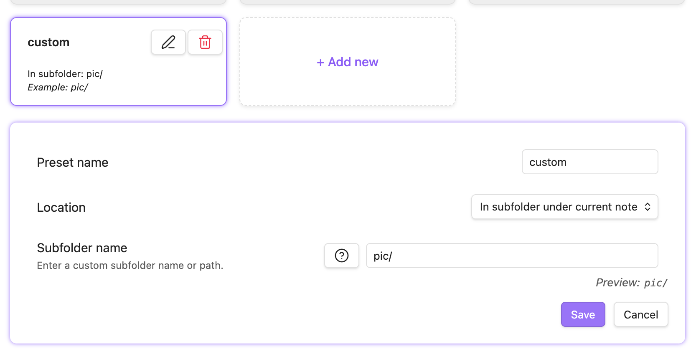

# 图片整理/编辑插件
推荐你可以去看看 Image Converter 这个插件，新插件，不太知名，不过也很有意思，基本上可以代替这几个插件。

[github.com](https://github.com/xRyul/obsidian-image-converter/)

### [GitHub - xRyul/obsidian-image-converter: ⚡️ Convert, compress, resize, annotate, markup,... 1.2k](https://github.com/xRyul/obsidian-image-converter/)

⚡️ Convert, compress, resize, annotate, markup, draw, crop, rotate, flip, align images directly in Obsidian. Drag-resize, rename with variables, batch process. WEBP, JPG, PNG, HEIC, TIF.

举几个主要功能：

粘贴时，可自动根据规则重命名图片；

可自动转换图片格式为png、jpg、webp，统一全库图片格式；

自动压缩图片，在不明显影响清晰度的情况下，减少将近百分之八十的大小，方便同步；

右键复制图片、复制图片 base64 码；

按住 ctrl ，鼠标滚轮拉升缩小图片；

在图片上写写画画。

# 图床
需要cloudflare，有点麻烦，还是存在本地好了
>全站免费方案：  
我用的是一个基于 CloudFare 免费计划部署的图床项目，这是作者的教程网站 [https://cfbed.sanyue.de 6](https://cfbed.sanyue.de/)，里面详细讲述了如何部署。另外还有一位开发者基于这个图床项目开发了 Obsidian 插件，[https://github.com/fantasy-ke/obsidian-cf-imgbed/tree/1.0.2 6](https://github.com/fantasy-ke/obsidian-cf-imgbed/tree/1.0.2)。存储渠道有多种选择，我用的是 Telegram 的渠道，因为这个渠道没有存储限制，不过单个文件上传限制是 20 MB，但作者通过文件切片上传解决了这个问题，我上传过 800~900 MB 的视频都可以，超过 1G 就不行了。使用的时候不需要科学上网。插件在文档中直接粘贴图片就可以自动上传并转换为 MarkDown 格式，不过对于已有的附件无法自动转化，插件里还保留了本地备份功能可选择路径和是否开启还有上传时图片添加水印的功能。图床项目部署的网站有访问码，可以防止被别人滥用。插件移动端也可以使用。

# obsidian 在 github 无法正确渲染
可以直接进入文件和链接设置，禁用维基链接，这样所有的链接都会以 Markdown 格式生成
https://www.reddit.com/r/ObsidianMD/comments/1ds8hkx/obsidian_does_not_use_standard_markdown/?tl=zh-hans

插件设置

image-converter
* 很逆天，不要以 ./pic 开头，这样会找不到，而是应该 pic/ ，并且选择subforder
	
* 然后把link format改为markdown，不然上川岛github无法渲染
