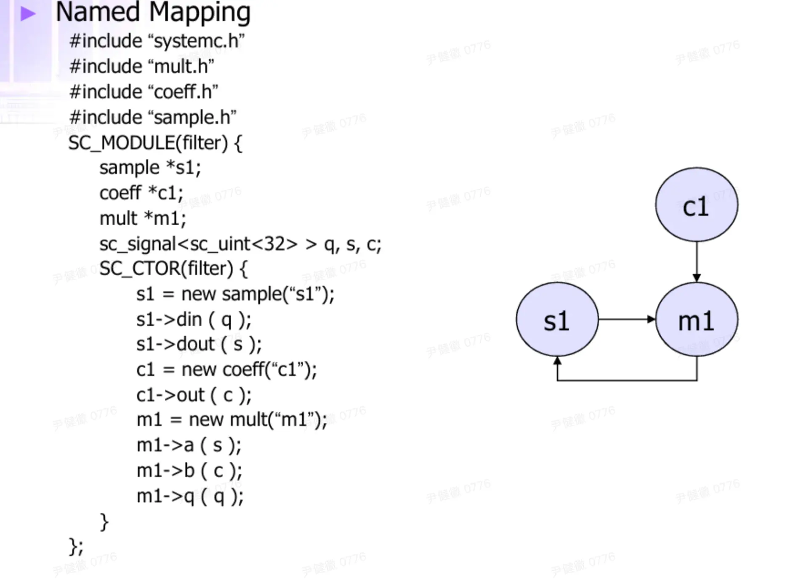
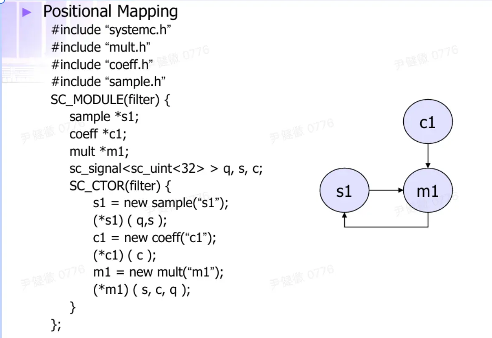

# 资料

1. 官方教程：https://learnsystemc.com/
    
    1. 上面learnsystemc的翻译和整理：https://zhuanlan.zhihu.com/c_1607417635079127040
        
2. 台湾大学systemc slide：http://media.ee.ntu.edu.tw/courses/msoc/slide/02_SystemC_Tutorial.pdf
    
    1. 第一课的翻译整理：https://zhuanlan.zhihu.com/p/703265170
        

  

  

# systemc

最基本的概念：

Below lists the most common terms used for SystemC.

|   |   |
|---|---|
|Method|A C++ method, i.e. a member function of a class.|
|[Module](https://learnsystemc.com/basic/module)|A structural entity, which can contain processes, ports, channels, and other modules. Modules allow expressing structural hierarchy. Module is the principle structural building block of SystemC, used to repsent a component in real systems.|
|[Process](https://learnsystemc.com/basic/simu_process)|A special kind of member function of a sc_module class, registered to the SystemC simulation kernel and called only by the simulation Kernel.|
|Interface|An interface provides a set of method declarations, but provides no method implementations and no data fields.|
|[Channel](https://learnsystemc.com/basic/signal_readwrite)|A channel implements one or more interfaces, and serves as a container for communication functionality.|
|[Port](https://learnsystemc.com/basic/port)|A port is an object through which a module can access a channel’s interface. But modules can also access a channel’s interface directly.|
|[Event](https://learnsystemc.com/basic/event)|A process can suspend on, or be sensitive to, one or more events. Events allow for resuming and activating processes.|
|[Sensitivity](https://learnsystemc.com/basic/sensitivity)|The sensitivity of a process defines when this process will be resumed or activated. A process can be sensitive to a set of events. Whenever one of the corresponding events is triggered, the process is resumed or activated.|

  

sc执行的各种阶段示意


  

  

**头文件：**

需要引入SystemC头文件，一般有两种方法

- 第一种如下
    

```Plain
#include <systemc.h>
```

此法会将systenc的所有命名空间，如sc_core等加入当前文件，这种方法用于同老版本的SystemC兼容使用，在未来的版本中可能去掉

- 第二种为
    

```Plain
#include <systemc>
using namespace sc_core;
```

这种声明方式，本质上是第一种方法去掉命名空间，因此使用此法需要自行引入需要的命名空间，通常使用第二种方法，同时配合using

  

入口地址是sc_main而不是main

  

**sc模块定义**

定义一个systemc module有三种方法：简单来说就是定义一个继承自sc_module的class或者struct

1. SC_MODULE(module_name) {}: this uses the systemC defined macro "SC_MODULE", which is equivement to #2. **一般使用这种**
    
2. struct module_name: public sc_module {}: a struct that inherits sc_module.
    
3. class module_name : public sc_module { public: }: a class that inherits sc_module.
    

Note, class is identical to struct except for its default access control mode of "private", as compared to "public" of struct.

  

**sc模块的构造函数**

- 每个module都需要一个不同的name，其构造函数至少需要一个参数（name）
    
- SC_CTOR是一个构造函数的宏，只需要一个参数，就是name
    
- 如果需要额外传递参数则不能使用这个宏，需要自己写构造函数，建议需要额外参数时使用SC_HAS_PROCESS宏
    
    ```JavaScript
    SC_MODULE(MODULE_C) { // constructor taking more arguments
      const int i;
      SC_CTOR(MODULE_C); // SC_HAS_PROCESS is recommended, see next example for details
      MODULE_C(sc_module_name name, int i) : sc_module(name), i(i) { // explcit constructor
        SC_METHOD(func_c);
      }
      void func_c() {
        std::cout << name() << ", i = " << i << std::endl;
      }
    };
    ```
    

method代表这个模块的成员函数

  

**SC_HAS_PROCESS(module)**：

- 不会默认创建一个构建函数，需要手动创建
    

  

什么是method，什么是process

  

**Simulation process：**

- 是sc_module的成员函数
    
- 没有输入，没有返回值
    

  

thread：模拟硬件process

- 并行跑
    
- 有敏感列表
    
- 不需要user来调用，始终激活
    

  

systemc支持3种threads

- SC_METHOD()：只执行一个周期
    
    - 串行执行
        
    - 类似 verilog的`@always bllock`
        
    - 用于组合逻辑或者简单的时序逻辑
        
- SC_THREAD()
    
    - 类似verilog的`@inital block`
        
    - 只在模拟开始时run，然后就暂停；内部可以包含一个循环，固定时间执行一段code
        
    - 一般用于testbench
        
- SC_CTHREAD()：执行一个或多个周期
    
    - Clock thread，reference a clock edge
        
    - 串行执行
        
    - 最常用的方法
        

  

敏感列表：

```JavaScript
#include <systemc.h>
SC_MODULE( and2 ) {
    sc_in<DT> a, b;
    sc_out<DT> f;
    
    void func() {
    f.write( a.read() & b.read() );
    }
    
    SC_CTOR( and2 ) {
        SC_METHOD( func );
        sensitive << a << b; 
    }
}
```

类似verilog中的

```C++
always @(a,b) begin
    f = a & b;
end
```

如果要表示时钟上升沿可以通过 `sensitive << clk.pos();`

  

sc可以通过<N>指定变量的bit数

```C++
sc_uinit<3> x; // unsigned
sc_init<3> x; // signed

// 与port_in和port_out一起使用
sc_in< sc_unit<1> > a,b;
```

  

ports：

- sc_in<data_type>; — input port
    
- sc_out<data_type>; — output port
    
- sc_inout<data_type>; — input/output port
    

如果<data_type>是自定义bit宽度，需要在末尾的括号前有一个空格`sc_in<sc_uint<10> >`

  

Fast Port Binding

上面的port绑定不是很直观并且比较慢，从sc2.1开始采用SC_EXPORT来快速绑定端口，可代替SC_PORT

  

sc_signal：

- 是一个wire，没有指定方向input or output
    
    - **Current Value (****`cur_val`****)**: `read()` 方法返回的值，代表当前仿真时间（或当前 Delta Cycle）下的信号状态。
        
    - **New Value (****`new_val`****)**: `write()` 方法更新的值，代表下一个 Delta Cycle 将要呈现的状态。
        
- 其数据流由连接的port指定
    
- `sc_signal >;`
    

两种使用示例

1. Name mapping

2. Positional mapping



  

  

SC_CTHREAD：

可以通过`reset_signal_is(rst,true)`这样来复位

```
SC_CTHREAD( func, clk.pos());
reset_signal_is(rst,true)

void func(void){
 wait();
 
 while(true){
     // read inputs
     // do something
     // write outputs
     wait()
 }
}
```

  

  

Systemc stage：

1. Elaboration：sc_start之前的准备工作，准备一部分数据结构（modules, ports, primitive channels, and processes），绑定ports
    
2. Execution
    
    1. Initialization：kernel识别所有待模拟的进程，放置到runable或者waiting set。除了no initialization的进程在waiting里，其余的都在runable。简单来说就是把进程插到调度队列中
        
    2. simulation：调度进程，advance模拟时间
        
        1. evaluate：一次次性run所有的runable process；对于每个process来说，会一直跑直到遇见wait()或者return。如果没有剩余的runable process，evaluate阶段就结束了
            
        2. advance-time：runable process清空时，开始这个阶段。主要完成三件事：使用事件机制将仿真事件转变为closest time；将等待特定时机的processes移动到runnable set；返回evaluate阶段
            
        
            Execution结束：1.所有process yielded；一个process执行了sc_stop；模拟时间到达设定值
        
3. cleanup：销毁对象、memory等
    

  

systemc的并发性建模并不是真的并发：实际上是串行执行（串行顺序不清楚如何安排），只是在所有进程执行完之后再增加一个统一的时间，使得外部看上去是并发

  

Event：event属于sc_event类，用于进程间同步，有如下方法

- void notify()：创建一个即时通知
    
- void notify(const sc_time&)，void notify(double, sc_time_unit)
    
- cancel()：删除本event的任意挂起的notify
    
    - 不能删除即时通知
        
    - 任意event只能有最多一个挂起的notify
        

一个event只能有两种动作：wait或者使其发生


  

waiti：

- wait()：等待敏感列表中的事件
    
- wait(e1)：等待event e1
    
- wait(e1|e2|e3)：等待事件e1，e2 or e3
    
- wait(e1&e2&e3)：等待事件e1，e2 and e3
    
- wait(200, SC_NS)：等待200ns
    
- wait(200, SC_NS, e1)：等待200ns之后的event e1
    
- wait(200, SC_NS, e1|e2|e3)：等待200ns之后的e1，e2 or e3
    
- wait(200, SC_NS, e1&e2&e3)：等待200ns之后的e1，e2 and e3
    
- wait(sc_time(200, SC_NS))：等待200ns
    
- wait(sc_time(200, SC_NS), e1)：等待200ns之后的event e1
    
- wait(sc_time(200, SC_NS), e1|e2|e3)：等待200ns之后的e1，e2 or e3
    
- wait(sc_time(200, SC_NS), e1&e2&e3)：等待200ns之后的e1，e2 and e3
    
- wait(200)：等待200个时钟周期，仅限于SC_CTHREAD（SystemC 1.0）
    
- wait(0, SC_NS)：等待一个delta 周期
    
- wait(SC_ZERO_TIME)：等待一个delta周期
    

静态wait与动态wait

  

Delta cycle理解：

https://caslab.ee.ncku.edu.tw/dokuwiki/techdoc:esl:systemc_delta_cycle

在 Verilog 中，你在时钟上升沿（Posedge）写入数据，接收端必须等到**下一个****时钟周期**才能读到数据。

在 SystemC 中，这个“时钟周期”就是 **Delta Cycle**。

但是delta cycle又不等价于一个时钟周期，它不会推进模拟时间

  

# systemc（二）

  

## datatype

sc_bit只有两个值 0 和 1

sc_logic增加了X和Z值，有4个值

sc_int和sc_uint

- 支持按位操作，支持选择某个bit，支持选择某个范围的bit，支持拼接；和verilog的操作很像
    

```C++
mybit = myint[7]
myrange = myint.range(7,4)
intc = （inta, intb)
```

sc_bitint和sc_biguint

sc_bv：二值，额外允许reduction操作，比如and_reduce()，or_reduce()，xor_reduce()

- or_reduce returns the result of ORing all bits in databus，然后返回一个bool值
    

sc_lv：4值，额外允许reduction操作，与上面的sc_bv类似

各种数据类型的模拟速度：


从上到下依次变慢，原生的c++数据类型最快

  

还有定点数fixed与浮点数ufixed，暂时不太关注，略过

  

## Basic channels and interfaces


interface是communication暴露出的接口，channel是具体实现communication，可能会包括多个interface，不同的channel对同一种interface的实现可能不一样

interface示例：

- sc_fifo_in_if
    
- sc_fifo_out_if
    
- sc_mutex_if
    
- sc_semaphore_if
    
- sc_signal_in_if
    
- sc_signal_inout_if
    

channel示例：

- sc_buffer
    
- sc_fifo
    
- sc_mutex
    
- sc_semaphore
    
- sc_signal
    
- sc_signal_resolved
    
- sc_signal_rv
    

  

下面介绍基本的channel：sc_mutex，sc_semaphore，sc_fifo，sc_signal，sc_buffer

mutex：独占一个对象，对共享对象做一个保证

- lock（一致阻塞直到获取锁）和trylock（非阻塞，通过返回值判断是否锁）
    

```C++
class bus{
    sc_mutex bus_access;
    ...
    void write(int addr, int data){
        bus_access.lock();
        // perform write
        bus_access_unlock();
    }
};
```

  

sc_semaphore：Have more than one copy of resources，信号量也是锁，但是会有多个可用的资源，只有资源不够用时才会阻塞（PV操作）


sc_fifo：可能是用得最多的建模channel


  

sc_signal：类似verilog里面的reg


说它是reg是因为其存在这样一种特性，同一计时下先写后读，读出的是旧值，写操作会在当前时间上加一个delta cycle，而读的还是没加delta cycle的值，因此是旧值

  

**Evaluate-update channels**


Evaluate stage：从runable的process中选一个出来执行，选谁这个顺序没有规定

计算完成之后可以调用request_update()，可以视作向update阶段发了一个请求，暂时挂起，等到所有process的evaluation结束之后进入update阶段，就会来处理这些挂起的update请求更新值；因此在update完成之前，变量中存的都还是旧值

> 注意只：The request_update() function may only be called inside member functions of a primitive channel

  

Update stage：

遍历evaluate阶段所有挂起的update请求，更新值。

在更新值时可能触发某些敏感列表，会唤醒某些进程加入到runable process，此时会+1 delta cycle，回到evaluate阶段继续计算这些process，直到某一时刻，所有值稳定，也没有唤醒新的process，此阶段结束。这里类似组合逻辑的信号传播过程。一级门电路翻转（Update），驱动下一级门电路运算（Evaluation），直到整个电路稳定。

接下来会有两个选择：

1. 查看未来的时间轴事件队列（Event Queue）。如果未来没有任何安排（没有 `wait(time)`，也没有 `next_trigger(time)`），说明仿真任务结束，调用 `sc_stop()`。
    
2. 如果还有time event notify：内核将当前仿真时间（$T_{now}$）更新为事件队列中最近的下一个时刻（$T_{next}$）。Verilog 类比：比如从 #10 跳到了 #20。
    

  

Advance time：仿真时间的推进可能会触发某些process，需要把他们加入

  

写systemc的多种视角：

- Direct top-level
    
- Indirect top-level
    
- Direct sub-module header-only
    
- Indirect sub-module header-only
    
- Direct sub-module
    
- Indirect sub-module
    

  

## communication

port就是指向channel的一个指针

sc的interface是继承自`sc_interface`的虚类

sc的channel是实现了一个或者多个interface的类，继承自`sc_channel`或者`sc_prim_channel`

互联的多种方式：可以看看选用什么类型的port


  

Port connection可以by name或者by position，这点类似verilog的模块初始化。说是connection，其实就是指针的赋值

  

更多有关ports的信息：

1. sc_fifo_out_if （if是interface的缩写）
    
    1. write()
        
    2. nb_write()
        
    3. num_free()
        
    4. data_read_event()
        
2. sc_fifo_in_if
    
    1. read()
        
    2. nb_read()
        
    3. num_available()
        
    4. data_written_event()
        

  

sc_fifo、sc_fifo_in_if、sc_fifo_in的区别是什么？

- sc_fifo是一个primitive channel
    
- sc_fifo_in_if：是一个interface，由sc_fifo实现
    
    - 等价于 sc_port<sc_fifo_in_if<float> > in;
        
- sc_fifo_in：是一个port：A specialized port class for use when reading from a fifo. (sc_port)
    

interface与port的区别，interface会有一些实现好的函数，而port只是一个指针的包装

  

sc_port<> Array可以通过如下进行初始化

```C++
sc_port<interface [,N]> portname;
sc_port<sc_fifo_in_if<int>, 4> p1;
```

  

sc_export：把内部的服务暴露给外面，让外部可以调用；类似一个函数指针；对比sc_port，它像一个**指针**。它定义了“我想调用 `IF` 接口里的函数（比如 `read` / `write`）”，但它自己没有实现这些函数。它必须连接到一个实现了该接口的对象上。例子：https://learnsystemc.com/basic/export

```C++
// Learn with Examples, 2020, MIT license
#include <systemc>
using namespace sc_core;

SC_MODULE(MODULE1) { // defines one module
  sc_export<sc_signal<int>> p; // an export for other modules to connect
  sc_signal<int> s; // a signal (channel) inside the module. If not using export, the channel need to be defined outside module1.
  SC_CTOR(MODULE1) {
    p(s); // bind an export to an internal channel
    SC_THREAD(writer); // a process to write to an internal channel
  }
  void writer() {
    int val = 1; // init value
    while (true) {
      s.write(val++); // write to an internal channel
      wait(1, SC_SEC);
    }
  }
};
SC_MODULE(MODULE2) { // a module that reads from an export
  sc_port<sc_signal_in_if<int>> p; // a port used to read from an export of another module
  SC_CTOR(MODULE2) {
    SC_THREAD(reader); // a process to read from an outside channel
    sensitive << p; // triggered by value change on the channel
    dont_initialize();
  }
  void reader() {
    while (true) {
      std::cout << sc_time_stamp() << ": reads from outside channel, val=" << p->read() << std::endl; // use port to read from the channel, like a pointer.
      wait(); // receives from port
    }
  }
};

int sc_main(int, char*[]) {
  MODULE1 module1("module1"); // instantiate module1
  MODULE2 module2("module2"); // instantiate module2
  module2.p(module1.p); // connect module2's port to module1's export. No need to declare a channel outside module1 and module2.
  sc_start(2, SC_SEC);
  return 0;
}
```
