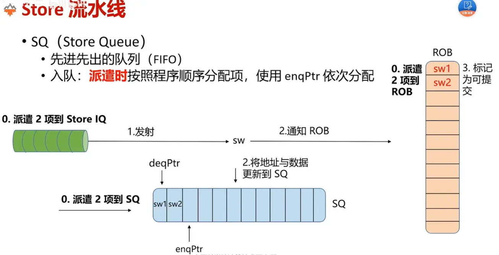
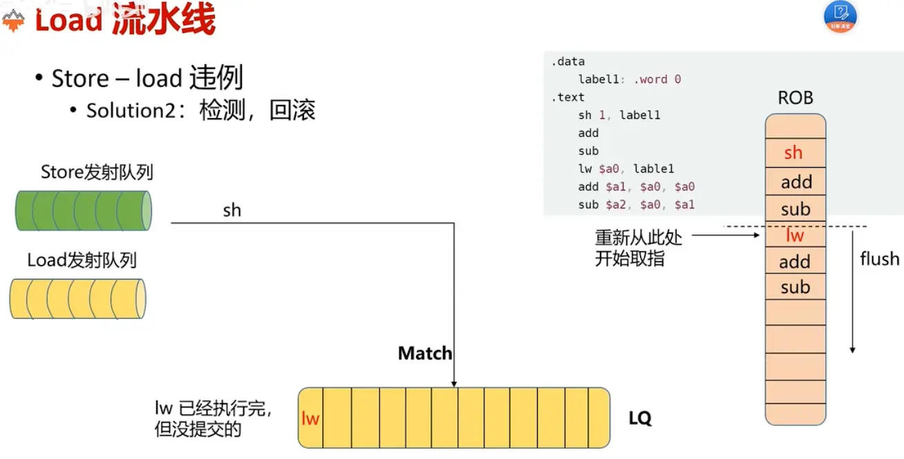

# 乱序访存入门

经典五级流水线中，访存和运算指令都会经历exe和mem阶段，但是实际上访存不会执行exe中的运算（除去访存地址运算），运算指令也不会去mem阶段访存

回到RISC指令的设计理念之一就是，运算指令不参与访存，访存指令不参与运算

因此直观的想法是，把访存单元抽象为一个独立的功能部件，这个功能部件只需要两个功能，处理load读和store写

访存单元一方面作为一个FU接受dispatch分发的load和store指令，一方面把load和store指令作为读写请求发送给cache，另一方面根据cache返回的数据写到ROB里面

## store流水线
**store指令**：store发射队列 -> store流水线（生成访存虚拟地址，去TLB查找，TLB如果miss需要回填；得到物理地址后进行权限检查）-> ROB?

store指令的特殊限制：必须在ROB提交之后才能进行真正的写操作，如果不做限制，当这条指令需要回滚（分支预测错误、异常、中断）时已经写到内存/cache了，无法撤回。这和load不一样，load读错了也没关系，不会影响内存

因此需要一个特殊的组件来完成这个功能，即当store指令commit时，发起写请求
* 可以让ROB来吗？
	* 可以，但是严重影响性能，store很耗费时间，在ROB卡着不走。能不能来一个异步的提交？
* 可以用一个单独的组件，而不是ROB，这个组件就叫做store queue
	* 入队：指令派遣时按照程序顺序分配SQ entry（因此SQ内部是顺序的，指令派遣不是乱序的吗？错，指令派遣是顺序，指令发射才是乱序的），此时也会分配ROB项
	* 把计算出的地址和数据都写到store queue/ROB里面
	* 出队：等到ROB提交store时，告诉store queue可以提交了；store queue会向dcache发送写请求。发送到的地方就是store buffer


store流水线因为一些原因阻塞了怎么办，可以通过标记store queue给他变成非阻塞，后续阻塞条件解除之后重发sw项

store可以提交后，会从SQ进入到store buffer，原因是store 一旦在 ROB 退休，体系结构上它就算完成了。  但这不意味着 L1 cache 恰好此刻就能立即接收这次写入。
比如可能有：
- cache 端口忙
- 正在处理 miss
- 写合并等待
- 写入 uncached/MMIO 空间要走特殊通路
所以需要一个 **store buffer** 把这些“已退休、合法可见”的 store 暂存起来。
这样 ROB 可以继续退休后面的指令，不必因为 cache 一时忙就整个后端堵死

## **load流水线：**
* load数据来源不仅来自于dcache，还来自store queue中未写入的store指令（store-load forwarding）。并且store queue的数据来源优先级更高，因为相比cache，这里的数据更加新

**store load违例**：不是寄存器相关，而是load store针对的地址相关，比如程序顺序是先store后load，但是由于load就绪更快，乱序调度后load先执行，由于load和store针对同一地址，本来应该先store写，然后load读新值。由于乱序调度，变成了，load读旧值，store还没写。这显然是错误的
```
store a1, 0(a2)
load  a3, 0(a2)
```
* sol1：阻塞型，规定任何load指令，只有等到前面的store指令进了SQ才能发射
* sol2：非阻塞型，允许load提前发射读取到旧值，但是需要检测该种违例情况。store比load年轻 && store和load针对同一地址 && load先于store执行，此种情况需要从load指令回滚处理器状态，重新做一遍load（推测执行？）

同样sol2也需要一个辅助结构，其作用是，存放已经执行完成，但是还没有到ROB提交的指令，只有这些load指令，才可能存在违例。也需要是顺序的存放
* ROB？同样是性能问题，每次需要遍历查找整个ROB，开销非常大
* 因此有一个load queue，他是一个用于记录load指令顺序的FIFO
* 入队和出队时机和store queue一致

检测：当一个新的store指令就绪，被发送到功能单元时，会检查LQ是否有比自己更加年轻且addr相同的，此时load满足执行时机早于store，之前说的三个条件全部满足，发生违例，需要回滚重新执行


一个例子，gem5中load store违例检查逻辑
```c++
void

LSQUnit::insertStore(const DynInstPtr& store_inst)

{

// Make sure it is not full before inserting an instruction.

assert(!storeQueue.full());

assert(storeQueue.size() < storeQueue.capacity());

++stats.addedLoadsAndStores;

  

DPRINTF(LSQUnit, "Inserting store PC %s, idx:%i [sn:%lli]\n",

store_inst->pcState(), storeQueue.tail(), store_inst->seqNum);

storeQueue.advance_tail();

  

store_inst->sqIdx = storeQueue.tail();

store_inst->sqIt = storeQueue.getIterator(store_inst->sqIdx);

  

store_inst->lqIdx = loadQueue.tail() + 1;

assert(store_inst->lqIdx > 0);

store_inst->lqIt = loadQueue.end();

  

storeQueue.back().set(store_inst);

  

stats.sqAvgOccupancy = queueOccupancy(storeQueue);

}
```
插入store指令到SQ时（顺序分发），会记录LQ末尾的index
当这个store指令操作数ready，可以发射时，会从记录的LQ index往后面扫（后续的load都是比store年轻的指令）

store set还存在一种预测机制
