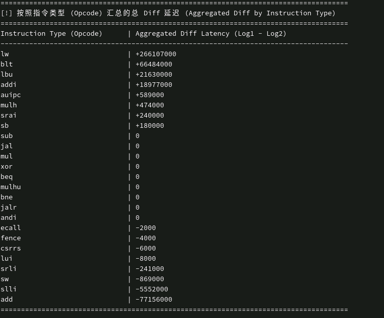

# 性能建模分享

1. 硬件与gem5通用测试程序的生成

- 负载程序要求：要求是ELF

    - 需要是支持的ISA\+ABI组合，RISC\-V 只接收 Riscv32/64 \+ Linux

    - elf内部布局没有特别要求，正常用户态elf，需要有加载段PT\_LOAD，e\_entry等，可选PT\_INTERP（动态链接）

- 程序入口：ELF内部的e\_entry，一般对应bootloader里面设置的\_start

    - 程序加载：

    - python层根据isa和sys创建一个se workload，然后交给c\+\+实例化一个对象。ELF相关类负责解析这个对象，从中获取entry，内存布局，把程序搬到内存中。激活线程，初始化页表等\.\.\.

    - 接着初始化栈，初始pc值：通过 Process::getStartPC\(\) 返回值：如果 ELF 有 PT\_INTERP，就先跳到解释器入口，即动态链接程序先跑 ld\.so；否则跳到主程序入口即\_start。

- 程序退出：分为两种，exit syscall和m5\_exit

    - Exit syscall：走系统调用，根据系统调用号找到对应的处理程序，halt当前线程，如果系统已经没有活动线程则退出模拟

    - m5\_exit：执行gem5的特定op，直接退出模拟

例子

```YAML
_start:
    
    # 控制寄存器初始化
    li x3, 0x70013
    csrs mcor,x3

    # enable write allocate
    # li x3, 0x4
    # csrs 0x7c1,x3
    li x3, 0x11ff
    csrs mhcr,x3

    # performence counter初始化
    li x3,0x1
    csrs 0x323, x3      # mhpmcnt3 L1 ICache Access
    ...
    
    # 设置栈指针
    la sp, stack_top

    # gpr初始化为0，避免仿真出现X
    li x1,0
    ...

    # 跳转到main函数，你自己的代码
    li a0, 0

    call main

exit:
    fence                                                       
    li a7, 93
    li a0, 0        
    ecall

```

踩过的坑

- 链接错误：如果执意使用m5\_exit，链接时需要gem5提前编好的一个\.so，比较麻烦，后改用exit syscall解决

- 执行时pagefault：一般是某个段没有分配地址，需要检查ld脚本，什么算是分配一段地址？下面二者的区别

    ```Plain Text
    # link script 1
    ENTRY(_start)
    SECTIONS
    {
      .text : {
        */bootloader.o(.text)
        *(.text)
        *(.rodata)
        *(.data)
        *(COMMON)
      }
      .bss : { *(.bss) }
      heap_low = .;
      . = . + 0x1000000;
      heap_top = .;
      . = . + 0x1000000;
      stack_top = .;
    }
    
    # link script 2
    ENTRY(_start)
    SECTIONS
    {
      .text : {
        */bootloader.o(.text)
        *(.text)
        *(.rodata)
        *(.data)
        *(COMMON)
      }
      .bss : { *(.bss) }
      .heap_low :{
        . = . + 0x1000000;
      }
      heap_top = .;
      .stack :{
        . = . + 0x1000000;
      }
      stack_top = .;
    }
    ```

- gem5执行没问题，硬件仿真时出现X信号：gpr没有初始化，在硬件中会表现为X值，而不是0


gem5执行后有用的信息

- 时间与总量：模拟时间、频率、提交了多少条、ipc（instructions per cycle）

- 指令组成：

    - Load 占比 = numLoadInsts / numInsts

    - Store 占比 = numStoreInsts / numInsts

    - Int 占比 = numIntInsts / numInsts

    - FP 占比 = numFpInsts / numInsts

    - Vector 占比 = numVecInsts / numInsts

    - Branch 占比 = numBranches / numInsts

    - 条件分支占比 = committedControl::IsCondControl / numInsts

- 分支行为：主要关注btb和预测准确度

    - BTB

    - 直接分支

    - 间接分支：指的是跳转目标地址需要从寄存器中读取，比如jalr

    - RAS

    - Loop predictor

- cache行为：L1/L2

    - 总的access次数

    - 总的hit次数

    - 总的miss次数

- DRAM行为

处理器前端和后端的概念

- **前端**：负责“把活接进来、看懂、分发出去” 

- **后端**：负责“真正干活、算结果、访问数据、写回结果”


gem5仿真速度？

- 90w insts/s

- 后续可以通过simpoint、kvm等加速？


**测试程序的选择？**

理想情况下就是根据真实负载，比如别的组出的case，在gem5上面跑，跑完和硬件对比。但是目前gem5还没有接入仿真器，硬件环境也没有就绪。我们只能对单个CPU进行测试，衡量这个CPU建模是不是够准确。

测试程序的底层逻辑是，需要是一个可控的，参数化的行为发生器，通过这种测试程序能够区分开准确的建模和模糊的建模

1. 用一小组很明确的计算/访存/控制流模式，持续重复执行足够长时间。

2. 每种模式只突出一类主要硬件行为，尽量压低其他干扰因素。

3. 所有关键行为都能用少量参数调节，从而扫出一条“响应曲线”，而不是只看一个点。

4. 程序行为在每次运行中尽量一致，这样 gem5 和真实硬件的差异才更可能来自建模，而不是来自程序随机性或 OS 噪声。


**性能建模**：如何最大程度对齐到微架构，从手册里面获取各种需要的参数信息，总结为一个表。但是手册不全，一般只会给出大概的信息，然后建模需要一些很具体的参数，比如btb有多少个entry，物理寄存器有多少个，需要从RTL中获取。如果没有RTL，就需要通过测试程序，进行CPU逆向，试出来这些参数了

在进行性能建模时，需要关注这些问题

- 性能差异较大时，如何找出怀疑的地方，性能差异出现在gem5的哪些指标

- 不同指令的延时测量，计算指令延时很好测量，但是到了O3CPU时，load/store指令，retire时通常不代表真的完成了load和store

- 如果模拟器架构和待建模的cpu架构有差异，是修改模拟器架构还是修改模拟器参数？

    - 迭代到后面，模拟器的规模也非常大，修改架构可能不比修改rtl简单，如何选择


gem5与硬件的校准体现在两个地方

1. gem5与硬件都有的架构：参数高度保持一致

2. gem5与硬件不共有的架构：先评估是否由于此处的误差，从而影响了整体程序的误差。如果是，能否在不修改gem5架构的情况下逼近


粗糙的对齐方法：

简单对比gem5与硬件的统计数据，一个个猜可能出现误差的地方，比如发现icache的访问次数不对，就要怀疑这一整条链路上，prefetcher、icache配置（way，大小，tag和data latency，lsq等），一个个改参数看是否能缩小差异

此过程需要先分析理论值、再看硬件和gem5


906例子：程序特征是lw多，sw少

1. icache访问次数对不上，gem5差不多是906的1/3，首先怀疑每个周期取指令的宽度是否一样，是否有合并icache访问次数这一说法。后来发现是gem5每次默认取一个cacheline，而不是一条指令，将 `fetch1LineSnapWidth` 从0（这个值为0时代表使用cacheline size）改到了8，这样就能实现每次取两条指令，不过这种地缺点是没有模拟如果这两条指令是跨cacheline的，则只会取第一条指令，第二条下次再取，但是误差很小可以不考虑

修改之后icache次数从 413526 \-\> 1303136，十分接近硬件的1305959

2. dcache访问次数对不上：906是gem5的1/2。首先还是怀疑访问粒度不一样，但是check了一下发现都是正确的，然后查看preftch，cache配置等都没有发现问题，只能怀疑是不是硬件有合并load或者store访存的机制，又或者是统计口径就不同

    1. 硬件有合并load/store机制？

        1. 有load\-store forwarding（后续的load请求命中store buffer，直接返回数据，不会加一次cache访问请求），但是gem5这种情况会增加一次cache访问请求

        2. 有store同target合并，gem5没有，这也是误差之一


以上次数都能对上之后，发现时间差得还是比较多，于是写了脚本，记录gem5中每条指令执行时间，与硬件每条指令执行时间进行对比，发现大部分误差来源于lw

3. dcache访问时间对不上

首先分析各个功能单元指令数量占比

然后分析时间瓶颈，分析每个pc的执行次数和执行时间，主要是在cache，从0\.0048降到0\.0026，一共有三次主要修改



1. 将dcache的data latency和tag latency从2改为1，tag和data并行访问，修改之后从0\.0048\-\>0\.0038

2. 对icache的data latency和tag latency进行同样的修改，修改之后从0\.0038\-\>0\.0033

3. 允许outstanding的memory请求，即允许上一个lw还没有完全返回，下一个lw也发到lsq上，修改之后从0\.0033\-\>0\.0026

发现有很多连续的lw，906一般一个cycle就处理了一条load，而gem5通常是需要3～4个cycle。


920例子；

1. l1 icache访问次数：硬件值 2988328，gem5 1744278

2. l1 dcache load miss：硬件值 79207，gem5 114743

    1. gem5比硬件高了45%，gem5 miss太多，可能原因

    - 排查下load access是否对齐，是的

    - prefetch对齐？是否是因为硬件的prefetch提前将数据load进来，导致miss减少？

    1. 推测：硬件对load miss有合并机制，write a case verify it？ 

        gem5也有合并机制，可能是gem5的load miss合并不够，有一个奇怪的点，miss次数更多，但是耗时反而更少，why？

        1. miss合并机制在gem5中表现为mshr，如何逼近到硬件的mshr？ 当同一个 cache block 已经有一个未完成 miss 时，后续对同一 block 的请求会命中已有 MSHR，而不是再新开一个 miss

        2. mshr指标是什么：

        ```Python
        self.mshrs = 8  # max outstanding misses [required]
        self.tgts_per_mshr = 2  # targets per MSHR [required] 一个mshr可以合并多少个target
        ```

    通过把mshr不变，tgts\_per\_mshr变小，既达到了减小miss次数，也达到了时间延长，why？

3. dram未对齐

    硬件没有建模，只是外挂了一个vip，不存在真实的DRAM

    - 但是内部DDR4有合法性检查，不能真的把延时设为0，那么把这个延时设置得很小，ps级别，基本可忽略

        - 为什么仅仅修改延时，也会导致访存次数这些的改变

    - 尝试更改ddr4为一个简单memory，但是这会导致访存次数这些也有很大的改变，why？

        - ddr内部有bank，以及对burst的拆分


这里的CPU逆向其实和测试程序的选取关系很大，首先介绍下CPU架构逆向的定义

- 已知微架构采用某种设计，但是不知道其具体的设计参数

- 不确定微架构采用的设计，给出一些可能的设计，逐个排除和确认

我们建模时遇到的问题主要还是第一种，遇到这种问题时，需要选用或者编写合适的benchmark


需要思考的问题

1. 针对什么微架构部件

2. 针对该部件的什么设计参数

3. 反映出现差别的指标是什么

4. 程序在什么情况下会导致瓶颈出现，程序的参数如何对应到设计参数

5. 如何校准指标？


比如上面的 L1 DCache 容量的测试上，这几个要素的回答是：

1. 针对什么微架构部件：L1 DCache

2. 针对该部件的什么设计参数：L1 DCache 的容量

3. 反映出现瓶颈的指标是什么：时间，周期数，缓存缺失次数

4. 如何构造程序来导致瓶颈出现：在内存中开辟数组，然后不断地扫描访问

5. 程序在什么情况下会导致瓶颈出现：数组大小超过 L1 DCache 容量

6. 程序的参数如何对应到设计参数上：数组的大小对应到 L1 DCache 的容量


逆向的意义不仅仅在于逆向，还在于对齐微架构参数，以及暴露单一因素是否是造成性能差异的原因。当一个benchmark跑上去时，很可能某个地方跑的时间多了，但是因为另一个未对齐地方执行时间更少，从而掩盖了这部分差异，如果需要针对任何负载程序都做到非常精确，这种一个个小部件的对齐是很重要的。


举个例子：https://zhuanlan\.zhihu\.com/p/720136752

假如不知道CPU每个周期取多少条指令，怎么测量呢。我们是不是应该设计一个程序，我们需要找到一种方式精确控制取回的指令的数量，并让其不足以供给后端的指令执行从而产生瓶颈。


cache的平均访存时间，其实很难测量
