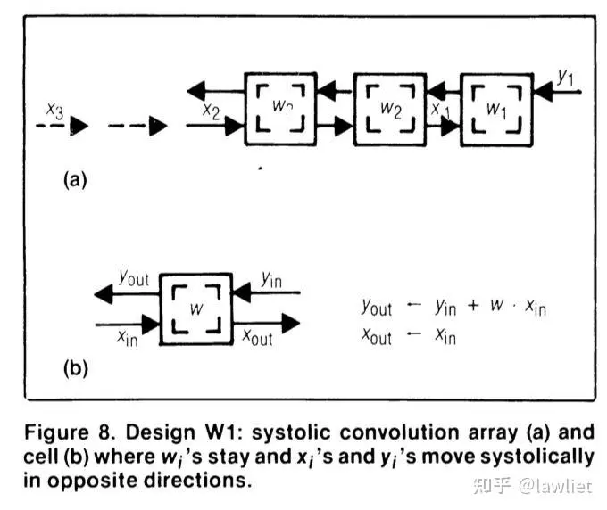
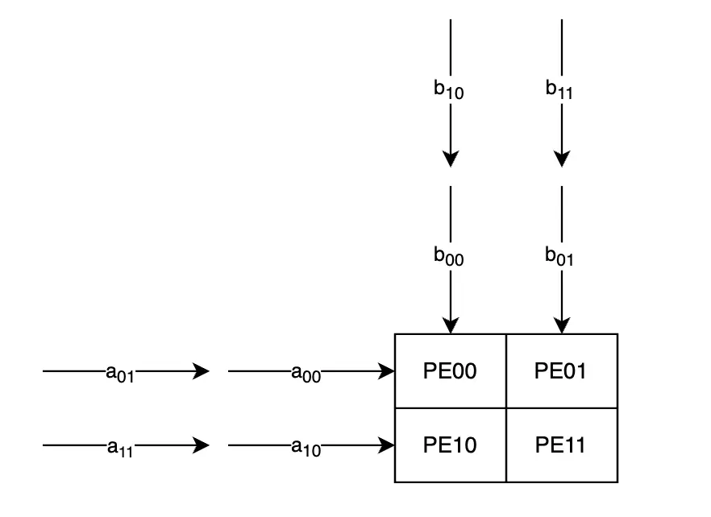
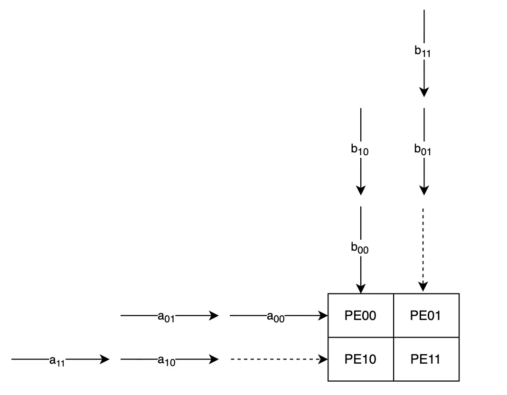
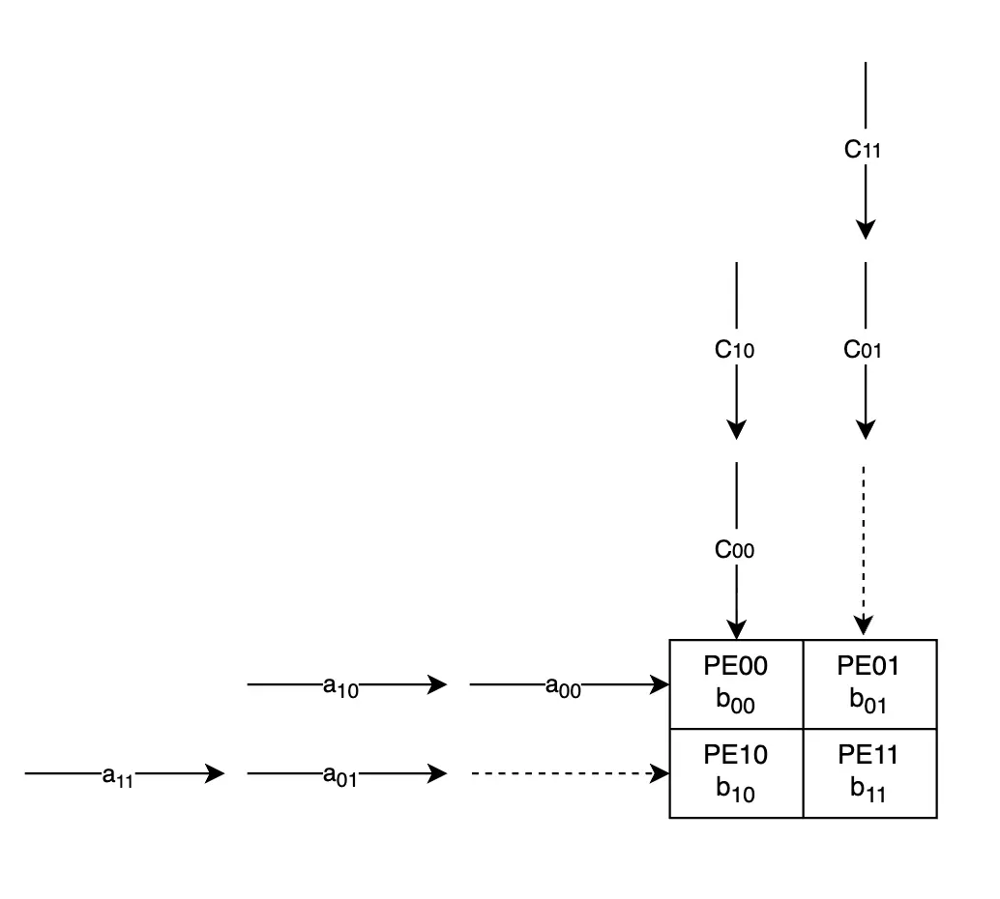
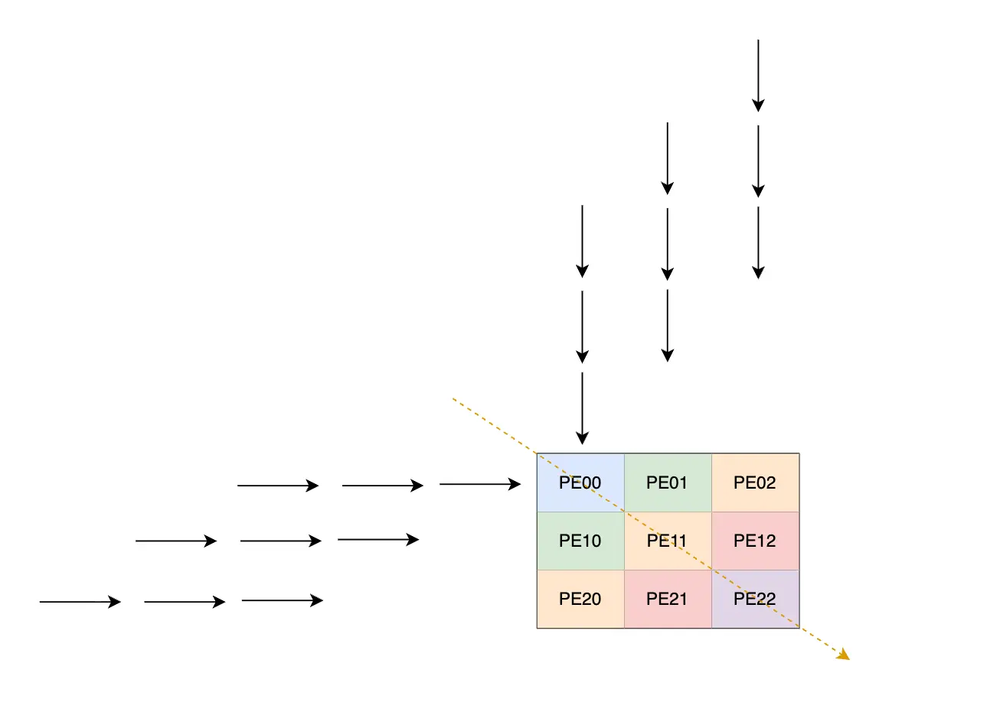

参考项目：
* https://github.com/tiny-tpu-v2/tiny-tpu
* https://zhuanlan.zhihu.com/p/650209037
# 从矩阵乘法到脉动阵列：一个 PE 是如何被推导出来的？

在学习 AI 加速器时，经常会遇到一个经典结构：**Systolic Array（脉动阵列）**。

很多资料会直接给出一个 PE（Processing Element）的形式：

```text
          x_in
            |
            v
        +-------+
w ----> |  MAC  | ----> x_out
        |       |
        |  acc  |
        +-------+
            |
            v
          y_out
```

并告诉我们：

$$
x_{out}=x_{in}
$$

$$
y_{out}=y_{in}+w\times x_{in}
$$

比如一个经典的一维脉动阵列运算就是 Weight Stationary（权重驻留）：weight 在 PE 中不动，$x$ 和 $y$ 向外流动。



但是，为什么 PE 要这样设计？为什么 $x$ 不变，而 $y$ 要累加？为什么输入数据需要继续向后传递？为什么有的计算结果需要保存在本地累加，有的计算结果又需要向后传递？

如果只看 TPU 或者 NPU 的结构图，很容易把脉动阵列理解成一个固定模板。实际上，它背后的设计逻辑来自一个更基础的问题：

**如何高效地完成大规模矩阵乘法，同时减少数据搬运？**

这也是 H. T. Kung 在 1982 年提出 Systolic Architecture 时关注的问题。

本文想回答的问题包括：

- 脉动阵列是怎么从矩阵乘法推导出来的？
- 每个 PE 为什么是一个 MAC（乘加模块）？
- 为什么会有 $x_{out}=x_{in}$ 和 $y_{out}=y_{in}+w\times x_{in}$？
- 每一行、每一列分别是什么？数据如何流动？顺序和时序如何安排？
- 谁横向移动，谁纵向移动？
- 只堆 MAC 局限性是什么？

---

## 从矩阵乘法开始

AI 中最重要的计算之一就是矩阵乘：

$$
C=A\times B
$$

其中：

$$
C_{ij}=\sum_k A_{ik}B_{kj}
$$

也就是说，一个输出元素 $C_{ij}$ 本质上是很多次 MAC：

$$
C_{ij}=A_{i0}B_{0j}+A_{i1}B_{1j}+A_{i2}B_{2j}+\cdots
$$

因此，最基本的计算单元就是：

$$
acc=acc+a\times b
$$

也就是乘加单元（MAC）。

最简单的硬件中，每个 MAC 每次根据输入 $a$ 和 $b$ 计算一个 $a\times b$，然后累加到内部的 sum 寄存器中。这样持续输入数据并累加，就可以算出一个 $C_{out}$ 的结果；也就是一个 PE 对应一个 $C$。

```text
       a
       |
       v
    +-----+
b-->| MAC |
    +-----+
       |
       v
       C
```

如果矩阵规模变大，比如是一个 $1000\times1000$ 的矩阵，需要不停地读取输入数据，一个 MAC 显然不够，于是自然会想到增加更多 MAC：

```text
MAC MAC MAC
MAC MAC MAC
MAC MAC MAC
```

但是新的问题出现了：计算单元增加以后，如何给它们提供数据？如果所有 MAC 都从一个共享存储读取：

```text
              Memory

          / / / / / /

       PE PE PE PE
       PE PE PE PE
       PE PE PE PE
```

那么，存储带宽和数据移动会成为主要瓶颈。

在 80 年代的 VLSI 设计中，一个重要事实是：长距离通信成本比计算成本高。因此 Kung 提出的思想是：不要让所有计算单元依赖远距离通信，而是让数据像流水一样流过计算单元，让 PE 只和邻居通信。

---

## 从数据复用推导二维阵列

前面我们已经知道了一个 PE 的构成，以及它如何计算出矩阵乘法中的一个最终结果。那么，如果需要计算出多个结果，数据应该怎么流动？

重新观察矩阵乘法：

$$
C_{ij}=\sum_k A_{ik}B_{kj}
$$

先考虑只计算一个输出 $C_{00}$：

$$
C_{00}=a_{00}b_{00}+a_{01}b_{10}+a_{02}b_{20}
$$

其中：

- $A$ 的一行会参与多个输出。
- $B$ 的一列会参与多个输出。

所以最自然的数据流是：

- $A$ 横向移动。
- $B$ 纵向移动。
- $C$ 在当前位置累加，每个 PE 输出一个 $C$ 的结果。

以结果是 $3\times3$ 的矩阵为例，可以形成二维阵列

每个 PE 做三件事：

1. 接收左侧传来的 $A$。
2. 接收上方传来的 $B$。
3. 计算并累加部分和。

由于 $A$ 还需要给后面的 PE 使用，所以：

$$
x_{out}=x_{in}
$$

而输出结果需要累加：

$$
psum_{out}=psum_{in}+x_{in}\times w
$$

那么纵向的 $y_{out}$ 到底是什么？这里会有几种做法，比如 Weight Stationary 和 Output Stationary；不同做法中流出的数据不同，也适用于不同的场景。

这就是最初的 PE 结构。它不是人为设计出来的，而是由矩阵乘法的数据依赖关系决定的。

---

## PE 内部保存什么？

随着 AI 模型的发展，人们发现，计算 MAC 本身越来越便宜，真正昂贵的是：

- 从 SRAM 读取数据。
- 从 DRAM 搬运数据。
- 在计算单元之间移动数据。

因此产生了不同的数据驻留方式。核心问题是：哪一种数据应该留在 PE 内部，以减少移动？

> 数据量比较大，最好就不要移动；数据复用性比较高，最好就不要移动。

主要有三种：

- Output Stationary
- Weight Stationary
- Input Stationary

---

### Output Stationary（输出驻留）

Output Stationary：让输出 partial sum 保存在 PE 中。

PE 内部保存 accumulator：

```text
acc += A * B
```

优点：

- partial sum 不需要移动。
- accumulator 利用率高。
- 非常适合大规模 GEMM。

缺点：

- $A$、$B$ 需要持续流动。
- 数据流固定，灵活性有限。

Google TPU v1 的矩阵计算结构接近这种思想。

---

### Weight Stationary（权重驻留）

Weight Stationary：让 weight 保存在 PE 内。

```text
        Activation

             |
             v

        +---------+
        |  MAC    | <--- Weight
        +---------+

             |
             v

           Output
```

这种方式在 CNN 中非常常见。

原因是卷积中的 kernel 会被重复使用，比如一个 $3\times3$ filter 会滑过整个 feature map，同一个 weight 会参与大量计算。

优点：

- weight reuse 高。
- 减少权重读取。

缺点：

- 输出累加需要更多通信。
- 对动态矩阵计算不够友好。

Weight Stationary 时，纵向其实就没有从外部来的输入了；横向仍然有输入，因为纵向的输入现在直接通过固定在 PE 中的 weight 提供，不需要再流动。

不过，纵向还需要 partial sum 的流动，可以视作 $C_{ij}$ 的流动；初始化时都是 0，并且 $C$ 也需要各自错开。

---

### Input Stationary（输入驻留）

Input Stationary：固定 activation。

这种方式适合某些卷积场景，因为一个输入像素可能参与多个输出。

优点：

- 输入复用率高。

缺点：

- weight 和 output 移动增加。
- 适用范围较窄。

但是，数据在时序上怎么放、流动顺序是什么，仍然需要解决。数据输入顺序需要一定的 skew（错开），下面用一个例子来说明。

---

## $2\times2$ 脉动阵列示例

考虑：

$$
A=
\begin{bmatrix}
a_{00} & a_{01}\\
a_{10} & a_{11}
\end{bmatrix}
$$

$$
B=
\begin{bmatrix}
b_{00} & b_{01}\\
b_{10} & b_{11}
\end{bmatrix}
$$

结果为：

$$
C=A\times B
$$

其中：

$$
C_{00}=a_{00}b_{00}+a_{01}b_{10}
$$

$$
C_{01}=a_{00}b_{01}+a_{01}b_{11}
$$

以下给出两种驻留的计算，需要重点观察数据流向、数据顺序（是一行还是一列放在一起流动，不同方式顺序也不同）、如何错开
### 输出驻留示例

映射关系如下：

```text
             B

        b00        b01
         |          |

      +------+------+
      | PE00 | PE01 |
A --->+------+------+
      | PE10 | PE11 |
      +------+------+
```

每个 PE 保存一个输出：

- PE00 -> $C_{00}$
- PE01 -> $C_{01}$
- PE10 -> $C_{10}$
- PE11 -> $C_{11}$

如果数据这样流动，能正确计算吗？一个箭头线代表一个 cycle。假设 $a_{00}$ 是 cycle 0 进入 PE00 的输入，$a_{01}$ 是 cycle 1 进入 PE00 的输入，以此类推。

这样 PE00 的计算是对的，但是 PE01 和 PE10 的计算都是错的。为什么？



cycle 0 时，$b_{10}$ 进入 PE01 的输入，但是 $a$ 的输入还没到，可以视作 0。而 $C_{01}$ 正常应该是：

$$
C_{01}=a_{00}b_{01}+a_{01}b_{11}
$$

在这里却错误地变成了：

$$
C_{01}=0\times b_{10}+a_{01}b_{11}
$$

同理，PE10 也是错的，PE11 计算正确。

因此输入需要进行 skew（错位）。也就是说，$b_{10}$ 需要等待一个 cycle，等到 $a_{00}$ 流动过来以后，才能进入 PE01。



### Weight Stationary 计算示例

以 $2\times2$ 矩阵为例：数据顺序也和之前的输出驻留不一样。横向输入顺序从 $a_{00},a_{01}$ 变为 $a_{00},a_{10}$，每个 PE 中驻留的是 weight，比如 PE01 中驻留的是 $B_{01}$。



- cycle 0：PE00：$C_{00}=0+a_{00}b_{00}$。
- cycle 1：PE00：$C_{10}=0+a_{10}b_{00}$；PE01：$C_{01}=0+a_{00}b_{01}$；**PE10：$C_{00}=a_{00}b_{00}+a_{01}b_{10}$**。
- cycle 2：PE01：$C_{11}=0+a_{10}b_{01}$；**PE10**：**$C_{10}=a_{10}b_{00}+a_{11}b_{10}$**；**PE11**：**$C_{01}=a_{00}b_{01}+a_{01}b_{11}$**。
- cycle 3：**PE11**：**$C_{11}=a_{10}b_{01}+a_{11}b_{11}$**。

加粗的部分就是已经计算完成的结果。可见，4 个 cycle 后，4 个元素都已经计算完成。

---

## 为什么 Transformer 改变了 AI 加速器？

早期 CNN 具有这些特点：

```text
固定卷积

固定 kernel

大量 weight reuse
```

因此非常适合 Weight Stationary。

但是 Transformer 的主要计算是：

$$
Attention(Q,K,V)
$$

其中：

$$
QK^T
$$

本质是大规模矩阵乘。

同时，Transformer 还具有这些特点：

- sequence length 不固定。
- token 数量变化大。
- 有 softmax、layernorm 等非 GEMM 操作。

因此现代 AI 芯片逐渐从固定数据流 NPU，发展为：

```text
Scalar Core
+
Vector Engine
+
Tensor/Systolic Engine
+
Large SRAM
```

其中，Tensor/Systolic Engine 负责大量矩阵乘；Scalar 和 Vector 单元负责控制、地址生成以及非矩阵计算。

---

## 总结

脉动阵列并不是一种“为了 AI 发明的特殊结构”，它本质上是：

**从矩阵乘法的数据依赖关系出发，为了解决 VLSI 中数据搬运成本过高问题而产生的一种计算组织方式。**

推导过程可以概括为：

```text
矩阵乘法

↓

大量 MAC

↓

多个 PE 并行

↓

数据搬运成为瓶颈

↓

让 A、B 在 PE 之间流动

↓

C 在 PE 内累加

↓

Systolic Array
```

而不同的数据驻留方式，本质上是在回答同一个问题：

**什么数据最值得留在计算单元附近？**

- Output Stationary：保留输出，适合 GEMM。
- Weight Stationary：保留权重，适合 CNN。
- Input Stationary：保留输入，适合部分卷积场景。

理解这个推导过程，比记住某一个 TPU 或 NPU 的结构图更重要。

---

## 思考：局限性

似乎有很大一部分 PE 在最开始时没有进行计算。比如一个结果为 $n\times n$ 的矩阵，其对应地需要 $n\times n$ 个 PE。实际上，PE 的利用是从左上角开始，沿着逆对角线往下逐步展开的。



以 $3\times3$ PE 为例，PE 会依次沿着黄色方向、按逆对角线开始有输入并进行计算：

$$
(PE00),\ (PE01,PE10),\ (PE02,PE11,PE20),\ldots
$$

这有点类似 CPU 中流水线的冷启动。但是 CPU 中流水线的 stage 比较少，而 PE 阵列往往比较大。对于一个 $100\times100$ 的 PE 阵列来说，这会浪费多少个 cycle 的 PE？

- 可以简单计算一下：第一个周期新启动 1 个，第二个周期新启动 2 个，直到第 100 个周期新启动 100 个，第 101 个周期新启动 99 个。
  $$
  (100^2-1)+(100^2-1-2)+(100^2-1-2-3)+\cdots+(100^2-1-2-\cdots-100)+(100^2-1-2-\cdots-100-99)+\cdots+0
  $$
- 可以看到浪费了很多周期：本来可以使用 PE，但是因为冷启动导致没有使用。不知道是否有相关研究进行了探讨。
