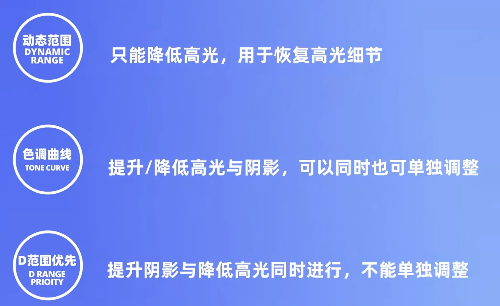

# 富士参数

## 曝光三要素

快门速度、光圈、iso
iso提高会导致画质降低、噪点变多，好处是提亮画面

互易律：指曝光三要素可按照比例互易而曝光量不变
例如：iso由125提高到250则光圈或快门降低一档保持曝光不变；这个可以把相机调整到某个档位，实现

拍了raw之后可以进行RAW处理，在这里我们可以调整下面介绍的关键参数 

## 色彩相关

### 色彩
色彩加减是用来提高/减少饱和度和色彩亮度的，色相基本不会改变
暖色冷色都会提升

通过拾色器对比（有HSB三个参数，H：色相；S：饱和度；B：亮度）

### 色彩效果
该参数调整没有色彩调整那么明显

* 色彩效果对暖色系饱和度进行小幅度提升（暖色系、小幅度）
* 强弱两档有轻微的幅度差距
* 不影响冷色系，不改变色相

### 色彩FX蓝
 * 大幅度提升冷色调饱和度、蓝色饱和度
 * 强弱两档有明显差距
 * 即便是FX弱与色彩+4对比，也是降维打击，蓝色饱和度大大提升

小结：
* 色彩参数主要是提升饱和度，下面三项可以互相叠加互不干扰
* 要提升暖色调 & 冷色调的饱和度：使用色彩
* 只想提升暖色调的饱和度：使用色彩效果
* 只想提升冷色调饱和度：使用FX蓝色

## 动态范围

动态范围的使用有前提，想要使用高一档的动态范围，需要提升iso

过曝时可以通过提升动态范围来降低曝光，同时保留阴影部分的细节

作用：
* 显著降低高光区域的曝光
* 不影响阴影区域的曝光
* 画质会略微下降，不过这是因为动态范围调高，导致iso调高带来的坏处，影响不大

### 色调曲线

有一条曲线，可以调整高光（-2到+4），阴影是（-2到+4），控制对比度
* 高光控制右侧更高的区域。加高光曲线上抬，减高光曲线下抬
* 阴影控制左侧低的区域，加阴影是加重了阴影效果，曲线会往下；减阴影则是减轻，曲线会往上

这条曲线对应到我们视觉上，则是顾名思义，各自控制各自

### D范围优先级

开启之后动态范围和色调曲线都不可用，调整该参数会影响iso

高光恢复能力强于动态范围，可以理解为自动调整高光和阴影，但是会降低对比度，使画面灰；没有单独调整高光和阴影那么灵活，但是操作更加简单

