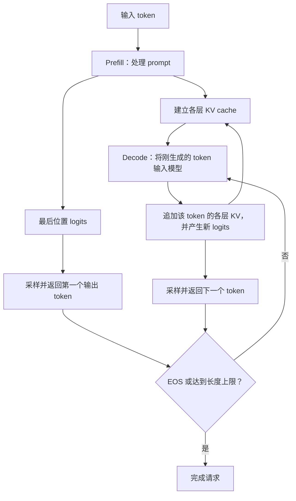
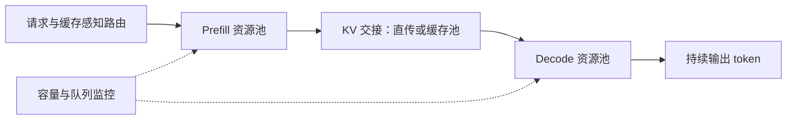

## 推理架构/计算特点

推理需要同时优化首 token 延迟、生成速度和服务吞吐。它包含两种形状明显不同的计算：prefill 处理已经知道的输入序列，decode 利用已有 KV cache 逐步处理新 token。两阶段通常执行同一套模型权重，但权重复用程度、状态访问量和调度目标不同。[Transformer 推理参考](https://jax-ml.github.io/scaling-book/inference/)

### 应该观察哪些指标

| 指标                         | 含义                         | 对系统设计的影响                   |
| -------------------------- | -------------------------- | -------------------------- |
| TTFT，Time To First Token   | 请求到达至第一个输出 token 返回的时间     | 包含排队、输入处理、prefill、采样及必要的传输 |
| ITL / TBT                  | 相邻输出 token 的时间间隔           | 反映生成是否连续，要关注 P95/P99 卡顿    |
| TPOT，Time Per Output Token | 通常为首 token 之后的平均每 token 耗时 | 不能代表单次间隔的尾延迟               |
| 端到端延迟                      | 请求到达至最后一个输出 token 返回       | 同时受输入和输出长度影响               |
| 吞吐量                        | 每秒完成的请求数或 token 数          | 必须标明输入、输出还是混合 token，以及统计范围 |
| Goodput，有效吞吐量              | 在指定延迟目标内完成的有效工作量           | 比单纯追求最大 tokens/s 更适合交互服务   |
| tokens/J、成本/token          | 能耗和经济效率                    | 要统一模型、质量、延迟约束及功耗统计边界       |

## Prefill 和 Decode 分析

### Prefill：输入已知，可以在 token 维度并行

对于长度为 $S$ 的 prompt，每层为各位置计算 Q/K/V，执行带因果 mask 的 attention，再经过输出投影和 MLP。各层之间仍然存在依赖，但同层的多个输入位置可以并行处理；因果 mask 不意味着必须像生成一样逐个运行整套模型。

典型工作包括：

1. 对多个 token 执行线性投影，形成较大的矩阵乘法。
2. 计算 prompt 内部的 attention。
3. 将各层 K/V 保存下来，供后续 decode 使用。
4. 计算末尾位置的 logits；普通生成不要求保留所有输入位置的 logits。

batch通常较大，可以并行

### Decode：单请求跨步串行，步内仍可并行

一次普通 decode 前向计算，为每个活跃请求处理一个新 token：

1. 计算该 token 的 Q/K/V。
2. 用新 Q 访问历史 KV，完成 attention。
3. 执行输出投影、MLP 等计算，并追加新 KV。
4. 从新 logits 得到下一个 token。

串行的是同一请求相邻生成步骤之间的依赖。不同请求可以 batch；单步内部仍可以采用张量并行、流水线并行等方式。推测解码还可以一次验证多个候选，但需要考虑接受率和验证开销，不能直接按候选数计算加速比。

### 两阶段的负载对照

| 维度            | Prefill               | 普通 Decode                 |
| ------------- | --------------------- | ------------------------- |
| 本轮新处理 token 数 | 单请求通常为 $S$，也可切成 chunk | 单请求通常为 1                  |
| 多请求线性层形状      | 常形成较大的 GEMM           | 小 batch 时是 GEMV 或较瘦的 GEMM |
| 权重复用          | 一次加载可服务较多输入 token     | 单请求复用少，主要依赖跨请求 batch      |
| Attention     | 多个 Q 访问 prompt 的 K/V  | 每个请求的新 Q 访问自己的历史 KV       |
| KV 状态         | 建立 prompt 的 KV        | 持续读取已有 KV 并追加             |
| 调度重点          | 尽快完成输入，控制 TTFT        | 控制每步延迟和卡顿，维持活跃 batch      |

以上为计算模式的归纳。实际实现中的 chunked prefill、前缀缓存和推测解码，会改变一轮到底处理多少个新 token。

## 计算模式与计算强度：如何推导 Prefill 偏计算、Decode 偏访存

roofline model：

Given two matrices X and Y, we can write X∗Y→Z where X has shape bf16[B,D], Y has shape bf16[D,F], and Z has shape bf16[B,F]. To do the matmul we need to load 2DF+2BD bytes, perform 2BDF FLOPs, and write 2BF bytes back

公式 

$T_\text{math} = \frac{\text{Computation FLOPs}}{\text{Accelerator FLOPs/s}} = \frac{2BDF}{\text{Accelerator FLOPs/s}}$

$T_\text{comms} = \frac{\text{Communication Bytes}}{\text{Bandwidth Bytes/s}} = \frac{2BD + 2FD + 2BF}{\text{Bandwidth Bytes/s}}$

attention：
1. Read the Q activations of shape bf16[B, T, D] from HBM.
2. Read the KV cache, which is a pair of bf16[B, S, D] tensors from HBM.
3. Perform 2BSTD FLOPs in the  matmul. With Flash Attention, we don’t need to write the bf16[B, S, T] attention matrix back into HBM.
4. Perform 2BSTD in the attention  matmul.
5. Write the resulting bf16[B, T, D] tensor back into HBM.

$\text{Multiheaded Attention Arithmetic Intensity} = \frac{4BSTD}{4BSD + 4BTD} = \frac{ST}{S+T}$

对于prefill来说，S = T，结果为 S/2，可以提高计算强度，达到计算瓶颈
对于decode来说 S >> T，结果为 1 常数，难以提高，因此一般是访存瓶颈

## WSE 为什么不适合 Prefill，为什么很多推理芯片只做 Decode

> 在什么工作负载和系统配置下，把 prefill 交给其他加速器、让 WSE 专注 decode，能够获得更好的延迟、吞吐或成本？

### SRAM 驻留为什么对低 batch Decode 有吸引力

WSE-3 的公开规格为约 44 GB 分布式片上 SRAM、21 PB/s 聚合内存带宽。[WSE-3 规格，Hot Chips 2024 第 3 页](https://hc2024.hotchips.org/assets/program/conference/day2/72_HC2024.Cerebras.Sean.v03.final.pdf#page=3)

结合前面的模型，可以作出以下架构推断：

- 如果权重能分布驻留在计算附近，反复执行低 batch decode 时，可减少对外部内存搬运权重的依赖。
- 低延迟路径不必完全依靠增加跨请求 batch 来摊薄外部权重流量，更有利于单用户生成速度。
- Prefill 的权重复用本来就较高，单纯继续提高内存带宽的边际收益可能变小；此时要比较矩阵计算效率、容量、功率和价格。

21 PB/s 是聚合的本地存储带宽，不能当作任意核心可访问全部 SRAM 的统一带宽，更不能直接除以 GPU 的 HBM 带宽就得到模型加速比。布局、片上通信、流水线和容量仍然限制可实现性能。

例如，一个假设的 70B 稠密模型，仅 BF16 权重就约 140 GB，超过一片 WSE-3 的 44 GB；即使权重量化能减小占用，也要为 KV、激活及运行时留空间。这说明需要讨论模型在多片上的分布和精度，不能假定整模型天然落在单片 SRAM 中。

例子：4096\*4096 的bf16，比较一次 decode 和一个 1024-token prompt 的 prefill：

|               | 单请求 decode 一步 | Prefill 1024 个 token |
| ------------- | ------------: | -------------------: |
| 输入形状          |      $1×4096$ |          $1024×4096$ |
| 权重大小          |        32 MiB |               32 MiB |
| 计算量           | 约 3355 万 FLOP |         约 344 亿 FLOP |
| 每个权重参与乘加次数    |           1 次 |               1024 次 |
| 仅按权重流量计算的算术强度 |   1 FLOP/Byte |       1024 FLOP/Byte |

## PD 分离的几种形态，其好处、坏处

### 先明确：分离的是什么

本文把 PD 分离定义为：**同一请求的 prefill 和后续 decode 由不同执行实例或资源集合承接，并交接必要状态。**

PD分离的几种方式

| 部署方式     | 如何执行                             | 灵活性                 |
| -------- | -------------------------------- | ------------------- |
| PD 混部    | 同一组设备运行 P 和 D，可以交替调度、混合 batching | 资源共享充分，需要控制干扰       |
| 同构 PD 分离 | 使用同型号芯片，划分 P 池和 D 池              | 可以调整两池规模、重新分配角色     |
| 异构 PD 分离 | P、D 使用不同类型或配置的硬件                 | 可以分别优化成本，但跨阶段调配能力受限 |

交接对象主要包括各层 prompt KV、已生成 token 或必要的 logits/隐藏状态、位置及请求元数据。权重通常已预加载在两边，不是每个请求都迁移整套模型。两边必须使用兼容的模型、KV 表示和位置编码；TP/PP 布局不同还可能需要重分片。

对应的公开设计包括：

- **DistServe**：将两阶段分开，分别选择资源和并行策略，并考虑集群带宽约束。[论文](https://arxiv.org/abs/2401.09670)
- **Splitwise**：研究同构、异构机器的阶段分工；在专用池之外增加可随负载调整的混合池。[作者说明](https://www.microsoft.com/en-us/research/blog/splitwise-improves-gpu-usage-by-splitting-llm-inference-phases/)
- **Mooncake**：将 PD 分离与独立 KV 缓存、缓存感知调度结合，利用 CPU DRAM/SSD 等资源，并采用按层流式传输来隐藏部分交接延迟。[论文](https://arxiv.org/abs/2407.00079)

Chunked prefill 本身不是 PD 分离；它只说明输入被切块。PD 分离也不等于 attention/FFN 分离：后者在每层内部交接激活，通信频率和临界路径不同。

### 好处：隔离干扰，并允许各阶段独立优化

一个长 prefill 若长时间占用设备，会延迟其他请求的 decode。物理分离可以减少这种直接竞争，使 P 池更关注输入处理效率，D 池更关注稳定生成。

两边还可以选择不同的 token batch、并行策略和实例数。例如 P 池优先形成大矩阵，D 池根据 KV 容量和 TPOT 限制活跃请求数。vLLM 的说明把独立调节 TTFT/ITL、控制尾部 ITL 作为主要动机。[vLLM：Disaggregated Prefilling](https://docs.vllm.ai/en/latest/features/disagg_prefill/)

分离不保证原始吞吐量一定提高。它可能在总 tokens/s 变化不大时，通过减少超时和卡顿，提高满足 SLO 的 goodput；也可能因额外传输而降低吞吐，必须说明比较口径。

### 坏处一：KV 交接可能进入临界路径

若完整传输一个请求的 KV，先按未压缩、无复用估算：

$$
t_{\mathrm{transfer}}
\geq
\frac{K_{\mathrm{request}}(S)}
{\beta_{\mathrm{net,eff}}}
$$

沿用上面的 1 GiB KV 算例：

| 理想链路速率 | 换算成字节带宽 | 传 1 GiB 的理想时间 |
|---:|---:|---:|
| 100 Gbit/s | 12.5 GB/s | 85.9 ms |
| 200 Gbit/s | 25 GB/s | 42.9 ms |
| 400 Gbit/s | 50 GB/s | 21.5 ms |

这里链路带宽采用十进制，KV 容量采用二进制 GiB。表格只计算一个请求独占链路的序列化时间，不包含协议、争用、源端读出、目的端写入和布局转换。多链路、缓存复用及压缩会改变传输量或可用带宽。

还应区分：

- 若 P 端先返回第一个 token，再迁移 KV，传输可能主要表现为第一个与第二个 token 之间的停顿。
- 若等 D 端准备好才返回输出，传输可能进入 TTFT。
- 若 KV 随各层计算流式发送，部分传输可与 prefill 重叠，临界路径只留下未隐藏的部分。

因此不能一律把完整 KV 传输时间加到 TTFT，也不能因为做了重叠就宣称传输没有成本。

### 坏处二：固定资源比例可能跟不上流量变化

假设请求到达率为 $\lambda$，每个请求平均需要的 P、D 设备时间分别为 $w_P,w_D$，资源数为 $n_P,n_D$。在简单平均负载模型下：

$$
\rho_P\approx\frac{\lambda w_P}{n_P},
\qquad
\rho_D\approx\frac{\lambda w_D}{n_D}
$$

两边都需要保留余量，才能控制排队。$w_P,w_D$ 必须来自相应 batch、并行配置下的有效服务时间，不能直接用输入/输出 token 数代替。

例如同构集群原先有 4 个 P 实例、4 个 D 实例，输入突然变长而输出变短：P 端可能排队，D 端却闲置。动态混合池能借用空闲能力，但切换角色可能涉及排空请求、迁移 KV 和重新配置。异构设备若缺少另一阶段的有效执行能力，调节空间更小。

此外，分离通常要求两边各持有可执行的权重副本。相对单副本共置方案，这会增加最低部署规模和容量成本；但相对本来就拥有很多副本的集群，不能简单说权重占用必然翻倍。

## 不做 PD 分离的代表：OpenAI Jalapeño，好处和坏处

### 从统一部署方式可以推导出的好处

以下是由前文成本模型得到的一般分析，不是对未公开 Jalapeño 调度器的描述。

| 好处            | 作用机制                 | 条件与边界                   |
| ------------- | -------------------- | ----------------------- |
| 减少阶段间 KV 迁移   | 请求在同一执行系统中延续，减少交接与同步 | 张量并行等内部通信仍存在            |
| 资源用途更灵活       | 不必长期固定设备只能接 P 或 D    | 实际调度仍受活跃 KV、模型副本与拓扑约束   |
| 更容易应对低流量或突发流量 | 可用设备不受两池固定配比限制       | 极重 prefill 仍可能影响正在生成的请求 |
| 保持多轮请求的状态局部性  | 复用历史 KV 时可减少远程拉取     | 依赖请求路由和缓存是否仍驻留          |
| 简化跨阶段系统协同     | 少一套交接协议、路由与独立扩容逻辑    | 高性能共置调度本身仍然复杂           |

统一部署的硬件设计目标，是在一套系统中提供足够均衡的计算、存储和通信资源。软件则要把这种能力转化为真实的请求效率，不能只看单个算子的峰值。

### 坏处：干扰仍要解决，阶段配置也更耦合

1. **Prefill 可能拖慢 decode。** 若输入不分块，一次长 prompt 计算可能拉长正在生成请求的 token 间隔。
2. **两个阶段难以完全独立选择硬件和并行布局。** 同一权重布局未必同时适合大矩阵 prefill 与低 batch decode。
3. **共享容量也会形成竞争。** 长 prefill 的临时工作区和大量活跃 decode KV 都会挤占内存。
4. **调度存在明确取舍。** 给输入更多时间可改善 TTFT，却可能增加生成间隔；严格优先 decode 又可能让新请求持续等待。

Jalapeño 的公开结果并没有提供“同一硬件、同一软件、仅切换是否分离”的完整对照。因此它能作为一种设计选择的实例，不能单凭跨芯片性能差异证明“不分离必然更快”。
